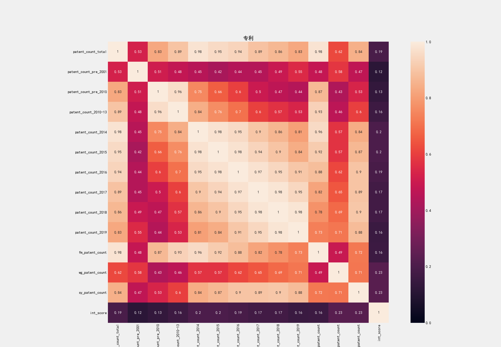

# IEEE ISI-World Cup 参赛历程
<!--IEEE ISI-World Cup 2019 比赛从2019年3月15日开始-->
<!--2019-04-10-->
<!--数据挖掘,大数据,随机森林-->

## 题目介绍
**题目：** 企业投资价值评估

**目标：** 根赛题主办方提供了38张xlsx格式企业各种数据以及企业投资价值综合评分（百分制，包含小数）的表格，包含上市企业的：基本工商信息、购地信息、年报信息、财务信息、纳税信息、知识产权信息等各维度全量企业数据，以此训练模型评测企业投资价值评分，训练集有3000家，最后用模型给测试集500家企业评分，依据RMSE结果排名。

## 解题思路

最终的目标是通过机器学习模型评估测试集企业的投资价值综合评分。注意到我们的目标是连续型的数值，因此回归模型是合理的选择，但整数的评分会给我们带来模型选择上更多的便利，因此我们决定先采用分类模型对数据进行初步评分，再通过回归模型提高精确度。我们最终的思路如下：

1. 理解问题
2. 数据探索
3. 数据清洗
4. 特征提取
5. 特征筛选
6. 尝试并比较几种基本模型
7. 尝试组合模型
8. 优化参数
9. 分析结果

以上步骤可能会反复进行。

## 开始

对题目要求有了初步了解之后，我们开始准备环境。python是目前最为火热的数据分析语言之一，其丰富的数据处理包为我们提供了很多方便。我们采用PyCharm开发，python版本为2.7，引入了`xlrd`，`xlwt`，`xlsxwriter`，`pandas`，`numpy`，`matplotlib`，`seaborn`，`scikit-learn`，`xgboost`等包。

## 数据初整理

企业信息共有38张表格，除去企业评分表外37张数据表格我们将其分成7类：年报类、财务信息类、软资产类、竞品类、纳税类、购地类、基本信息。

``` python
category_annual_report_files = [u'年报-企业基本信息',
                                u'年报-企业资产状况信息',
                                u'年报-对外投资信息',
                                u'年报-的对外提供保证担保信息',
                                u'年报-社保信息',
                                u'年报-网站或网点信息',
                                u'年报-股东股权转让',
                                u'年报-股东（发起人）及出资信息']

category_soft_assets_files = [u'专利',
                              u'产品',
                              u'作品著作权',
                              u'商标',
                              u'资质认证',
                              u'软著著作权',
                              u'项目信息']

category_finance_files = [u'上市公司财务信息-每股指标',
                          u'上市信息财务信息-财务风险指标',
                          u'上市信息财务信息-成长能力指标',
                          u'上市信息财务信息-利润表',
                          u'上市信息财务信息-现金流量表',
                          u'上市信息财务信息盈利能力指标',
                          u'上市信息财务信息运营能力指标',
                          u'上市信息财务信息资产负债表'
                          ]

category_competing_products = [u'竞品']

category_paying_taxes = [u'纳税A级年份',
                         u'一般纳税人']

category_basic_information = [u'工商基本信息表',
                              u'海关进出口信用',
                              u'招投标',
                              u'债券信息',
                              u'融资信息']

category_landing_purchase = [u'购地-地块公示',
                             u'购地-市场交易-土地抵押',
                             u'购地-市场交易-土地转让',
                             u'购地-房地产大企业购地情况',
                             u'购地-房地产大地块出让情况',
                             u'购地-结果公告']
```
接着，我们对每一类的数据进行了初步统计分析，列出了基本统计信息并写入excel表格。

```python
def read_file_to_df(file_dir, file_name, ext='.xlsx', sheet_name='Sheet'):
    """
    read file from the file_dir, currently we read excel. Once the data type changed, we are convenient to change here.
    :param file_dir:
    :param file_name: file name without extension
    :param ext: file's extension, maybe '.xlsx','.xls' or '.csv'
    :param sheet_name: sheet name
    :return:
    """
    fn_split = file_name.split('.')
    file_name = fn_split[0]  # remove the extension
    if len(fn_split) > 1:
        ext = '.' + fn_split[1]

    return pandas.read_excel(file_dir + file_name + ext, sheet_name=sheet_name)

def list_file_columns_values(file_name, file_url=working_file_url):
    """
    list a file's columns statistic info.
    :param file_name:
    :param file_url:
    :return:
    """
    columns_dict = {}
    data = file_utils.read_file_to_df(file_url, file_name)
    for column in data.columns:
        print ('column:%s' % column)
        if list(data.columns).index(column) == 0:  # ignore the first column -- the number of company
            continue
        dropped_data = data.drop_duplicates(subset=[column], keep='first')

        sort_list = dropped_data[column].tolist()
        sort_list.sort()
        sort_list.insert(0, 'Nan Percent')
        sort_list.insert(0, 'Total Num')
        count_list = []
        for item in sort_list:
            if item == 'Total Num':
                count_list.append(data.__len__())
            elif item == 'Nan Percent':
                try:
                    count_list.append(float(float(data[column].isna().sum()) / float(data[column].__len__())))
                except AttributeError as ae:
                    count_list.append(0)
            elif item is numpy.nan:
                try:
                    count_list.append(data[column].isna().sum())
                except AttributeError as ae:
                    count_list.append(0)
            elif isinstance(item, unicode):
                counted_data = data[data[column] == item.encode('utf-8')]
                count_list.append(counted_data.__len__())
            else:
                count_list.append(data[data[column] == item].__len__())
        column_dict = {column: sort_list}
        count_dict = {column + '_count': count_list}
        columns_dict.update(column_dict)
        columns_dict.update(count_dict)

    return columns_dict

```

下表是专利信息表格的统计信息（部分）。

| 专利类型        | 专利类型_count | 授权公告日       | 授权公告日_count | 申请日         | 申请日_count |
|-------------|------------|-------------|-------------|-------------|-----------|
| Total Num   | 980360     | Total Num   | 980360      | Total Num   | 980360    |
| Nan Percent | 0          | Nan Percent | 0           | Nan Percent | 0         |
| 发明专利        | 107        | 1985-11-28  | 1           | 1987-06-03  | 1         |
| 发明公布        | 404207     | 1986-10-03  | 1           | 1988-04-13  | 2         |
| 发明公布更正      | 652        | 1986-10-03­ | 1           | 1989-02-08  | 1         |
| 发明授权        | 170671     | 1987-07-28  | 1           | 1991-02-20  | 1         |
| ...         | ...        | ...         | ...         | ...         | ...       |


通过列出来的统计信息，我们能进一步分析每个表格有多少个数值，空值比是多少，每个数值的多少等等信息。

## 数据清洗

根据上一步的初步分析，我们接下来需要做的就是数据清洗。首先是重复数据的删除。

```python
def merge_rows(file_name, keys=None, file_url=working_file_url, dst_file_url=clean_data_temp_file_url):
    """
    remove duplicated rows.
    :param file_name:
    :param keys:
    :param file_url:
    :param dst_file_url: which file folder should store the result
    :return:
    """

    data_frame = file_utils.read_file_to_df(file_url, file_name)
    data_frame = data_frame.drop_duplicates()

    file_utils.write_file(data_frame, file_utils.check_file_url(dst_file_url), file_name,
                          sheet_name='Sheet', index=False)

    return
```

删除重复数据后需要做空值的处理，空值的处理需要依据数据意义以及统计信息来决定是删除、插补还是新建类别。在我们的数据处理中，有很多60-90%空缺的列，我们会采取删除列的操作；另外，有些行重要信息空值过多，我们会采取删除行的操作；其余空缺我们大部分用新建类别来标记是空缺值；我们没有用到插补策略。

```python
def drop_rows_too_many_empty(file_name, columns, thresh=2, file_url=clean_data_temp_file_url,
                             dst_file_url=clean_data_temp_file_url):
    """
    drop rows that too many values are empty.
    :param file_name:
    :param columns: the columns we need to check if it is empty
    :param thresh: how many empty is 'too many'
    :param file_url: input file url
    :param dst_file_url: where to store the result
    :return:
    """
    data_frame = file_utils.read_file_to_df(file_url, file_name)
    data_frame = data_frame.dropna(subset=columns, thresh=thresh)

    file_utils.write_file(data_frame, file_utils.check_file_url(dst_file_url), file_name,
                          sheet_name='Sheet', index=False)
    return


def drop_columns(file_name, columns, file_url=clean_data_temp_file_url, dst_file_url=clean_data_temp_file_url):
    try:
        data_frame = file_utils.read_file_to_df(file_url, file_name)
        data_frame = data_frame.drop(columns, axis=1)

        file_utils.write_file(data_frame, file_utils.check_file_url(dst_file_url), file_name,
                              sheet_name='Sheet', index=False)
    except ValueError as e:
        print('except:', e)
    return

def fillna_with_values():
    df = file_utils.read_file_to_df(clean_data_temp_file_url, u'作品著作权')
    values = {u'作品著作权类别'.encode('utf-8'): 9, u'作品著作权登记日期'.encode('utf-8'): '1000-01-01',
              u'作品著作权创作完成日期'.encode('utf-8'): '1000-01-01', u'作品著作权首次发布日期'.encode('utf-8'): '1000-01-01'}
    df = df.fillna(values)
    file_utils.write_file(df, clean_data_temp_file_url, u'作品著作权')
```

在处理完空值之后，观测到数据中很多格式不统一的地方，诸如日期数据，同一列可能出现‘2019-01-01’、‘19-01-01’、‘2019-01’、‘2019’、‘2019年1月1日’等等不同的表达，一些金额数据也有不同单位，可能是‘1000元’、‘1000人民币’、‘1000元人民币’、‘1000’、‘1000美元’等等，对于这些数据，我们需要将每一列的格式统一，带单位的数据需要将单位去除，并进行必要换算（如美元换算成人民币采用汇率6.7）。

同时，在格式统一的过程中我们注意到一些类别数据分类过多、过散、有重复，如‘作品著作权’表`作品著作权类别`就有`'A 文字'`, `'文字'`, `'文字作品'`这几种相同但表述不同的类别存在。于是，我们采取步骤将这些类别进行再分类，降低类别数。

还有在一列里面有多组数据，比如‘年报-股东（发起人）及出资信息’表‘认缴出资信息’列数据包含三个信息：

```
认缴出资方式：货币
认缴出资额（万元）：3945926.64万人民币
认缴出资日期：2010-10-14
```
在这一步可以将这些信息展开。

另外，还有一些明显的错误值需要处理，如股权比例有些数值小于0，而这在现实中不可能存在。对于这些数据，我们会将其标注成错误数据。

一份完整的数据清洗示例如下。

```python
def drop_unit_with_transfer(file_name, column_name, unit_strs, transfer_map, empty_mask='Unknown',
                            file_url=clean_data_temp_file_url, dst_file_url=clean_data_temp_file_url):
    """

    :type transfer_map: dict
    :type unit_strs: list
    """
    data_frame = file_utils.read_file_to_df(file_url, file_name)
    for index in range(0, len(data_frame)):
        content = data_frame.at[index, column_name]
        if pandas.isnull(content):
            data_frame.set_value(index, column_name, empty_mask)
        for j in range(0, len(unit_strs)):
            if str(content).endswith(unit_strs[j]):
                data_frame.set_value(index, column_name, str(content).replace(unit_strs[j], ''))

        for key in transfer_map.keys():
            if str(content).endswith(key):
                content = str(content).replace(key, '')
                if not (isinstance(content, float) or isinstance(content, int)):
                    try:
                        content = float(str(content))
                    except AttributeError as ae:
                        print (ae)
                        continue
                    except ValueError as ve:
                        print (ve)
                        continue

                content = content * transfer_map.get(key)
                data_frame.set_value(index, column_name, content)

    file_utils.write_file(data_frame, file_utils.check_file_url(dst_file_url), file_name,
                          sheet_name='Sheet', index=False)
    return

def mark_invalid_num_data(file_name, column_name, operator, thresh_value, error_mask=-1,
                          file_url=clean_data_temp_file_url, dst_file_url=clean_data_temp_file_url):
    data_frame = file_utils.read_file_to_df(file_url, file_name)
    for index in range(0, len(data_frame)):
        content = data_frame.at[index, column_name]
        if not (isinstance(content, float) or isinstance(content, int)):
            try:
                content = float(str(content))
            except AttributeError as ae:
                print (ae)
                continue
            except ValueError as ve:
                print (ve)
                continue

        isvalid = True
        if operator == '<':
            isvalid = not (content < thresh_value)
        elif operator == '>':
            isvalid = not (content > thresh_value)
        elif operator == '>=':
            isvalid = not (content >= thresh_value)
        elif operator == '<=':
            isvalid = not (content <= thresh_value)

        if not isvalid:
            data_frame.set_value(index, column_name, error_mask)

    file_utils.write_file(data_frame, file_utils.check_file_url(dst_file_url), file_name,
                          sheet_name='Sheet', index=False)
    return

def empty_value_handle_share_exchange_info():
    """
    Dirty value handle for table 年报-股东股权转让.xlsx.
    First we'll drop rows that empty value is too many.
    ['变更前股权比例','变更后股权比例','年报年份','股权变更日期']
    Once there are more than 2 empties in these 4 columns we will drop that row.
    Then we check nulls column by column and decide how to process with it.
    Next we should numeric all the value for future process.
    After these are done, it's time to work out features we can use in this table which belongs
        to exploratory data analysis.

    -----------------------------
    变更前股权比例
    ------
    Empty percentage is 0.3939%(17 out of 4316). We replace them as -1.
    The format is not uniformed. Some are formatted as '.07%', some are '0.07%' and some are '0.07'. We need to drop '%'
    and make all format as '0.07'. For numbers greater than 1, we mark them as -1.

    -----------------------------
    变更后股权比例
    ------
    Empty percentage is 0.278%(12 out of 4316). We replace them as -1.
    The format is not uniformed. Some are formatted as '.07%', some are '0.07%' and some are '0.07'. We need to drop '%'
    and make all format as '0.07'. For numbers greater than 1, we mark them as -1.
    A more complicate problem is some value are actually belong to '股权变更日期', which we need to copy them to column
    '股权变更日期'

    -----------------------------
    股权变更日期
    ------
    Empty percentage is 0.3939%(17 out of 4316). The empty value are replaced to the invalid value('1000-01-01')
    so we can handle it later.
    Others are well formatted with format yyyy-mm-dd.

    -----------------------------
    年报年份
    ------
    Empty percentage is 0.139%(6 out of 4316). The empty value are replaced to the invalid value('1000')
    so we can handle it later.
    Others are well formatted with format yyyy-mm-dd.

    -----------------------------
    :return:
    """
    empty_check_list = [u'变更前股权比例'.encode('utf-8'),
                        u'变更后股权比例'.encode('utf-8'),
                        u'年报年份'.encode('utf-8'),
                        u'股权变更日期'.encode('utf-8')]
    dcu.drop_rows_too_many_empty(u'年报-股东股权转让.xlsx', columns=empty_check_list, thresh=2)
    panaly.list_category_columns_values([u'年报-股东股权转让'], u'年报-股东股权转让_empty_handled',
                                        file_url=clean_data_temp_file_url)

    df = file_utils.read_file_to_df(clean_data_temp_file_url, u'年报-股东股权转让')
    values = {u'变更前股权比例'.encode('utf-8'): -1, u'变更后股权比例'.encode('utf-8'): -1,
              u'股权变更日期'.encode('utf-8'): '1000-01-01', u'年报年份'.encode('utf-8'): '1000'}
    for index in range(0, len(df)):
        content = df.at[index, u'股权变更日期'.encode('utf-8')]
        content_b = df.at[index, u'变更后股权比例'.encode('utf-8')]
        if '-' in str(content_b) and (pandas.isnull(content) or pandas.isna(content)):
            df.set_value(index, u'股权变更日期'.encode('utf-8'), content_b)
            df.set_value(index, u'变更后股权比例'.encode('utf-8'), '')

    df = df.fillna(values)
    file_utils.write_file(df, clean_data_temp_file_url, u'年报-股东股权转让')

    dcu.drop_unit_with_float_format(u'年报-股东股权转让', u'变更前股权比例'.encode('utf-8'), ['%'], empty_mask=-1)
    dcu.drop_unit_with_float_format(u'年报-股东股权转让', u'变更后股权比例'.encode('utf-8'), ['%'], empty_mask=-1)

    dcu.mark_invalid_num_data(u'年报-股东股权转让', u'变更前股权比例'.encode('utf-8'), '>', 100)
    dcu.mark_invalid_num_data(u'年报-股东股权转让', u'变更后股权比例'.encode('utf-8'), '>', 100)

    return
```

## 特征工程

### 特征提取

我们拥有的是3000家企业的全量信息，而我们需要将这些信息综合成每家企业的若干特征。每一张表格中都可能提取出很多信息。在数据清洗后就可以开始特征提取的步骤，此时空值太多的数据已经被删除，不会对我们的分析有影响。

特征的提取策略主要包括：

1. 直接使用

    对于一家公司对应一个值的指标，我们直接采用。如‘年报-企业基本信息’中的数据等等。
2. 时间数据求增长率
   
    有很多季度、年度数据，我们可以求其增长率。
3. 计数
   
    诸如‘专利’、‘作品著作权’等我们可以计算每家公司的总数、近N（N一般取1、3、5、10等）年来的总数。
4. 类别计数
   
    像‘资质认证’这种数据我们除了统计其计数外，也统计其覆盖的类别数。
5. 加总
   
    ‘购地类信息’很多需要加总，每家公司会有多次购地，其总购地面积可以作为一个指标。

以上列出来的是我们提取指标中常用的一些方法，也有很多数据是多种方法结合提取的。

提取完数据后需要将我们的指标能够被模型所用，所以还需要将所有指标数字化。

至此，我们就形成了3000家公司多个特征，总共大概有300多个特征，高维度的数据会造成很多问题，我们并不能将所有特征全部用上，需要进行特征的选取。

### 特征选择

对特征的选择的依据首先是看这个特征的方差，如果这个特征方差太小，说明其差异不大，不太可能从中得到比较好的信息。另外，通过观察特征和最终目标分数之间的散点图可以看出两者是否存在关系。

形成特征后就可以通过画图来直观体现特征的优劣。

```python
# Visualization
import matplotlib.pyplot as plt

# matplotlib inline
plt.style.use('fivethirtyeight')
plt.rcParams['font.size'] = 14
plt.rcParams['patch.edgecolor'] = 'k'
plt.rcParams['font.sans-serif'] = ['SimHei']  # 步骤一（替换sans-serif字体）
plt.rcParams['axes.unicode_minus'] = False

def pic_scatter(index_files, category_name, index_file_url=corporation_index_file_url,
                scatter_url=corporation_index_scatter_file_url):
    """
    scatter picture for each index and the score.
    :param index_files: the index file we need to analyse.
    :param category_name: the category of the index, the images will be stored at this file folder.
    :param index_file_url: file url to index files.
    :param scatter_url: scatter image url to be stored.
    :return:
    """
    fig = plt.figure(figsize=(14, 9))
    for file_n in index_files:
        print file_n
        data_frame = fu.read_file_to_df(index_file_url, file_n + '_index')
        for column in data_frame.columns:
            if column == 'Unnamed: 0':
                continue

            plt.title(column)
            plt.xlabel('score')
            plt.ylabel(column)

            x = data_frame['int_score'].to_list()
            y = data_frame[column].to_list()
            xy = list(zip(x, y))

            s = []
            c = np.random.rand(len(xy))
            for xy_item in xy:
                s.append(xy.count(xy_item) * 1.5)
            plt.scatter(x, y, s=s, c=c)

            # plt.show()

            fig.savefig(fu.check_file_url(
                scatter_url + '/' + category_name + '/' + file_n + '/') + str(column).replace('/', '-') + '.png',
                        dpi=150)
            plt.clf()

```

下图中`co_industry_3`就是一个方差太小的列子，而`products_total`则观察不出目标分数与其关系。


要观察到特征和目标分数之间的关系，一般线性关系是最容易发现的，如下图中`certi_cat_total`就很好的体现了其与分数之间的关系。


而其余的关系一般不如`certi_cat_total`这么明显，向下图`tra_mark_5`，但也能看出关系，这些需要保留。


通过散点图对特征进行了初步筛选后，我们还需要进一步压缩维度。对于相关系数很高的特征，我们可以保留其中一个。这个我们可以通过热点图来直观体现。像下图专利相关特征的热点图。


从上图中，我们可以从之前的13个指标中筛选出彼此相关系数不太高的5个指标：

```
'patent_count_2010-13',
'patent_count_2018',
'patent_count_pre_2001',
'patent_count_total',
'wg_patent_count'
```

通过这一步筛选，我们大致能避免多重共线性。

## 初步模型选取

经过筛选，我们的特征已经按类别整理好，如下表所示。

| Unnamed: 0 | pa...total | pa..._2010 | pa..._2010-13 | 企业总评分       | int_score | int_score_root |
|------------|------------|------------|---------------|-------------|-----------|----------------|
| 1001       | 4                  | 4                     | 0                    | 75.37427577 | 75        | 75             |
| 1002       | 2                  | 0                     | 1                    | 79.83012198 | 80        | 79             |
| 1003       | 1182               | 97                    | 419                  | 78.31826444 | 78        | 78             |
| ...        | ...                | ...                   | ...                  | ...         | ...       | ...            |


其中int_score是根据四舍五入获得的企业总评分整数值，而int_score_root是依据去尾法得到的企业总评分整数值。第一阶段的依据分数分类我们会尝试两种方法，以防在评分过程中会以整数段区分，比如89.9可能和89更接近而不是90。

### 指标引入

在得到各类数据的指标（特征）数据后，我们并没有选择一次性加入所有指标，而是以之前的分表为单位，逐步引入指标。我们首先引入的指标是‘软资产’类的7个表格指标，因为从之前散点图来看，此类数据对评分有较为显著的影响。其次是企业财务信息，然后是年报以及其他。

### 数据拆分

我们总共有3000家企业的数据，但其中44家企业最终并没有评分数据，所以有效训练数据是2956个。最后的测试集是500，我们依据500/2956的比例，在我们2956个训练数据中随机选取了428个数据作为测试集，另外2528个数据为训练集。我们有两种方法来做这个操作，一是随机生成428个数据，并保存，每次训练和测试都是以这个数据集拆分为准，另外一个是在每次训练之前都随机生成训练集和测试集，这样能测试模型稳定性。我们先采用第一种方式来调整参数，然后会以第二种方式来检验稳定性。

(1)

```python
def generate_random_test_corporates():
    """
    We separate the hole train data into test data(428)(we delete 8 because of lacking score) and train data(2528),
    so the test/train = 0.169 which is the final test(500) / train(2956) ratio.
    :return:
    """
    ran_list = random.sample(range(1001, 4001), 428)
    print(len(list(set(ran_list))))
    print (sorted(ran_list))
```

(2)

```python
def generate_test_corporates():
    data_frame = fu.read_file_to_df(corporation_index_second_stage_file_url, u'年报-企业基本信息_index')
    corporates = list(data_frame['Unnamed: 0'])
    ran_list = random.sample(range(0, 2956), 428)
    test_cos = []
    print(len(list(set(ran_list))))
    print (sorted(ran_list))
    for i in ran_list:
        test_cos.append(corporates[i])
    return test_cos


test_corporates = generate_test_corporates()
```

### 基础模型测试

分类模型有多种，我们尝试了最为流行的一些分类模型，如随机森林（RF），xgboost，k近邻，也尝试了一些回归模型如线性回归，逻辑回归。在各种模型中，依据RMSE，我们发现随机森林在得分和稳定性上都较其它模型更优，因此随机森林应该是我们首选。

## 参数调整

## 模型调整

