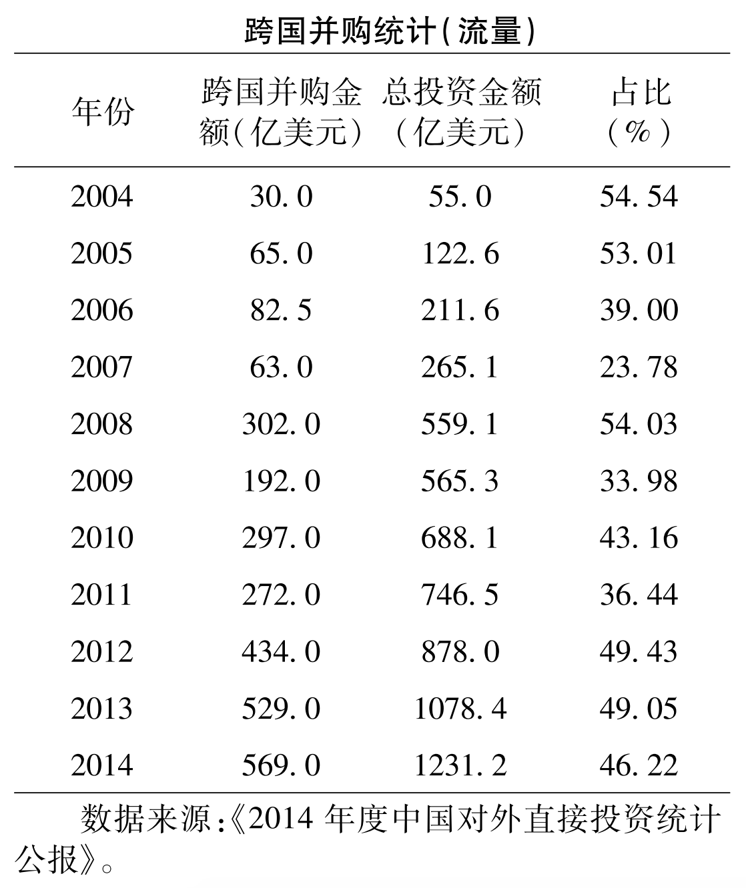

# 绿地投资还是跨国并购：中国企业对外直接投资方式的选择
<!--绿地投资还是跨国并购：中国企业对外直接投资方式的选择-->
<!--2019-10-12-->
<!--对外直接投资, 绿地投资, 跨国并购, 企业异质性-->

```
@article{2017,
author = {蒋冠宏 and 蒋殿春},
journal = {世界经济},
pages = {126--146},
title = {绿地投资还是跨国并购：中国企业对外直接投资方式的选择},
volume = {7},
year = {2017}
}

```
## 内容提要

利用2003-2009年中国工业企业对外投资和跨国并购数据，检验了企业**异质性**对其对外直接投资方式的影响。

* 生产率、资本密集度、规模
* 出口
* 研发密度、流动资产比

**结论**：*生产率高、资本密集、规模大、研发密度高且流动性资产比重高的中国企业选择跨国并购方式的可能性更大。具有“可转移优势”是中国企业对外直接投资选择进入方式的重要决定因素。*

## 引言

中国企业对外直接投资进入东道国的方式主要有：

1. 跨国并购
2. 绿地投资



中国企业对外投资总额在急剧增长。跨国并购金额占对外投资总额的<font color='red'>比重较大</font>。

*注：图中只给出了跨国并购金额以及对外投资总额，没有单独列出绿地投资。如果对外投资除了跨国并购就是绿地投资，那么绿地投资占比应该更显著。*

企业究竟选择何种方式进入东道国？

### 国外研究

Nocke和Yeaple(2007)从理论上分析了**企业异质性**与其对外直接投资方式选择的问题。发现：**绿地投资要求企业具有较高的技术优势以弥补额外的固定投资和营销网络的不足。跨国并购是收购国外已经存在的企业，并基于资源和优势互补的目的以整合目标企业的优势，服务东道国市场。**

### 中国情况

中国是新兴市场国家，企业所具有的的**可转移优势**与发达国家相比可能存在差距，也可能存在差异。

**-> 因此，国外的理论是否适用于中国企业对外直接投资方式的选择需要进一步研究。** 在中国企业大规模“走出去”的背景下，弄清中国企业对外投资方式选择的背后机理不仅是学术界的需要，也是为中国企业进一步走出去提供理论和经验依据的要求。

### 本文贡献

全面和系统探讨了中国企业对外直接投资选择绿地投资还是跨国并购的原因。发现企业是否具有“**可转移优势**”，如生产率水平、资本密集度、研发能力和流动资产占比等，是决定中国企业是否选择**跨国并购**的重要因素。企业的“**不可转移优势**”，如出口能力，及企业在国外的营销网络和市场进入渠道等，是决定中国企业是否选择**绿地投资**的重要因素。

```
可转移优势 -> 跨国并购
不可转移优势 -> 绿地投资
```

上述发现对于理解中国企业对外直接投资方式的选择具有重要参考价值。

## 文献回顾
三个方面：

1. 传统经济和管理学理论假说
2. 行业和国家层面因素
3. 基于异质性企业的角度

### 传统经济和管理学理论假说

1. 交易成本观点
   * Hennart和Reddy(1997)
     * 如果获得的资源具有较大溢出效应，则倾向于绿地投资。
   * Pan和Tse(2000)
     * 签订契约的难易程度和后期契约的履行质量等显著影响了外资企业在中国的投资方式。
2. 所有权优势观点
   * Hennart和Park(1994)
     * 效率（生产、研发、营销网络和渠道）较高的企业采用绿地投资，较低的企业采用跨国并购。
3. 资源和组织观点
   * Anand和Delios(2002)
     * 企业的研发密度、广告密度越高和营销网络越发达，越可能采用跨国并购的方式。
   * Barkema和Vermeulen(1998)
     * 国际分散经营和产品多样化战略都促使企业采用绿地投资方式。
4. 制度理论观点
   * Davis等(2000)
     * 母公司企业制度越规范，采用绿地投资的方式越多。
   * Harzing(2002)
     * 企业相对规模越大、国际化经验越丰富和管理制度越规范，越有可能采用跨国并购的方式。

就研发来看，Harzing(2002)与Anand和Delios(2002)的研究发现**恰恰相反**。前者的研究视角是基于**能力开发型投资**，而后者的研究视角是基于**能力寻求型投资**。

这类文献强调交易成本、所有权优势、资源和制度等因素的影响。虽为本文研究提供了有价值的理论和机制基础，但它们忽略了企业异质性因素的作用。

### 行业和国家层面因素
1. 行业因素
   * Delios和Beamish(1999)
     * 在无形资产和研发密集的行业，企业偏好跨国并购。原因在于跨国并购能够迅速掌握被收购企业的无形资产、研发资源和营销网络等。
   * Zejan(1990)
     * 东道国产业增长速度比较快，企业可能采用绿地投资，反之采用跨国并购。原因是如果行业增长较快，在位东道国企业并不担心外国企业的进入。
   * Larimo(2003)
     * 行业缺乏目标企业或者行业还处在初始发展阶段，则企业可能采用绿地投资。
2. 国家层面因素
   * Child等(2001)
     * 文化距离越远，企业越倾向于选择合资或者绿地投资，而不是跨国并购。
   * Brouthers和Brouthers(2000)
     * 从东道国的不确定性风险、产权保护和其他制度安全等角度研究。

从行业因素看，研发密度高和无形资产占比大的行业往往采用跨国并购的方式。如果东道国行业还处在高速增长的初期阶段，企业倾向于绿地投资。

从国家因素看，如果两国文化相似，或东道国的不确定风险太高，又或制度较差，那么企业倾向于采用跨国并购方式。

上述文献加深了我们对相关问题的认识，但这类文献忽略了同行业内企业的异质性，以及面临相同国家因素时不同企业的选择策略。与上述文献不同，本文进一步考察了在行业和国家因素的约束下，**异质性**对企业市场进入策略选择的影响。

### 基于异质性企业的角度
1. 发达国家
   * Helpman等(2004)
      * 生产率较高的企业选择OFDI，生产率居中的企业选择出口，生产率最低的企业选择只服务国内或退出市场。
   * Nocke和Yeaple(2007)
     * 如果企业异质性来源于可转移优势（如生产技术），则生产率高的企业采用跨国并购，居中的企业采用绿地投资，而生产率低的企业选择出口。
     * 如果企业异质性来源于不可转移优势（如营销网络和市场渠道等），生产率高的企业采用绿地投资，居中的企业采用出口，生产率低的企业是跨国并购。
   * Nocke和Yeaple(2008)
     * 工资差距较小的国家之间，企业更可能采用跨国并购；工资差距较大的国家之间，企业主要以绿地投资方式为主。
     * 绿地投资的企业生产率要高于跨国并购的企业。
   * Trax(2011)
     * 无形资产占比较高的行业，高生产率的企业都采用跨国并购；在无形资产占比较低的行业，跨国并购企业的生产率低于出口和绿地投资的企业。
   * Raff等(2009)
     * 盈利能力强的企业可能采取跨国并购的方式。

异质性企业理论的主要结论是，生产率较高的企业采取绿地投资，而生产率较低的企业采取跨国并购，但在研发密集和无形资产比重较高的行业，上述结论相反。

2. 发展中国家
   * 王方方和赵永亮(2012)
     * 基于企业异质性理论解释中国企业“走出去”的决定因素。
   * Wang和Wang(2015)
     * 外商企业并购对中国企业绩效的影响。

目前对中国企业“走出去”的市场进入策略研究还不多见。


## 理论假设

本文主要考虑四个方面因素的影响：

* 可转移优势
* 不可转移优势
* 国别
* 投资动机

### 可转移优势
可转移优势主要指企业的技术、研发和管理能力等，具体体现在企业的**生产率**和**研发创新**等方面。目前研究发现这种可转移优势也表现在企业的规模和资本密度方面。

#### 理论框架
```markdown
* 规模越大和资本越密集的企业越能够克服OFDI的固定成本（Helpman等，2004；Yeaple，2009）。
* 如果企业异质性来源于可转移优势（如生产技术），则生产率高的企业采用跨国并购，居中的企业采用绿地投资，而生产率低的企业选择出口。（Nocke和Yeaple，2007）。
```
```markdown
* 生产率更高、规模更大和资本更密集的企业更倾向于OFDI（王方方和赵永亮，2012；田巍和于淼杰，2012）。
```
```markdown
* 跨国并购的企业需要具有更高的可转移优势（Nocke和Yeaple，2007）。
* 具有可转移优势的表现是企业生产率较高和研发投入更密集（Helpman等，2004）。
```

*注：与文献回顾对应*

 与非OFDI企业相比，OFDI企业具有一定可转移优势。 -> 生产率较高的企业进行跨国并购，生产率较低的企业选择绿地投资。

具有“可转移优势”的企业“走出去”寻求“不可转移资源”。但与发达国家企业相比，中国企业的“可转移优势”并不明显。所以具有“可转移优势”的中国企业除了寻求“不可转移资源”的动机外，也有获取“可转移资源”的动机。获取东道国最有效的方式是**跨国并购**。

#### H1

在已经开始对外投资的企业中，**生产率**更高和**研发投入**更多（可转移优势更明显）的企业倾向于跨国并购，而生产率相对较低的企业选择绿地投资。

### 不可转移优势
不可转移优势指不能够随OFDI而转移到东道国的优势。主要是依赖于特定市场的进入渠道、销售网络和品牌忠诚度等。具体表现在企业的**出口指标**上。

#### 理论框架
```markdown
* 不可转移资源优势明显的企业倾向于绿地投资（Nocke和Yeaple，2007）。
* 具有不可转移优势的企业进入东道国市场需要寻求东道国资源：
    * 不可转移资源
        企业前期出口越丰富，对外部市场（东道国市场）越了解，越弱化对东道国不可转移资源的需求。
    * 可转移资源
        通过雇佣当地要素的绿地投资可以实现，不需要选择沉没成本更高的跨国并购。
```

与绿地投资相比，跨国并购所需的**沉没成本**可能更高，因而投资的门槛也更高。对具有不可转移优势的企业来说，最优的选择是进行绿地投资，其次才考虑跨国并购。

#### H2

出口多（不可转移优势明显）的企业倾向于选择绿地投资的市场进入策略。

### 东道国收入

#### 理论框架
```markdown
* 不同收入东道国绿地投资的生产率门槛是有差异的。在高收入国家绿地投资需要的固定资产投资和支付的工资相对更高，因而需要的生产率门槛相对较高，所以要求企业有更高的生产率。
* 跨国并购的生产率门槛也存在类似现象（Nocke和Yeaple，2007）。
  * 并购支付的资产价格差异。
  * 并购需要的搜寻和协同成本差异。
```

跨国并购总体而言需要更多的沉没成本，因而需要企业有更高的生产率优势。

跨国并购相对绿地投资有几大优势：直接并且迅速地获取进入东道国市场的渠道，也能够获取东道国企业的技术、研发和创新等资源。

跨国并购是更有利的进入策略。

#### H3

无论在高收入还是中低收入水平国家投资，生产率较高的企业倾向于选择 跨国并购的市场进入策略。

### 投资动机

中国企业对外直接投资的动机分为四类（2015年度中国对外直接投资统计公告）：

1. 商贸服务型
2. 生产销售型
3. 技术研发型
4. 资源开发型

由于资源开发类投资的企业数量不多，本文只考虑前三种类型。
#### 理论框架

```markdown
* 不同类型的固定成本有差异。
* 不同类型的可变成本有差异。
* 生产率较高的企业倾向于跨国并购（Nocke和Yeaple，2007）。
* 技术研发型OFDI具有新兴市场特征，目的是获取发达国家的技术和研发资源。这类投资生产率门槛较高，绿地投资和跨国并购的门槛差异可能不是很大。
```

商贸服务型投资的生产率门槛最低，生产销售型居中，而技术研发型最高。

#### H4a

出于商贸服务和生产销售型投资动机，生产率高的企业可能倾向于选择跨国并购。

#### H4b

出于技术研发型投资动机，生产率对企业选择绿地投资还是跨国并购的影响可能是无差异的。

## 数据说明、模型和变量设定

### 数据说明

**数据来源：**
* 中国工业企业数据库
* 商务部统计的中国对外直接投资名录
* BVD（Zephyr）统计数据库

最终获得了2003-2009年2304家有绿地投资的企业，2003-2009年中国100家进行跨国并购的工业企业数据。

本文企业样本只选取首次绿地投资和跨国并购的样本；本文也舍弃了既有绿地投资又有跨国并购的企业样本。

