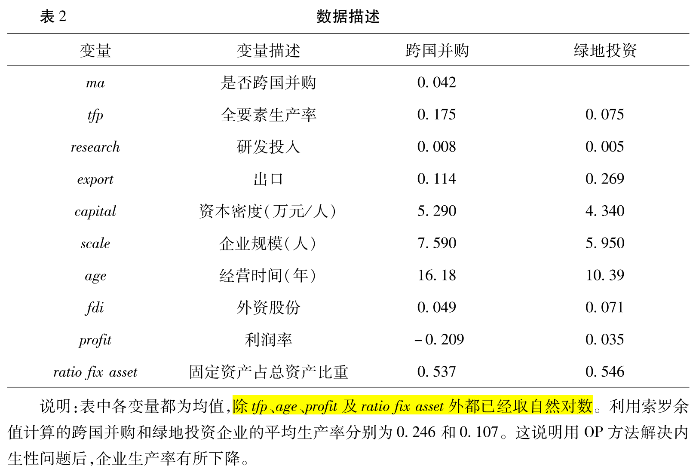
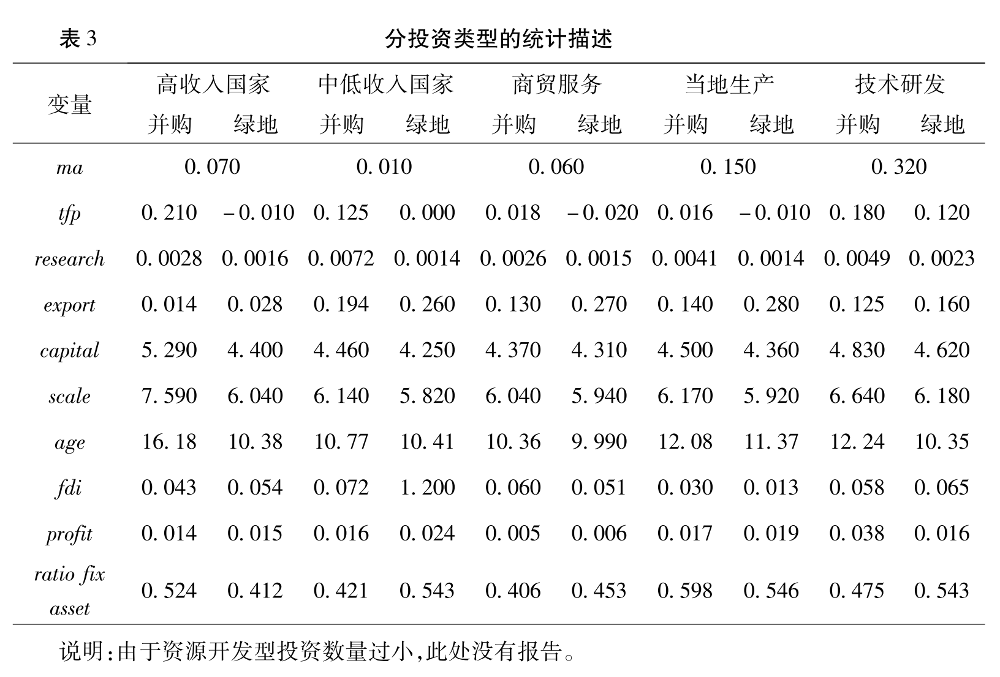
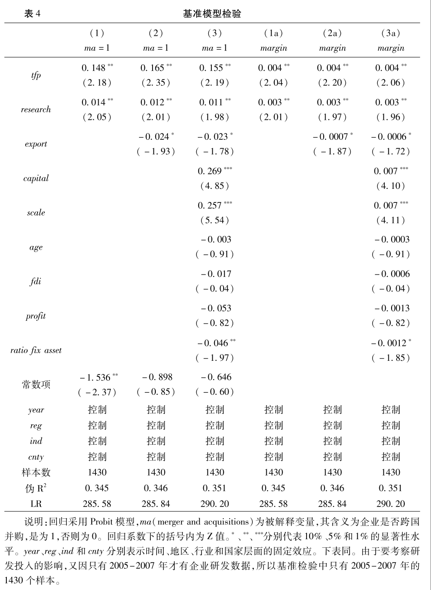
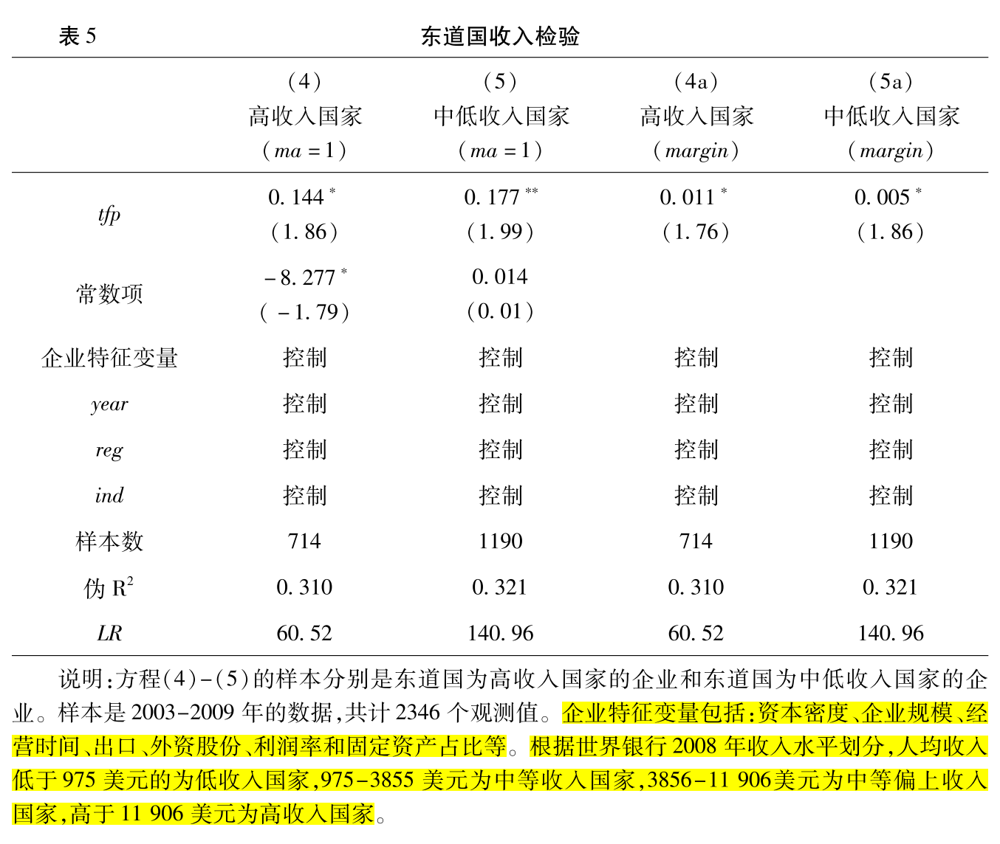
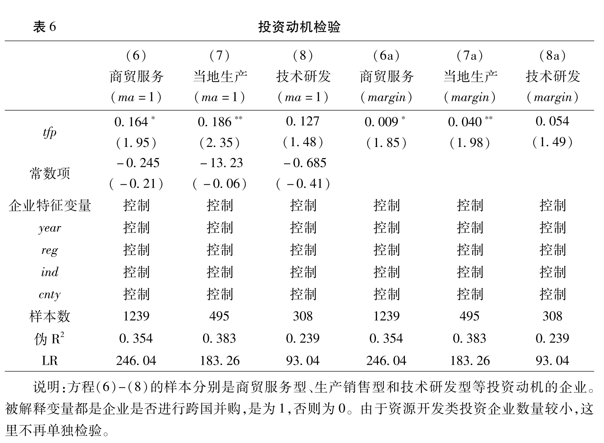

# 绿地投资还是跨国并购：中国企业对外直接投资方式的选择
<!--绿地投资还是跨国并购：中国企业对外直接投资方式的选择-->
<!--2019-10-12-->
<!--对外直接投资, 绿地投资, 跨国并购, 企业异质性-->

```
@article{2017,
author = {蒋冠宏 and 蒋殿春},
journal = {世界经济},
pages = {126--146},
title = {绿地投资还是跨国并购：中国企业对外直接投资方式的选择},
volume = {7},
year = {2017}
}

```

- [绿地投资还是跨国并购：中国企业对外直接投资方式的选择](#%e7%bb%bf%e5%9c%b0%e6%8a%95%e8%b5%84%e8%bf%98%e6%98%af%e8%b7%a8%e5%9b%bd%e5%b9%b6%e8%b4%ad%e4%b8%ad%e5%9b%bd%e4%bc%81%e4%b8%9a%e5%af%b9%e5%a4%96%e7%9b%b4%e6%8e%a5%e6%8a%95%e8%b5%84%e6%96%b9%e5%bc%8f%e7%9a%84%e9%80%89%e6%8b%a9)
  - [内容提要](#%e5%86%85%e5%ae%b9%e6%8f%90%e8%a6%81)
  - [引言](#%e5%bc%95%e8%a8%80)
    - [国外研究](#%e5%9b%bd%e5%a4%96%e7%a0%94%e7%a9%b6)
    - [中国情况](#%e4%b8%ad%e5%9b%bd%e6%83%85%e5%86%b5)
    - [本文贡献](#%e6%9c%ac%e6%96%87%e8%b4%a1%e7%8c%ae)
  - [文献回顾](#%e6%96%87%e7%8c%ae%e5%9b%9e%e9%a1%be)
    - [传统经济和管理学理论假说](#%e4%bc%a0%e7%bb%9f%e7%bb%8f%e6%b5%8e%e5%92%8c%e7%ae%a1%e7%90%86%e5%ad%a6%e7%90%86%e8%ae%ba%e5%81%87%e8%af%b4)
    - [行业和国家层面因素](#%e8%a1%8c%e4%b8%9a%e5%92%8c%e5%9b%bd%e5%ae%b6%e5%b1%82%e9%9d%a2%e5%9b%a0%e7%b4%a0)
    - [基于异质性企业的角度](#%e5%9f%ba%e4%ba%8e%e5%bc%82%e8%b4%a8%e6%80%a7%e4%bc%81%e4%b8%9a%e7%9a%84%e8%a7%92%e5%ba%a6)
  - [理论假设](#%e7%90%86%e8%ae%ba%e5%81%87%e8%ae%be)
    - [可转移优势](#%e5%8f%af%e8%bd%ac%e7%a7%bb%e4%bc%98%e5%8a%bf)
      - [理论框架](#%e7%90%86%e8%ae%ba%e6%a1%86%e6%9e%b6)
      - [H1](#h1)
    - [不可转移优势](#%e4%b8%8d%e5%8f%af%e8%bd%ac%e7%a7%bb%e4%bc%98%e5%8a%bf)
      - [理论框架](#%e7%90%86%e8%ae%ba%e6%a1%86%e6%9e%b6-1)
      - [H2](#h2)
    - [东道国收入](#%e4%b8%9c%e9%81%93%e5%9b%bd%e6%94%b6%e5%85%a5)
      - [理论框架](#%e7%90%86%e8%ae%ba%e6%a1%86%e6%9e%b6-2)
      - [H3](#h3)
    - [投资动机](#%e6%8a%95%e8%b5%84%e5%8a%a8%e6%9c%ba)
      - [理论框架](#%e7%90%86%e8%ae%ba%e6%a1%86%e6%9e%b6-3)
      - [H4a](#h4a)
      - [H4b](#h4b)
  - [数据说明、模型和变量设定](#%e6%95%b0%e6%8d%ae%e8%af%b4%e6%98%8e%e6%a8%a1%e5%9e%8b%e5%92%8c%e5%8f%98%e9%87%8f%e8%ae%be%e5%ae%9a)
    - [数据说明](#%e6%95%b0%e6%8d%ae%e8%af%b4%e6%98%8e)
    - [模型和变量设定](#%e6%a8%a1%e5%9e%8b%e5%92%8c%e5%8f%98%e9%87%8f%e8%ae%be%e5%ae%9a)
      - [参数计算](#%e5%8f%82%e6%95%b0%e8%ae%a1%e7%ae%97)
    - [数据描述](#%e6%95%b0%e6%8d%ae%e6%8f%8f%e8%bf%b0)
  - [经验检验和结果分析](#%e7%bb%8f%e9%aa%8c%e6%a3%80%e9%aa%8c%e5%92%8c%e7%bb%93%e6%9e%9c%e5%88%86%e6%9e%90)
    - [基准模型检验](#%e5%9f%ba%e5%87%86%e6%a8%a1%e5%9e%8b%e6%a3%80%e9%aa%8c)
      - [生产率](#%e7%94%9f%e4%ba%a7%e7%8e%87)
        - [理论解释](#%e7%90%86%e8%ae%ba%e8%a7%a3%e9%87%8a)
      - [出口](#%e5%87%ba%e5%8f%a3)
        - [理论解释](#%e7%90%86%e8%ae%ba%e8%a7%a3%e9%87%8a-1)
      - [资本密度和规模](#%e8%b5%84%e6%9c%ac%e5%af%86%e5%ba%a6%e5%92%8c%e8%a7%84%e6%a8%a1)
        - [理论解释](#%e7%90%86%e8%ae%ba%e8%a7%a3%e9%87%8a-2)
      - [其它](#%e5%85%b6%e5%ae%83)
    - [东道国检验](#%e4%b8%9c%e9%81%93%e5%9b%bd%e6%a3%80%e9%aa%8c)
      - [生产率](#%e7%94%9f%e4%ba%a7%e7%8e%87-1)
        - [理论解释](#%e7%90%86%e8%ae%ba%e8%a7%a3%e9%87%8a-3)
    - [投资动机检验](#%e6%8a%95%e8%b5%84%e5%8a%a8%e6%9c%ba%e6%a3%80%e9%aa%8c)
  - [总结和政策含义](#%e6%80%bb%e7%bb%93%e5%92%8c%e6%94%bf%e7%ad%96%e5%90%ab%e4%b9%89)

## 内容提要

利用2003-2009年中国工业企业对外投资和跨国并购数据，检验了企业**异质性**对其对外直接投资方式的影响。

* 生产率、资本密集度、规模
* 出口
* 研发密度、流动资产比

**结论**：*生产率高、资本密集、规模大、研发密度高且流动性资产比重高的中国企业选择跨国并购方式的可能性更大。具有“可转移优势”是中国企业对外直接投资选择进入方式的重要决定因素。*

## 引言

中国企业对外直接投资进入东道国的方式主要有：

1. 跨国并购
2. 绿地投资


中国企业对外投资总额在急剧增长。跨国并购金额占对外投资总额的<font color='red'>比重较大</font>。

*注：图中只给出了跨国并购金额以及对外投资总额，没有单独列出绿地投资。如果对外投资除了跨国并购就是绿地投资，那么绿地投资占比应该更显著。*

企业究竟选择何种方式进入东道国？

### 国外研究

Nocke和Yeaple(2007)从理论上分析了**企业异质性**与其对外直接投资方式选择的问题。发现：**绿地投资要求企业具有较高的技术优势以弥补额外的固定投资和营销网络的不足。跨国并购是收购国外已经存在的企业，并基于资源和优势互补的目的以整合目标企业的优势，服务东道国市场。**

### 中国情况

中国是新兴市场国家，企业所具有的的**可转移优势**与发达国家相比可能存在差距，也可能存在差异。

**-> 因此，国外的理论是否适用于中国企业对外直接投资方式的选择需要进一步研究。** 在中国企业大规模“走出去”的背景下，弄清中国企业对外投资方式选择的背后机理不仅是学术界的需要，也是为中国企业进一步走出去提供理论和经验依据的要求。

### 本文贡献

全面和系统探讨了中国企业对外直接投资选择绿地投资还是跨国并购的原因。发现企业是否具有“**可转移优势**”，如生产率水平、资本密集度、研发能力和流动资产占比等，是决定中国企业是否选择**跨国并购**的重要因素。企业的“**不可转移优势**”，如出口能力，及企业在国外的营销网络和市场进入渠道等，是决定中国企业是否选择**绿地投资**的重要因素。

```
可转移优势 -> 跨国并购
不可转移优势 -> 绿地投资
```

上述发现对于理解中国企业对外直接投资方式的选择具有重要参考价值。

## 文献回顾
三个方面：

1. 传统经济和管理学理论假说
2. 行业和国家层面因素
3. 基于异质性企业的角度

### 传统经济和管理学理论假说

1. 交易成本观点
   * Hennart和Reddy(1997)
     * 如果获得的资源具有较大溢出效应，则倾向于绿地投资。
   * Pan和Tse(2000)
     * 签订契约的难易程度和后期契约的履行质量等显著影响了外资企业在中国的投资方式。
2. 所有权优势观点
   * Hennart和Park(1994)
     * 效率（生产、研发、营销网络和渠道）较高的企业采用绿地投资，较低的企业采用跨国并购。
3. 资源和组织观点
   * Anand和Delios(2002)
     * 企业的研发密度、广告密度越高和营销网络越发达，越可能采用跨国并购的方式。
   * Barkema和Vermeulen(1998)
     * 国际分散经营和产品多样化战略都促使企业采用绿地投资方式。
4. 制度理论观点
   * Davis等(2000)
     * 母公司企业制度越规范，采用绿地投资的方式越多。
   * Harzing(2002)
     * 企业相对规模越大、国际化经验越丰富和管理制度越规范，越有可能采用跨国并购的方式。

就研发来看，Harzing(2002)与Anand和Delios(2002)的研究发现**恰恰相反**。前者的研究视角是基于**能力开发型投资**，而后者的研究视角是基于**能力寻求型投资**。

这类文献强调交易成本、所有权优势、资源和制度等因素的影响。虽为本文研究提供了有价值的理论和机制基础，但它们忽略了企业异质性因素的作用。

### 行业和国家层面因素
1. 行业因素
   * Delios和Beamish(1999)
     * 在无形资产和研发密集的行业，企业偏好跨国并购。原因在于跨国并购能够迅速掌握被收购企业的无形资产、研发资源和营销网络等。
   * Zejan(1990)
     * 东道国产业增长速度比较快，企业可能采用绿地投资，反之采用跨国并购。原因是如果行业增长较快，在位东道国企业并不担心外国企业的进入。
   * Larimo(2003)
     * 行业缺乏目标企业或者行业还处在初始发展阶段，则企业可能采用绿地投资。
2. 国家层面因素
   * Child等(2001)
     * 文化距离越远，企业越倾向于选择合资或者绿地投资，而不是跨国并购。
   * Brouthers和Brouthers(2000)
     * 从东道国的不确定性风险、产权保护和其他制度安全等角度研究。

从行业因素看，研发密度高和无形资产占比大的行业往往采用跨国并购的方式。如果东道国行业还处在高速增长的初期阶段，企业倾向于绿地投资。

从国家因素看，如果两国文化相似，或东道国的不确定风险太高，又或制度较差，那么企业倾向于采用跨国并购方式。

上述文献加深了我们对相关问题的认识，但这类文献忽略了同行业内企业的异质性，以及面临相同国家因素时不同企业的选择策略。与上述文献不同，本文进一步考察了在行业和国家因素的约束下，**异质性**对企业市场进入策略选择的影响。

### 基于异质性企业的角度
1. 发达国家
   * Helpman等(2004)
      * 生产率较高的企业选择OFDI，生产率居中的企业选择出口，生产率最低的企业选择只服务国内或退出市场。
   * Nocke和Yeaple(2007)
     * 如果企业异质性来源于可转移优势（如生产技术），则生产率高的企业采用跨国并购，居中的企业采用绿地投资，而生产率低的企业选择出口。
     * 如果企业异质性来源于不可转移优势（如营销网络和市场渠道等），生产率高的企业采用绿地投资，居中的企业采用出口，生产率低的企业是跨国并购。
   * Nocke和Yeaple(2008)
     * 工资差距较小的国家之间，企业更可能采用跨国并购；工资差距较大的国家之间，企业主要以绿地投资方式为主。
     * 绿地投资的企业生产率要高于跨国并购的企业。
   * Trax(2011)
     * 无形资产占比较高的行业，高生产率的企业都采用跨国并购；在无形资产占比较低的行业，跨国并购企业的生产率低于出口和绿地投资的企业。
   * Raff等(2009)
     * 盈利能力强的企业可能采取跨国并购的方式。

异质性企业理论的主要结论是，生产率较高的企业采取绿地投资，而生产率较低的企业采取跨国并购，但在研发密集和无形资产比重较高的行业，上述结论相反。

2. 发展中国家
   * 王方方和赵永亮(2012)
     * 基于企业异质性理论解释中国企业“走出去”的决定因素。
   * Wang和Wang(2015)
     * 外商企业并购对中国企业绩效的影响。

目前对中国企业“走出去”的市场进入策略研究还不多见。


## 理论假设

本文主要考虑四个方面因素的影响：

* 可转移优势
* 不可转移优势
* 国别
* 投资动机

### 可转移优势
可转移优势主要指企业的技术、研发和管理能力等，具体体现在企业的**生产率**和**研发创新**等方面。目前研究发现这种可转移优势也表现在企业的规模和资本密度方面。

#### 理论框架
```markdown
* 规模越大和资本越密集的企业越能够克服OFDI的固定成本（Helpman等，2004；Yeaple，2009）。
* 如果企业异质性来源于可转移优势（如生产技术），则生产率高的企业采用跨国并购，居中的企业采用绿地投资，而生产率低的企业选择出口。（Nocke和Yeaple，2007）。
```
```markdown
* 生产率更高、规模更大和资本更密集的企业更倾向于OFDI（王方方和赵永亮，2012；田巍和于淼杰，2012）。
```
```markdown
* 跨国并购的企业需要具有更高的可转移优势（Nocke和Yeaple，2007）。
* 具有可转移优势的表现是企业生产率较高和研发投入更密集（Helpman等，2004）。
```

*注：与文献回顾对应*

 与非OFDI企业相比，OFDI企业具有一定可转移优势。 -> 生产率较高的企业进行跨国并购，生产率较低的企业选择绿地投资。

具有“可转移优势”的企业“走出去”寻求“不可转移资源”。但与发达国家企业相比，中国企业的“可转移优势”并不明显。所以具有“可转移优势”的中国企业除了寻求“不可转移资源”的动机外，也有获取“可转移资源”的动机。获取东道国最有效的方式是**跨国并购**。

#### H1

在已经开始对外投资的企业中，**生产率**更高和**研发投入**更多（可转移优势更明显）的企业倾向于跨国并购，而生产率相对较低的企业选择绿地投资。

### 不可转移优势
不可转移优势指不能够随OFDI而转移到东道国的优势。主要是依赖于特定市场的进入渠道、销售网络和品牌忠诚度等。具体表现在企业的**出口指标**上。

#### 理论框架
```markdown
* 不可转移资源优势明显的企业倾向于绿地投资（Nocke和Yeaple，2007）。
* 具有不可转移优势的企业进入东道国市场需要寻求东道国资源：
    * 不可转移资源
        企业前期出口越丰富，对外部市场（东道国市场）越了解，越弱化对东道国不可转移资源的需求。
    * 可转移资源
        通过雇佣当地要素的绿地投资可以实现，不需要选择沉没成本更高的跨国并购。
```

与绿地投资相比，跨国并购所需的**沉没成本**可能更高，因而投资的门槛也更高。对具有不可转移优势的企业来说，最优的选择是进行绿地投资，其次才考虑跨国并购。

#### H2

出口多（不可转移优势明显）的企业倾向于选择绿地投资的市场进入策略。

### 东道国收入

#### 理论框架
```markdown
* 不同收入东道国绿地投资的生产率门槛是有差异的。在高收入国家绿地投资需要的固定资产投资和支付的工资相对更高，因而需要的生产率门槛相对较高，所以要求企业有更高的生产率。
* 跨国并购的生产率门槛也存在类似现象（Nocke和Yeaple，2007）。
  * 并购支付的资产价格差异。
  * 并购需要的搜寻和协同成本差异。
```

跨国并购总体而言需要更多的沉没成本，因而需要企业有更高的生产率优势。

跨国并购相对绿地投资有几大优势：直接并且迅速地获取进入东道国市场的渠道，也能够获取东道国企业的技术、研发和创新等资源。

跨国并购是更有利的进入策略。

#### H3

无论在高收入还是中低收入水平国家投资，生产率较高的企业倾向于选择跨国并购的市场进入策略。

### 投资动机

中国企业对外直接投资的动机分为四类（2015年度中国对外直接投资统计公告）：

1. 商贸服务型
2. 生产销售型
3. 技术研发型
4. 资源开发型

由于资源开发类投资的企业数量不多，本文只考虑前三种类型。
#### 理论框架

```markdown
* 不同类型的固定成本有差异。
* 不同类型的可变成本有差异。
* 生产率较高的企业倾向于跨国并购（Nocke和Yeaple，2007）。
* 技术研发型OFDI具有新兴市场特征，目的是获取发达国家的技术和研发资源。这类投资生产率门槛较高，绿地投资和跨国并购的门槛差异可能不是很大。
```

商贸服务型投资的生产率门槛最低，生产销售型居中，而技术研发型最高。

#### H4a

出于商贸服务和生产销售型投资动机，生产率高的企业可能倾向于选择跨国并购。

#### H4b

出于技术研发型投资动机，生产率对企业选择绿地投资还是跨国并购的影响可能是无差异的。

## 数据说明、模型和变量设定

### 数据说明

**数据来源：**
* 中国工业企业数据库
* 商务部统计的中国对外直接投资名录
* BVD（Zephyr）统计数据库

最终获得了2003-2009年2304家有绿地投资的企业，2003-2009年中国100家进行跨国并购的工业企业数据。

本文企业样本只选取首次绿地投资和跨国并购的样本；本文也舍弃了既有绿地投资又有跨国并购的企业样本。

### 模型和变量设定

本文采用Probit模型检验异质性如何影响其对外投资模式的选择。

$$
\begin{aligned} probit\left(d_{i j k t}^{m a}=1\right)=& y e a r_{t}+r e g_{i}+i n d_{i}+ cnty_{c}+\beta \times t f p_{i j k(t-1)} \\ &+\sum \phi_{n} y_{i j k(t-1)}^{n}+\sum \theta_{n} x_{i j k(t-1)}^{n}+\xi_{i j k t} \end{aligned}
$$

其中，$i、j、k$和$t$分别表示地区、行业、企业和时间。$d_{i j k t}^{m a}$表示企业是否跨国并购。$year_{t}、reg_{i}、ind_{i}$和$cnty_{c}$分别表示时间、地区、行业和国家层面的固定效应，以控制不可观察的时间、地区、行业和东道国差异对企业对外投资方式选择的影响。$tfp$表示**企业生产率**。$y$为前文理论假设中包含的除生产率之外的变量，其中包括**研发投入**和**出口**。$x$为其他企业特征变量，其中包括**资本密度**、**企业规模**、经营时间、外资股份、利润率和固定资产占总资产的比重。

由于当期国际化模式选择可能对企业特征变量有影响，因此解释变量都滞后1期，一定程度上解决**内生性问题**。

#### 参数计算

* 企业生产率
  * 利用Olley和Pakes(1996)的方法，基于企业工业产值、劳动、投资和中间投入计算全要素生产率。其中2008-2009年中国工业企业数据库没有报告中间投入，因此用2007-2009年的平均中间投入比重估算2008-2009年的中间投入。
* 企业研发指标
  * 研发投入占其销售总额的比值
* 企业出口
  * 出口交货值占销售总额的比重
* 企业资本密度
  * 固定资本存量与从业人数之比
* 企业规模
  * 年均从业人数
* 外资股份
  * 港澳台资本与外商资本之和占实收资本的比重
* 利润率
  * 企业利润额占销售总额的比重
* 流动资产占比
  * 用固定资产占总资产的比重作为流动资产占比代理变量的反向指标

### 数据描述



1. 跨国并购企业的生产率是绿地投资企业的2倍多。
2. 跨国并购企业的出口比重和利润率都低于绿地投资企业。
3. 跨国并购企业的研发投入比<font color='grey'>重要远高于后者</font>。
4. 跨国并购企业的固定资产比重较低，从而说明这类企业的流动资产比重可能较高。



1. 跨国并购企业的生产率更高和研发投入更多。
2. 跨国并购企业出口和利润率更低。
3. 跨国企业的资本密度更高、规模更大和经营时间更长。

通过数据描述，我们大概知道两类企业的基本差异，且与前文理论假设预测基本一致。

## 经验检验和结果分析

### 基准模型检验



#### 生产率

1. $tfp$系数显著为正，且随着其它变量的加入，$tfp$系数符号稳健，都在5%水平上显著为正。说明企业全要素生产率越高，越有可能选择跨国并购的OFDI模式。
2. 由边际效应系数可知，对于生产率处于平均水平的企业而言，其全要素生产率增加10%就会导致其在对外投资中选择跨国并购模式的概率增加4%。
3. 企业研发的系数显著为正，空值其他因素后稳健，说明企业研发投入越多，越有可能选择跨国并购的投资方式。
4. 对于平均研发水平的企业而言，其研发投入增加10%，其选择跨国并购的概率增加3%。

##### 理论解释

根据Delios和Beamish(1999)的研究，跨国并购都发生在研发密度较高的行业或企业。原因在于，研发密度越高的企业，越有可能通过并购来整合技术和其他创新资源，从而促进企业效率提高。

验证了**H1：** *在已经开始对外投资的企业中，生产率更高和研发投入更多（可转移优势更明显）的企业倾向于跨国并购，而生产率相对较低的企业选择绿地投资。*

Nocke和Yeaple(2008)利用美国企业数据研究发现，生产率从高到低，企业依次选择绿地投资、跨国并购和出口的国际化模式，认为绿地投资企业的生产率要系统性高于跨国并购的企业。而作为新兴市场国家，中国企业的优势能力分布可能有所不同。在本文样本期间内，中国企业的跨国并购基本都是针对发达国家的（资源行业除外），即中国与目标企业国存在较大的收入差距。而中国企业的绿地投资主要分布在发展中国家，即东道国与中国的收入水平相当。发达国家的企业是收入差距较小的国家跨国并购，而在收入差距较大的国家绿地投资。因此，中国企业的这种对外直接投资模式是Nocke和Yeaple(2008)理论模型中的发展中国家版本。

两点解释
* 中国企业对外直接投资的自身特征。与发达国家相比，新兴市场国家企业的可转移优势可能是较弱的。为此，新兴市场国家企业对发达国家进行直接投资的重要目的是获取技术和研发能力，以提升自身生产率。因此会采用快捷有效的跨国并购，这要求中国企业自身具有一定的优势能力才能整合和吸收并购企业的资源和技术，进而形成新的创新能力。中国企业绿地投资大都针对发展中国家，中国企业可能是相对先进的企业。简单说，**与在发展中国家进行绿地投资相比，在发达国家并购对企业的生产率门槛要求更高**。
* 中国企业采用跨国并购投资方式的原因还可能与自身成本收益、动机、行业特征和国家特征密不可分。

总之，中国企业对外直接投资有自身特征，生产率高的企业选择跨国并购，而生产率低的企业选择绿地投资。这与利用发达国家企业数据研究得到的结果存在较大差异。因此，本文是基于新兴市场国家数据对Nocke和Yeaple(2008)理论含义的深化和拓展。

#### 出口

1. 企业出口系数都显著为负。说明，出口越多的企业越有可能采取绿地投资的方式。

验证了**H2：** *出口多（不可转移优势明显）的企业倾向于选择绿地投资的市场进入策略。*

##### 理论解释

中国企业的对外直接投资（确切说应该是绿地投资）促进了企业的出口(蒋冠宏和蒋殿春，2014)。

根据传统理论，对外直接投资前出口越多，该企业可能对东道国市场需求越了解，越有可能冲销企业在外国市场营销网络的劣势，也就越有利于企业进行绿地投资。

#### 资本密度和规模

1. 资本密度和规模的系数都显著为正，说明资本密度越高和规模越大的企业越有可能选择跨国并购的投资方式。

##### 理论解释

与以往文献一直，在资本密度越高的行业，技术开发的潜力越大，跨国并购的事件也就越多。

#### 其它

1. **企业固定资产比重**的系数显著为负 ，说明固定资产比重越高的企业，其选择绿地投资的可能性越高。**企业的存续事件**、**企业外资股份**以及**企业利润**的系数和显著性不稳健，本文不能给出明确结论。

### 东道国检验

根据Helpman等(2004)的理论分析，企业OFDI的生产率门槛取决于在东道国投资的固定成本和工资水平等因素。依据上述理论，我们推测企业在不同收入水平国家进行绿地投资及的生产率门槛存在差异。从跨国并购来看，在不同收入国家并购支付的资产价格 、承担的协调和资产整合成本都存在差异。所以不同收入国家并购需要的生产率门槛也存在差异。

在前文的理论假设中，我们分析 了东道国收入水平差异对绿地投资和跨国并购生产率门槛的影响，认为即使考虑到 东道国收入水平差异，跨国并购也要求企业有更高的生产率。

为验证上述理论假设，我们按照东道国收入差异进行了分类检验。



#### 生产率

1. 生产率系数都显著为正，这说明无论是高收入国家还是中低收入国家进行直接投资，生产率较高的企业都倾向于选择跨国并购。
2. 对于具有平均生产率的企业而言，其生产率每增长1%，在高收入东道国选择跨国并购的概率增加1.1%，在中低收入东道国选择跨国并购的概率增加0.5%。

验证了**H3：** *无论在高收入还是中低收入水平国家投资，生产率较高的企业倾向于选择跨国并购的市场进入策略。*

##### 理论解释

与绿地投资相比，跨国并购虽然不需要前期固定资产投资，但需要支付并购资金，承担企业协调和资产整合等沉没成本。这说明即使考虑到东道国收入差异而导致的工资、沉没成本和资产价格差异，跨国并购仍然需要企业有更高的生产率优势。

### 投资动机检验

本文重点关注中国企业OFDI的三类动机：商贸服务型、生产销售型和技术研发型。

依据前文分析，生产率门槛从低到高，分别为商贸服务型、生产销售型和技术研发型。



1. 方程(6)的生产率系数在10%水平上显著为正。说明对于商贸服务型投资动机，生产率高的企业更有可能选择跨国并购。
2. 方程(7)的生产率系数在5%的水平上显著为正，说明对于当地生产和销售类投资动机，生产率越高的企业越倾向于选择跨国并购。

验证了**H4a：** *出于商贸服务和生产销售型投资动机，生产率高的企业可能倾向于选择跨国并购。*

3. 方程(8)的生产率系数为正但不显著，说明对于技术研发型投资动机，生产率对企业选择市场进入策略没有显著影响。

技术研发类投资的目的是通过学习和利用外国的研发能力和技术提高母国企业的技术水平和市场竞争力。因此，无论是绿地投资还是跨国并购，都要求企业本身具有加高的生产率优势，进入门槛都较高。所以从检验结果来看这两类投资模式体现在企业生产率上无明显差异。

验证了**H4b：** *出于技术研发型投资动机，生产率对企业选择绿地投资还是跨国并购的影响可能是无差异的。*

## 总结和政策含义

得到以下几个结论：

1. 与绿地投资相比，高生产效率企业更有可能选择跨国并购的投资方式。
2. 资本密度越高和规模越大的企业越有可能选择跨国并购的模式。
3. 出口越多的企业越倾向于采用绿地投资的模式。
4. 如果企业研发密度较高，则选择跨国并购模式的可能性较大。
5. 流动性资产占比越高的企业选择跨国并购模式的可能性越高。

在考虑到企业投资动机和东道国收入水平存在差异的情况下，上述结论仍然稳健。

本文深化了对新兴市场国家企业OFDI的市场进入策略的认识。

<font color='red'>政策启示</font>：
新兴市场国家企业尽管与欧美发达企业的竞争力存在差距，但在参与全球市场竞争中仍然可能取得成绩。关键是新兴市场国家企业如果利用自身优势，选择合适的市场进入策略，实现对特定资源的获取，从而提升自身竞争力。

*注：文章分析的是现象，而没有研究各自采用策略后的效果，因此得到此政策启示有待商榷。*