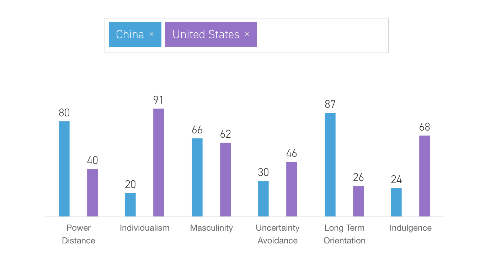

# KFC's Ads Strategy in China

## Theory Analysis

Above are two ads from KFC, which are very open and sexy. Anyway, the ads in mainland China come as follows:

We can see the big difference here, ads in China usually invite influential young celebrities while in the USA, they are much more open and usually sexy. This can due to the culture variation.

### Hofstede's Cultural Dimensions Theory
Hofstede's cultural dimensions theory describes the effects of a society's culture on the values of its members, and how these values relate to behavior, using a structure derived from factor analysis.[^HofstedeWiki] It comes up with six dimentions:
* POWER DISTANCE
* INDIVIDUALISM
* MASCULINITY
* UNCERTAINTY AVOIDANCE
* LONG TERM ORIENTATION
* INDULGENCE

From the results from Hofsted Insights pictured above, we see China is much more implicit than the USA as Indulgence score illustrated.

### Fan Economy

What's more related to KFC China's ads strategy is so called "Fan economy". Fan economy in the traditional sense refers to operational income generating behavior relationship between fans and the people who are followed.[^FanEconomy]

A fan, or fanatic, sometimes also termed aficionado or supporter, is a person who is enthusiastically devoted to something or somebody, such as a singer or band, a sport or a sports team, a genre, a politician, a book, a movie or an entertainer. They may show their enthusiasm in a variety of ways, such as by promoting the object of their interest, being members of a fan club, holding or participating in fan conventions, or writing fan mail and the most important, they buy things which have endorsements from their idol.

In a recent interview, 1.45% of fans in China spend more than income every month in supporting their idols, among whom the income is lower than 3000 yuan per month, the ratio is 4.35%. To more precise, 69.04% of these fans have spent money on their idols and 4.67% of them spend more than 5000 yuan per month.[^FanEconomyAnalysis] That's really a big market, and that's why we see so much influential celebrities in KFC China's ads.

Another phenomenon of fans is a lot of them are teenagers, who are easy to be influenced by other people. If we look into KFC China's 
endorsements, we can easily assert the target is the young, just like decades ago when they first step into China, at when they built children fun park and provided a bunch of toys, but this time, they changed the way.

According to Sina Entertainment, the total fans of TFboys have already reached 17 million and much more for each member of this three people team, 35% of fans of TFboys is younger than 20, and 11.8% of them are willing to buy the products they endorse.[^SinaEntertainment] Lu Han, another influential celebrity whose follows reached 60 million in Weibo, is also invited by KFC China to endorse KFC food. There's a lot more, seems KFC China sincerely believe in these celebrities although they are surely expensive.

Interestingly, most of these celebrities are supported by females. As what big data has proved, women's ability to spend money is much stronger than males'. However, KFC China didn't abandon males, they also cooperate with e-game(such as LOL) competitions.

[^HofstedeWiki]:https://en.wikipedia.org/wiki/Hofstede%27s_cultural_dimensions_theory
[^FanEconomy]:https://en.wikipedia.org/wiki/Fan_economy
[^FanEconomyAnalysis]:http://www.chyxx.com/industry/201812/697638.html
[^SinaEntertainment]:http://ent.sina.com.cn/f/y/youliao48_2/#004