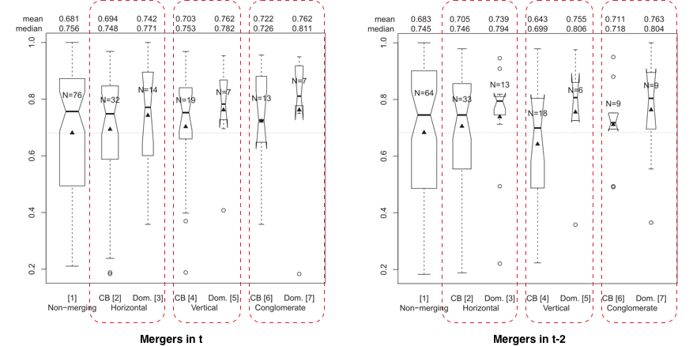
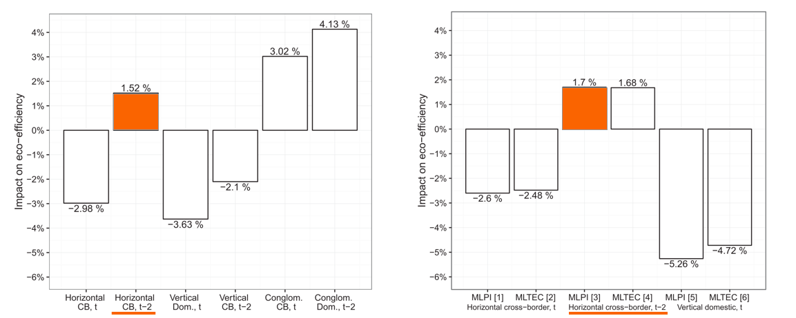
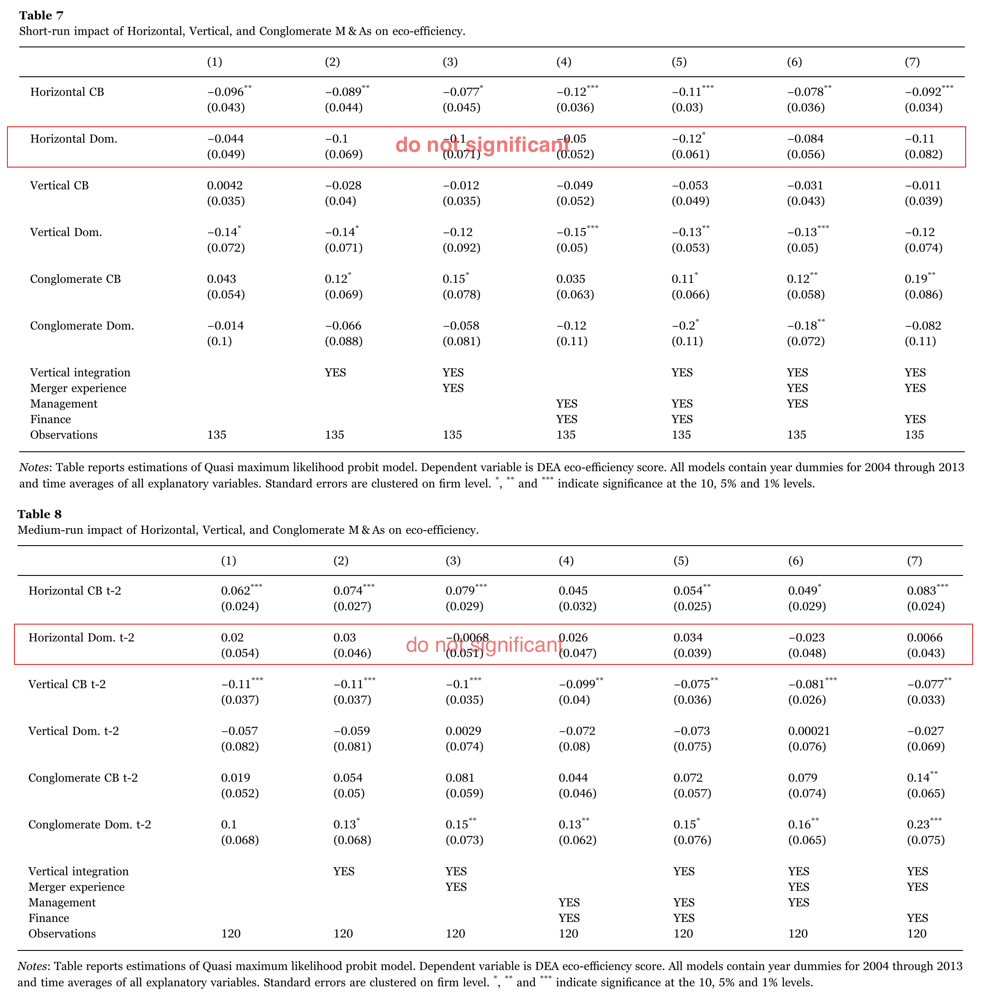

# Eco-efficiency outcomes of mergers and acquisitions in the European electricity industry
<!--Eco-efficiency outcomes of mergers and acquisitions in the European electricity industry-->
<!--2019-05-22-->
<!--M&A, DEA, MLPI-->

```
@article{Monastyrenko2017,
abstract = {The European electricity industry was recently liberalized. In response, there was a surge of mergers and acquisitions (M{\&}As). This study addresses the effects of M{\&}As on the eco-efficiency of European electricity producers in 2005–2013. The environmental production technology comprises CO2 emissions as an undesirable output. I compute eco-efficiency using data envelopment analysis (DEA) and the Malmquist-Luenberger productivity index, which are both based on radial directional distance function. I observe a decreasing trend in average eco-efficiency, which contradicts the previously documented moderate efficiency gains of liberalization. The effects of M{\&}As are isolated using second-step fractional regression. The domestic horizontal M{\&}As, which are systematically regulated by the European Commission, have no impact. Although one cross-border horizontal deal has a same-year effect of roughly −3{\%}, this effect becomes approximately +1.5{\%} over a two-year timespan. Vertical domestic M{\&}As have a short-run negative impact of 3.6{\%} that does not persist over time. Vertical international M{\&}As reduce the eco-efficiency by 2.1{\%} two years after their completion. Limited evidence suggests that the conglomerate deals are at least not harmful. The policy implication is that the merger regulation should be based on DEA eco-efficiency measures. Regulators should devote more attention to cross-border M{\&}As and particularly to vertical deals.},
author = {Monastyrenko, Evgenii},
doi = {10.1016/j.enpol.2017.04.030},
issn = {03014215},
journal = {Energy Policy},
keywords = {Carbon dioxide emissions,Data envelopment analysis,Eco-efficiency,Electric power industry,Fractional regression model,Mergers and acquisitions},
mendeley-groups = {M{\&}A,M{\&}A/DEA},
number = {April},
pages = {258--277},
publisher = {Elsevier Ltd},
title = {{Eco-efficiency outcomes of mergers and acquisitions in the European electricity industry}},
url = {http://dx.doi.org/10.1016/j.enpol.2017.04.030},
volume = {107},
year = {2017}
}
```
[toc]

## Introduction

### Background

In the early 1990s, the European energy market was highly regulated. The liberalization of the European electricity sector started in 1996:


### Literature review


### Intro

Investigates the outcomes of **129** M&As that were completed by the **15** largest European electricity producers between **2004** and **2013**.

**output-oriented DEA model**

**Malmquist-Luenberger productivity index (MLPI)** -- a common measure in intertemporal efficiency evaluation.

## Data and methodology

### M&As

**129** M&As panel data for the **15** largest European electricity producers over the **2005–2013** period, **Datasource**: Thomson Reuters SDC Platinum database.


*All samples are large EU electricity producer acquires a smaller entity*

**Sample Conditions:**
1. the date of completion was between January 2004 and December 2013;
2. the acquisition was realized by one of the studied energy firms rather than by an affiliate, associate or subsidiary company;
3. the acquirer's stake was initially below 50%, but after completion of the acquisition, the stake was 50% or higher.

The total sample is composed of 93 cross-border (72.1%) and 36 domestic (27.9%) deals.


European energy firms merged most intensively in 2006 and 2008, whereas the highest share of interna- tional mergers was observed in 2005. In 2004 and 2010, nearly as many domestic as international mergers occurred.


### DEA

> **inputs**:
> 1. installed capacity
> 2. total operational expenditure 

> **outputs**:
> 1. **good outputs**: 
>    * generated electricity
>
> 2. **bad outputs**: 
>    * carbon dioxide (CO2) emissions


> **Datasource:**
> 1. the energy utility data provided by Enerdata;
> 2. PricewaterhouseCoopers (2013)[^PricewaterhouseCoopers2013];
> 3. Thomson One.


**Tow Approaches:**
1. **The window DEA approach**
   
   The underlying assumption is that the technological frontier does not move within the window.
2. **Malmquist-Luenberger productivity index (MLPI)**
   
   *The Malmquist productivity index (MPI):*

   It can be decomposed into technical change (frontier shift -- technical efficiencie) and efficiency change (position relative to the frontier -- allocative efficiencie).

   *MLPI*

   Is based on the DDF and incorporates both desirable and undesirable outputs.


### Regression Analysis

The Two stage DEA, allows the computation of eco-efficiency values and the isolation of the causal influences of contextual factors. (Actually a **econometric model**)

The appropriate selection of the second-stage estimator should build on the properties of the obtained measures of eco-efficiency.

$$
\begin{aligned} DEAscores_{i t}=& \alpha_{0}+\alpha_{k} N u m M \& A s_{i t}+\beta_{1} GenToSales_{i t}+\beta_{2} TwoMergers_{i t}+\\ &+\beta_{3} TwoCBMergers_{i t}+\gamma_{1} K / S_{i t}+\gamma_{2} I / K_{i t}+\gamma_{3} Y / S_{i t}+ \\ &+ \gamma_{4} Leverage_{i t}+\gamma_{5}Leverage_{i t}^{2}+\gamma_{6} CurrentRatio_{it}
\\ &+\gamma_{7}CurrentRatio_{i t}^{2}\\ &+\Sigma \theta_{m} Location_{i t}+\Sigma_{2005}^{2013} \delta_{t} Year_{t}+\varepsilon_{i t}
\end{aligned}
$$


## Results and discussion


### A first look

#### DEA result: 


#### MLPI result:


The two methods indicate the similar result: **The sector's technical efficiency declines over the entire period of interest.**

**2005-2009**   the overall eco-efficiency of the sector, as well as its technical efficiency, decreased consistently. Meanwhile, allocative efficiency has changed ambiguously. 

> *Hypothesize that vertical mergers have a negative impact on eco-efficiency*.

**2010-2013**   aggregate eco-efficiency over the 2010– 2013 period has experienced marginal growth above the 2009 values.

#### NATIONAL REGULATORY models:


> *incentive-based regulation may favor eco-efficiency.*

### Distinguishing domestic and cross-border M&As

##### Merging and Non-merging Utilities


> * *Mergers and non-mergers have almost identical median scores across the three periods of interest.*
> 
> * *The mean eco-efficiency of merged firms is marginally higher in the year the deal is completed.*
> 
> * *The mean and median eco-efficiency values of firms that merged domestically are higher over all periods of interest.*

##### Short-run impact


##### Average partial effects


> *The results of the fractional regression model suggest that both cross-border and domestic mergers are $\color{red}{\textsf {detrimental}}$ to eco-efficiency in the year of their completion.*

The cross-industry empirical results suggest that, at best, mergers do not impact the acquirers (e.g., Asquith, 1983; Agrawal et al., 1992; Loderer and Martin, 1992), but they are often detrimental (e.g., King et al., 2004; Moeller et al., 2004).

##### Theoretical Explanation

* **"lemons" for sale**, whereby poorly performing firms are targeted for M & As (e.g., Jensen and Ruback, 1983; Lichtenberg et al., 1987).
* **deal premium**, Domestic acquirers are less uncertain about the target's future performance than bidders in international mergers.They are more likely to pay a deal premium, which could be in terms of shareholders wealth or firm efficiency. Therefore, domestic acquirers tend to absorb less-efficient targets first.
* Modern theory is ambiguous on Cross-border M& As:
  1. newfound access to the country-specific capabilities of a foreign target. -- $\color{green}{\textsf {beneficial}}$
  2. (a) acquirers could experience greater informational asymmetry. 
   (b) international bidders face the costs of adapting to the macro- economic, legislative and cultural conditions of the destination country. 
   (c) acquirers must overcome the increased complexity of coordi- nating with foreign affiliate.
* **anti-competitive effects**,cross-border mergers can have weaker anti-competitive effects. Because partners in international deals are more remote, their mutual pre-merger competition is lower, which implies lower efficiency alterations following cross-border mergers.

### Distinguishing among horizontal, vertical, and conglomerate M&As



> * Horizontal and conglomerate mergers should positively contribute to eco-efficiency. 
> * Vertical deals should have positive outcomes over the short run. 
> * In the medium run, vertical cross-border mergers should cause a decline in eco-efficiency. 
> * In the medium run,  vertical domestic ones should have a positive impact.

The regression results suggest that horizontal domestic mergers do not have any statistically significant effects on eco-efficiency.





#### Horizontal

##### Results

> * Horizontal cross-border mergers damage eco-efficiency over the short run.
> 
> * Horizontal cross-border mergers start to positively affect eco-efficiency in the medium run.

##### Theoretical Explanation

A delayed-in-time positive effect can be interpreted based on the idea that acquired underperforming lemons later evolve into over- performing "cherries".


> By **Blonigen et al. (2014):** *Multinationals aim to acquire promising assets immediately after a negative productivity shock because their price is relatively low at that point. Once the integration of an underperforming energy utility (a lemon) in the production structure is finalized, and it becomes an overperforming cherry.*

#### Vertical

##### Results

> * In general, vertical mergers negatively impact the eco-efficiency of European electricity producers. Vertical domestic mergers are detrimental in the short run.
> * In the medium run, the effect is no longer statistically significant.
Thus, domestic and cross-border vertical mergers differ in the timing of their effects.

##### Theoretical Explanation

> **Alfaro et al. (2016)** argued that *the administrative cost of integration is the limiting factor for productivity gains from vertical integration.* 
#### Conglomerate

##### Results

> * Conglomerate mergers positively impact the **DEA** eco-efficiency. However, the regression results for the **MLPI** do not confirm the statistical significance of conglomerate mergers. Thus, there is limited empirical evidence regarding conglomerate mergers.


## Conclusions and policy implications Since

> * The results suggest that the average eco-efficiency of the European energy sector decreased over the 2005–2009 period, and this trend accelerated in 2008, possibly because of the global financial crisis. For 2009–2013, eco-efficiency was, on average, at the 2009 level.

> * This study demonstrates that a merger of any type has a detrimental effect on eco-efficiency of 2.24% in the short run and a positive effect of 0.9% in the medium run.

> * The domestic deals are systematically more detrimental than the cross-border deals.

> * Horizontal domestic mergers do not affect eco- efficiency.

> * Horizontal cross-border mergers have negative short-run effects of approximately 3%. However, over the medium run, deals of this type increase eco-efficiency by roughly 1.5%.

> * Conglomerate mergers have positive effects on eco-efficiency.

> * A vertical domestic merger tends to reduce eco-efficiency by approximately 3.6% in the year of its completion. Over the medium term, cross-border vertical mergers reduce eco-efficiency by 2.1%

引用
---

[^PricewaterhouseCoopers2013]: PricewaterhouseCoopers, 2013. Climate Change and Electricity: European Carbon Factor, benchmarking of CO2 emissions by Europe’s largest electricity utilities. Les Cahiers du Développement Durable 12th Edition. PwC France.
