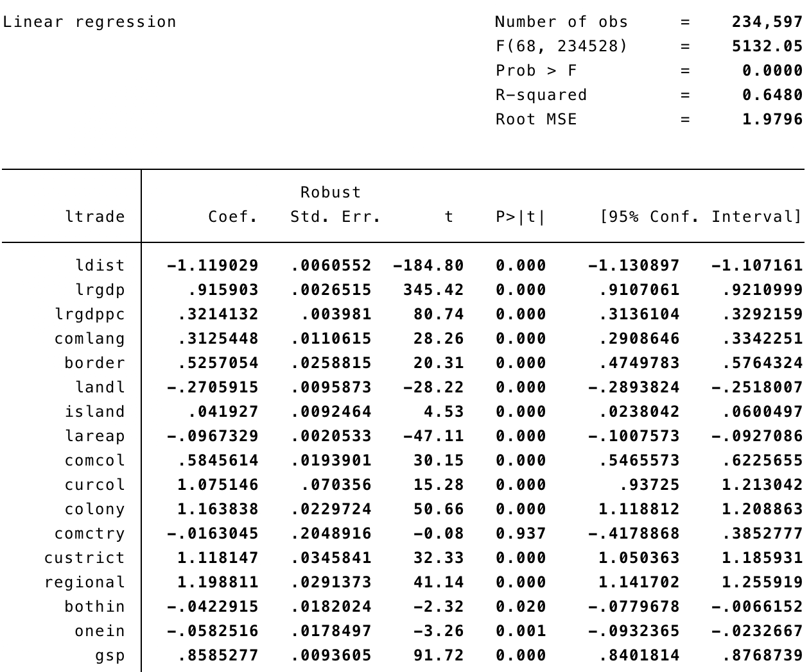

# Do We Really Know the WTO Increases Trade?[^authorsite]
<!--Do We Really Know the WTO Increases Trade? --> 
<!--2020-04-29-->
<!--GATT, WTO, gravity model-->

```
@article{AndrewK.Rose2004,
author = {{Andrew K. Rose}},
doi = {10.2202/1524-5861.1728},
issn = {15245861},
journal = {The American Economic Association},
keywords = {GATT,WTO,gravity model,liberalization,trade promotion},
mendeley-groups = {M{\&}A},
number = {1},
pages = {98--114},
title = {{Do we really know that the WTO increases trade?}},
volume = {94},
year = {2004}
}
```

## Introduction

## Motivation

## Empirical Methodology

To estimate the effect of multilateral trade agreements on international trade, the paper rely on the standard "**gravity**" model of bilateral trade.

The empirical strategy is to control for as many "natural" causes of trade as possible, and search for effects of multilateral agreements in the residual. Once other factors have been taken into account, the author compare trade patterns for countries in the GATT/WTO with those outside the system. the author search for this effect using variation across countries (since not all countries are in the system) and time (since membership of the GATT/WTO has grown). If the GATT/WTO has a large effect on trade, the author expect members to have significantly higher trade than outsiders.

### Model

$$
\begin{aligned}
\ln \left(X_{i j t}\right)=& \beta_{0}+\beta_{1} \ln D_{i j}+\beta_{2} \ln \left(Y_{i} Y_{j}\right)_{t} \\
&+\beta_{3} \ln \left(Y_{i} Y_{j} / P o p_{i} P o p_{j}\right)_{t}+\beta_{4} Lang_{i j} \\
&+\beta_{5} Cont_{i j}+\beta_{6} L a n d l_{i j}+\beta_{7} I s l a n d_{i j} \\
&+\beta_{8} \ln \left(A r e a_{i} A r e a_{j}\right)+\beta_{9} C o m C o l_{i j} \\
&+\beta_{10} C u r C o l_{i j t}+\beta_{11} C o l o n y_{i j} \\
&+\beta_{12} C o m N a t_{i j}+\beta_{13} C U_{i j t} \\
&+\beta_{14} F T A_{i j t}+\Sigma_{t} \phi_{t} T_{t}+\gamma_{1} B o t h i n_{i j t} \\
&+\gamma_{2} O n e i n_{i j t}+\gamma_{3} G S P_{i j t}+\varepsilon_{i j t}
\end{aligned}
$$

Where $i$ and $j$ denotes trading partners, $t$ denotes the time.

*- Dependent variable:*

* $X_{ijt}$ denotes the average value of real bilateral trade between $i$ and $j$ at time $t$,

*- Country variables:*

* $Y$ is the real GDP,
* $Pop$ is population,
* $Area$ is the area of the country,

*- Bilateral Variables:*

* $D_{ij}$ is the distance between $i$ and $j$,
* $Bothin_{ijt}$ is a binary variable which is unity if both $i$ and $j$ are GATT/WTO members at $t$,
* $Onein_{ijt}$ is a binary variable which is unity if either $i$ or $j$ is a GATT/WTO member at $t$,
* $GSP_{ijt}$ is a binary variable which is unity if $i$ was a GSP beneficiary of $j$ or vice versa at $t$,
* ...
* $\varepsilon_{ijt}$ represents the omitted other influences on bilateral trade, assumed to be well-behaved.


$$
\begin{aligned}
X_{i j t} &=e^{\beta_{0}} \times\left(D_{i j}\right)^{\beta_{1}} \times\left(Y_{i} Y_{j}\right)_{t}^{\beta_{2}} \times\left(\frac{Y_{i} Y_{j}}{\operatorname{Pop}_{i} P o p_{j}}\right)_{t}^{\beta 3} \\
& \times\left(e^{\beta_{4} L a n g_{i j}}\right) \times\left(e^{\beta_{5} C o n t_{i j}}\right) \times\left(e^{\beta_{6} L a n d l_{i j}}\right) \times\left(e^{\beta_{7} I s l a n d_{i j}}\right) \\
& \times\left(A r e a_{i} A r e a_{j}\right)^{\beta_{8}} \times\left(e^{\beta_{9} C o m C o l_{i j}}\right) \times\left(e^{\beta_{10} C u r C o l_{i j}}\right) \\
& \times\left(e^{\beta_{11} C o l o n y_{i j}}\right) \times\left(e^{\beta_{12} C o m N a t _{i j}}\right) \times\left(e^{\beta_{13} C U_{i j t}}\right) \times\left(e^{\beta_{14} F T A_{i j}}\right)=\\
& \times\left(e^{\Sigma_{t} \phi_{t} T_{t}}\right) \times e^{\gamma_{1} B o t h i n_{i j t}} \times e^{\gamma_{2} O n e i n_{i j t}} \times e^{\gamma_{3} G S P_{i j t}} \times e^{\varepsilon_{i j t}} \\
&=k \times\left(Y_{i} Y_{j}\right)_{t}^{\beta_{2}}\left(\frac{Y_{i} Y_{j}}{Pop_{i} P o p_{j}}\right)_{t}^{\beta_{3}}\left(A r e a_{i} A r e a_{j}\right)^{\beta_{8}}\left(D_{i j}\right)^{\beta_{1}} \\
&=k \frac{\left(Y_{i} Y_{j}\right)_{t}^{\beta_{2}}\left(\frac{Y_{i} Y_{j}}{P o p_{i} P o p_{j}}\right)_{t}^{\beta_{3}}\left(A r e a_{i} A r e a_{j}\right)^{\beta s}}{\left(D_{i j}\right)^{-\beta_{1}}}
\end{aligned}
$$

## Data

* Trade data from IMF’s Direction of Trade
    * Real US $ (deflate trade by the Amer- ican CPI for all urban consumers (1982-1984 = 100; taken from http://www.freelunch.com)
    * 178 trading entities, most global trade covered 
    * 1948-1999 (with gaps)
    * Average (4 measures -- export from $i$ to $j$, from $j$ to $i$, import from $i$ to $j$, from $j$ to $i$-- of) bilateral exports and imports
* PWT, WDI, IFS for population, GDP
* CIA’s website
* WTO website for GATT/WTO accession
    * Began in 1948 (covered 32 entities)
    * 1960: 50 “contracting parties”
    * 1970: 90
    * 1990: 112
    * Now(2004): 158 with 29 “observers”
* GSP bilateral preferences from UN’s Operation and Effects of the Generalized System of Preferences 
    * Interpolate from 1974, 1979, 1984 (data imperfect)


## An Event Study Approach

Preliminary look at the aggregate data: graphical "event studies" which look at aggregate openness-the ratio of export plus imports to GDP-around the dates of GATT/WTO entry.

$$
Openness_{it} = \frac{Export_{it} + Import_{it}}{Y_{it}}
$$

*Regression:*
$$
Openness_{it} = \alpha_0 + \alpha_1 \ln Y_{it} + \alpha_2 \ln \frac{Y_{it}}{Pop_{it}}
$$


The top left-hand diagram examines openness in the five years before, during (marked by the vertical line), and after entry. The middle line (with circles) shows the mean level of openness, while the two other lines show a confidence interval of plus and minus two standard deviations. **Openness does not seem to vary much in the decade around entry into the multilateral trade system.**

The other three diagrams in the figure are analogous event studies, which plot the residuals once openness has been regressed on the natural logarithms of both real GDP and real GDP per capita. **There is little evidence that GATT/WTO entry has a strong significant effect on the ratio of aggregate trade to GDP in any of the graphics.**

## Benchmark Results



[^authorsite]: http://faculty.haas.berkeley.edu/arose/RecRes.htm