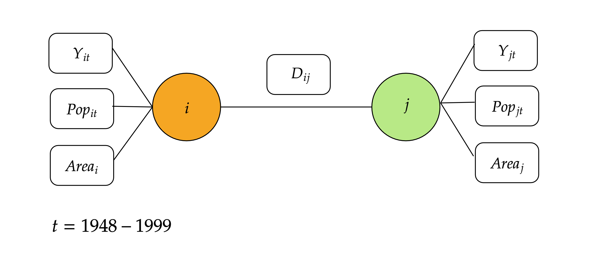

# Do We Really Know the WTO Increases Trade?[^authorsite]
<!--Do We Really Know the WTO Increases Trade? --> 
<!--2020-04-29-->
<!--GATT, WTO, gravity model-->

```
@article{AndrewK.Rose2004,
author = {{Andrew K. Rose}},
doi = {10.2202/1524-5861.1728},
issn = {15245861},
journal = {The American Economic Association},
keywords = {GATT,WTO,gravity model,liberalization,trade promotion},
mendeley-groups = {M{\&}A},
number = {1},
pages = {98--114},
title = {{Do we really know that the WTO increases trade?}},
volume = {94},
year = {2004}
}
```

## Introduction

## Motivation

## Empirical Methodology

$$
\begin{aligned}
\ln \left(X_{i j t}\right)=& \beta_{0}+\beta_{1} \ln D_{i j}+\beta_{2} \ln \left(Y_{i} Y_{j}\right)_{t} \\
&+\beta_{3} \ln \left(Y_{i} Y_{j} / P o p_{i} P o p_{j}\right)_{t}+\beta_{4} Lang_{i j} \\
&+\beta_{5} Cont_{i j}+\beta_{6} L a n d l_{i j}+\beta_{7} I s l a n d_{i j} \\
&+\beta_{8} \ln \left(A r e a_{i} A r e a_{j}\right)+\beta_{9} C o m C o l_{i j} \\
&+\beta_{10} C u r C o l_{i j t}+\beta_{11} C o l o n y_{i j} \\
&+\beta_{12} C o m N a t_{i j}+\beta_{13} C U_{i j t} \\
&+\beta_{14} F T A_{i j t}+\Sigma_{t} \phi_{t} T_{t}+\gamma_{1} B o t h i n_{i j t} \\
&+\gamma_{2} O n e i n_{i j t}+\gamma_{3} G S P_{i j t}+\varepsilon_{i j t}
\end{aligned}
$$

Where $i$ and $j$ denotes trading partners, $t$ denotes the time.



$$
\begin{aligned}
X_{i j t} &=e^{\beta_{0}} \times\left(D_{i j}\right)^{\beta_{1}} \times\left(Y_{i} Y_{j}\right)_{t}^{\beta_{2}} \times\left(\frac{Y_{i} Y_{j}}{\operatorname{Pop}_{i} P o p_{j}}\right)_{t}^{\beta 3} \\
& \times\left(e^{\beta_{4} L a n g_{i j}}\right) \times\left(e^{\beta_{5} C o n t_{i j}}\right) \times\left(e^{\beta_{6} L a n d l_{i j}}\right) \times\left(e^{\beta_{7} I s l a n d_{i j}}\right) \\
& \times\left(A r e a_{i} A r e a_{j}\right)^{\beta_{8}} \times\left(e^{\beta_{9} C o m C o l_{i j}}\right) \times\left(e^{\beta_{10} C u r C o l_{i j}}\right) \\
& \times\left(e^{\beta_{11} C o l o n y_{i j}}\right) \times\left(e^{\beta_{12} C o m N a t _{i j}}\right) \times\left(e^{\beta_{13} C U_{i j t}}\right) \times\left(e^{\beta_{14} F T A_{i j}}\right)=\\
& \times\left(e^{\Sigma_{t} \phi_{t} T_{t}}\right) \times e^{\gamma_{1} B o t h i n_{i j t}} \times e^{\gamma_{2} O n e i n_{i j t}} \times e^{\gamma_{3} G S P_{i j t}} \times e^{\varepsilon_{i j t}} \\
&=k \times\left(Y_{i} Y_{j}\right)_{t}^{\beta_{2}}\left(\frac{Y_{i} Y_{j}}{Pop_{i} P o p_{j}}\right)_{t}^{\beta_{3}}\left(A r e a_{i} A r e a_{j}\right)^{\beta_{8}}\left(D_{i j}\right)^{\beta_{1}} \\
&=k \frac{\left(Y_{i} Y_{j}\right)_{t}^{\beta_{2}}\left(\frac{Y_{i} Y_{j}}{P o p_{i} P o p_{j}}\right)_{t}^{\beta_{3}}\left(A r e a_{i} A r e a_{j}\right)^{\beta s}}{\left(D_{i j}\right)^{-\beta_{1}}}
\end{aligned}
$$

## Data

## An Event Study Approach
$$
Openness_{it} = \frac{Export_{it} + Import_{it}}{Y_{it}}
$$
$$
Openness_{it} = \alpha_0 + \alpha_1 \ln Y_{it} + \alpha_2 \ln \frac{Y_{it}}{Prop_{it}}
$$

[^authorsite]: http://faculty.haas.berkeley.edu/arose/RecRes.htm