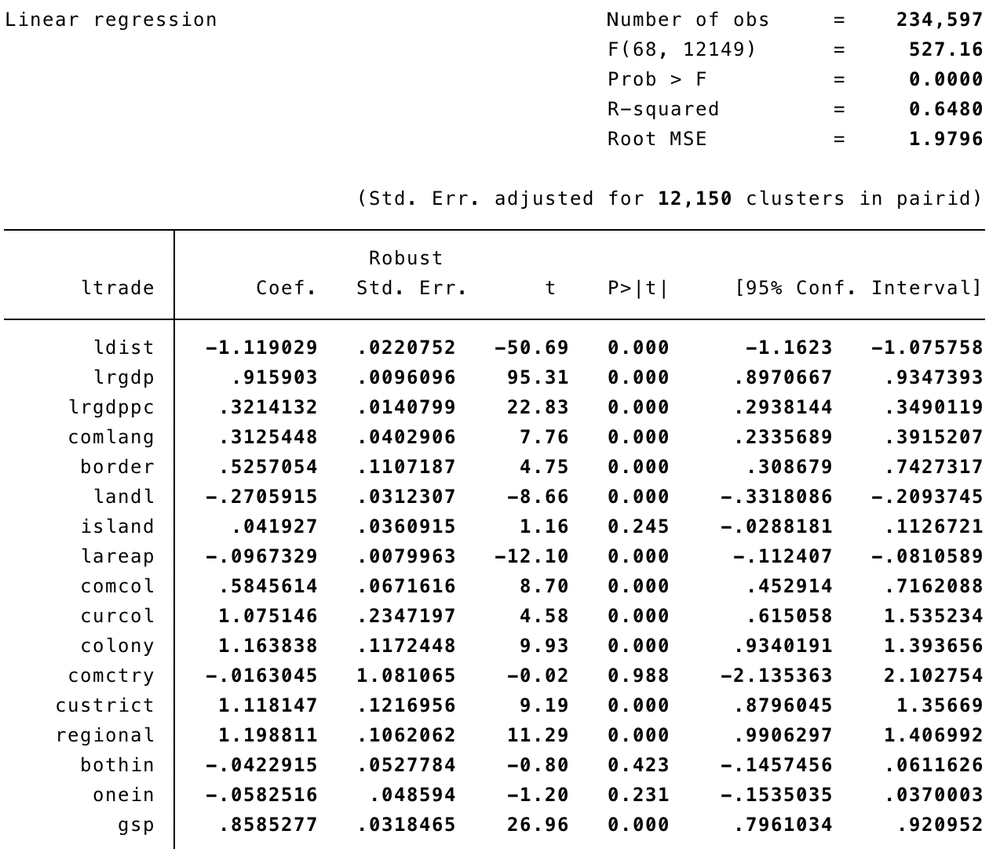
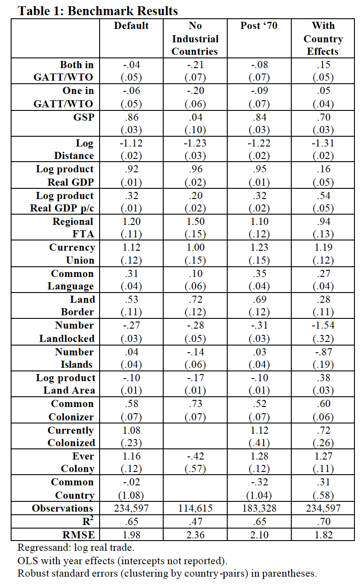

# Do We Really Know the WTO Increases Trade?
<!--Do We Really Know the WTO Increases Trade? --> 
<!--2020-04-29-->
<!--GATT, WTO, gravity model-->

Article Info[^authorsite]
```
@article{AndrewK.Rose2004,
author = {{Andrew K. Rose}},
doi = {10.2202/1524-5861.1728},
issn = {15245861},
journal = {The American Economic Association},
keywords = {GATT,WTO,gravity model,liberalization,trade promotion},
mendeley-groups = {M{\&}A},
number = {1},
pages = {98--114},
title = {{Do we really know that the WTO increases trade?}},
volume = {94},
year = {2004}
}
```

- [Do We Really Know the WTO Increases Trade?](#do-we-really-know-the-wto-increases-trade)
  - [Introduction](#introduction)
  - [Motivation](#motivation)
  - [Empirical Methodology](#empirical-methodology)
    - [Model](#model)
  - [Data](#data)
  - [An Event Study Approach](#an-event-study-approach)
  - [Benchmark Results](#benchmark-results)
    - [Benchmark](#benchmark)
    - [Robust Checks](#robust-checks)
      - [No Industry Countries](#no-industry-countries)
      - [Post 1970](#post-1970)
      - [With Country Effects](#with-country-effects)
    - [Results](#results)
  - [Sensitivity Analysis](#sensitivity-analysis)
    - [Cross-Sectional Analysis](#cross-sectional-analysis)
    - [Allowing the Effects to Vary Over GATT Rounds](#allowing-the-effects-to-vary-over-gatt-rounds)
    - [Allowing the Effects to Vary by Region and Income Class](#allowing-the-effects-to-vary-by-region-and-income-class)
    - [Further Robustness Checks](#further-robustness-checks)
      - [Sample Sensitivity Analysis](#sample-sensitivity-analysis)
      - [Estimation Sensitivity Analysis](#estimation-sensitivity-analysis)
      - [Dynamic Analysis](#dynamic-analysis)
    - [More Technical Issues](#more-technical-issues)
    - [More Positive Results](#more-positive-results)
      - [Perturbation](#perturbation)
      - [Summary of Different Estimates](#summary-of-different-estimates)
  - [Future Research](#future-research)
    - [Caveates and Conclusion](#caveates-and-conclusion)

## Introduction

Economists disagree about a lot, but not everything. Almost all of us think that international trade should be free.The World Trade Organization (WTO) is probably the most popular international institution inside the profession.

<font color='red'><i>But should we-and the protestors-really care about the WTO at all? Do we really know that the WTO and its predecessor the General Agreement on Tariffs and Trade (GATT) have actually promoted trade?</i></font>

No compelling empirical evidence showing that the GATT/WTO has actually encouraged trade. **This paper provide the first comprehensive econometric study of the effect of the postwar multilateral agreements on trade**.

## Motivation

* Many believe that trade is enhanced by multilateral system
    * Part of reason why trade has grown faster than income?
* WTO’s objective: “Its main function is to ensure that trade flows as smoothly, predictably and freely as possible.”
* WTO quotations:
    * “… The achievements of the system are well worth celebrating. Since the General Agreement on Tariffs and Trade began operating from Geneva in 1948, world merchandise trade has increased 16 fold … world trade now grows roughly three times faster than merchandise output … this advance ranks among the great international economic achievements of the post-world war era …”
    * “The past 50 years have seen an exceptional growth in world trade.  Merchandise exports grew on average by 6% annually. Total trade in 2000 was 22-times the level of 1950. GATT and the WTO have helped to create a strong and prosperous trading system contributing to unprecedented growth.”


## Empirical Methodology

To estimate the effect of multilateral trade agreements on international trade, the paper rely on the standard "**gravity**" model of bilateral trade.

The empirical strategy is to control for as many "natural" causes of trade as possible, and search for effects of multilateral agreements in the residual. Once other factors have been taken into account, the author compare trade patterns for countries in the GATT/WTO with those outside the system. the author search for this effect using variation across countries (since not all countries are in the system) and time (since membership of the GATT/WTO has grown). If the GATT/WTO has a large effect on trade, the author expect members to have significantly higher trade than outsiders.

### Model

$$
\begin{aligned}
\ln \left(X_{i j t}\right)=& \beta_{0}+\beta_{1} \ln D_{i j}+\beta_{2} \ln \left(Y_{i} Y_{j}\right)_{t} \\
&+\beta_{3} \ln \left(Y_{i} Y_{j} / P o p_{i} P o p_{j}\right)_{t}+\beta_{4} Lang_{i j} \\
&+\beta_{5} Cont_{i j}+\beta_{6} L a n d l_{i j}+\beta_{7} I s l a n d_{i j} \\
&+\beta_{8} \ln \left(A r e a_{i} A r e a_{j}\right)+\beta_{9} C o m C o l_{i j} \\
&+\beta_{10} C u r C o l_{i j t}+\beta_{11} C o l o n y_{i j} \\
&+\beta_{12} C o m N a t_{i j}+\beta_{13} C U_{i j t} \\
&+\beta_{14} F T A_{i j t}+\Sigma_{t} \phi_{t} T_{t}+\gamma_{1} B o t h i n_{i j t} \\
&+\gamma_{2} O n e i n_{i j t}+\gamma_{3} G S P_{i j t}+\varepsilon_{i j t}
\end{aligned}
$$

Where $i$ and $j$ denotes trading partners, $t$ denotes the time.

*- Dependent variable:*

* $X_{ijt}$ denotes the average value of real bilateral trade between $i$ and $j$ at time $t$,

*- Country variables:*

* $Y$ is the real GDP,
* $Pop$ is population,
* $Area$ is the area of the country,

*- Bilateral Variables:*

* $D_{ij}$ is the distance between $i$ and $j$,
* $Bothin_{ijt}$ is a binary variable which is unity if both $i$ and $j$ are GATT/WTO members at $t$,
* $Onein_{ijt}$ is a binary variable which is unity if either $i$ or $j$ is a GATT/WTO member at $t$,
* $GSP_{ijt}$ is a binary variable which is unity if $i$ was a GSP beneficiary of $j$ or vice versa at $t$,
* ...
* $\varepsilon_{ijt}$ represents the omitted other influences on bilateral trade, assumed to be well-behaved.


Include a comprehensive set of year-specific “fixed” effects to account for such factors as the value of the dollar, the global business cycle, the extent of globalization, oil shocks, and so forth.

$$
\begin{aligned}
X_{i j t} &=e^{\beta_{0}} \times\left(D_{i j}\right)^{\beta_{1}} \times\left(Y_{i} Y_{j}\right)_{t}^{\beta_{2}} \times\left(\frac{Y_{i} Y_{j}}{\operatorname{Pop}_{i} P o p_{j}}\right)_{t}^{\beta 3} \\
& \times\left(e^{\beta_{4} L a n g_{i j}}\right) \times\left(e^{\beta_{5} C o n t_{i j}}\right) \times\left(e^{\beta_{6} L a n d l_{i j}}\right) \times\left(e^{\beta_{7} I s l a n d_{i j}}\right) \\
& \times\left(A r e a_{i} A r e a_{j}\right)^{\beta_{8}} \times\left(e^{\beta_{9} C o m C o l_{i j}}\right) \times\left(e^{\beta_{10} C u r C o l_{i j}}\right) \\
& \times\left(e^{\beta_{11} C o l o n y_{i j}}\right) \times\left(e^{\beta_{12} C o m N a t _{i j}}\right) \times\left(e^{\beta_{13} C U_{i j t}}\right) \times\left(e^{\beta_{14} F T A_{i j}}\right)\\
& \times\left(e^{\Sigma_{t} \phi_{t} T_{t}}\right) \times e^{\gamma_{1} B o t h i n_{i j t}} \times e^{\gamma_{2} O n e i n_{i j t}} \times e^{\gamma_{3} G S P_{i j t}} \times e^{\varepsilon_{i j t}} \\
&=k \times\left(Y_{i} Y_{j}\right)_{t}^{\beta_{2}}\left(\frac{Y_{i} Y_{j}}{Pop_{i} P o p_{j}}\right)_{t}^{\beta_{3}}\left(A r e a_{i} A r e a_{j}\right)^{\beta_{8}}\left(D_{i j}\right)^{\beta_{1}} \\
&=k \frac{\left(Y_{i} Y_{j}\right)_{t}^{\beta_{2}}\left(\frac{Y_{i} Y_{j}}{P o p_{i} P o p_{j}}\right)_{t}^{\beta_{3}}\left(A r e a_{i} A r e a_{j}\right)^{\beta s}}{\left(D_{i j}\right)^{-\beta_{1}}}
\end{aligned}
$$

## Data

* Trade data from IMF’s Direction of Trade
    * Real US $ (deflate trade by the American CPI for all urban consumers (1982-1984 = 100; taken from http://www.freelunch.com)
    * 178 trading entities, most global trade covered 
    * 1948-1999 (with gaps)
    * Average (4 measures -- export from $i$ to $j$, from $j$ to $i$, import from $i$ to $j$, from $j$ to $i$-- of) bilateral exports and imports
* PWT, WDI, IFS for population, GDP
* CIA’s website
* WTO website for GATT/WTO accession
    * Began in 1948 (covered 32 entities)
    * 1960: 50 “contracting parties”
    * 1970: 90
    * 1990: 112
    * Now(2004): 158 with 29 “observers”
* GSP bilateral preferences from UN’s Operation and Effects of the Generalized System of Preferences 
    * Interpolate from 1974, 1979, 1984 (data imperfect)

Descriptive statistics show that the key GATT/WTO and GSP variables are not highly correlated with most of the gravity variables. The only exception is the GSP dummy, which is positively correlated with both real GDP variables, as one might expect (given that richer countries are those that extend the GSP concessions). In other words, multicollinearity is not a problem for the coefficients of interest.


## An Event Study Approach

Preliminary look at the aggregate data: graphical "event studies" which look at aggregate openness-the ratio of export plus imports to GDP-around the dates of GATT/WTO entry.

$$
Openness_{it} = \frac{Export_{it} + Import_{it}}{Y_{it}}
$$

*Regression:*

$$
Openness_{it} = \alpha_0 + \alpha_1 \ln Y_{it} + \alpha_2 \ln \frac{Y_{it}}{Pop_{it}}
$$


The top left-hand diagram examines openness in the five years before, during (marked by the vertical line), and after entry. The middle line (with circles) shows the mean level of openness, while the two other lines show a confidence interval of plus and minus two standard deviations. **Openness does not seem to vary much in the decade around entry into the multilateral trade system.**

The other three diagrams in the figure are analogous event studies, which plot the residuals once openness has been regressed on the natural logarithms of both real GDP and real GDP per capita. **There is little evidence that GATT/WTO entry has a strong significant effect on the ratio of aggregate trade to GDP in any of the graphics.**

## Benchmark Results

### Benchmark

Use the augmented gravity model, estimated with ordinary least squares, year fixed effects, and robust standard errors over the full sample.



Countries that are farther apart trade less, while economically larger and richer countries trade more. These traditional gravity effects are not only large but economically sensible in size, highly statistically significant, and in line with estimates from the literature. Countries belonging to the same regional trade association trade more, as do countries sharing a language, or land border. Landlocked countries trade less, as do physically larger countries. A shared colonial history encourages trade. (Heck, even the notorious currency union effect has an economically and statistically significant effect.) These effects are sensible and explain almost two-thirds of the variation in bilateral trade. Thus, the gravity equation seems to have done a good job in explaining most of the reasons why international trade varies across almost a quarter-million observations.

### Robust Checks

#### No Industry Countries


#### Post 1970


#### With Country Effects

// TODO: Haven't reproduce the result yet.

### Results



It's unable to find evidence that membership in the GATT/WTO has had a strong positive effect on international trade. But since the GSP is associated with an approximate doubling of trade, it seems that the data (rather than the methodology) are delivering the negative message.

## Sensitivity Analysis

### Cross-Sectional Analysis

Tabulate the estimates of {$\gamma_1$, $\gamma_2$, $\gamma_3$} when the gravity equation is estimated on individual years at five-year intervals. (The gravity regressors are included in the regression.


It is possible to find positive significant effects of GATT/WTO membership on trade, if one looks carefully; the data from the 1950's show positive and significant effects of GATT membership. **However**, these coefficients shrink in the 1960's with the large expansion of the GATT and turn negative in the 1970's. The effects are also small in the 1980's and unstable in the 1990's.

### Allowing the Effects to Vary Over GATT Rounds

A different issue is whether the effects of GATT/WTO membership have varied over time.


There is clearly (statistically and economically) significant variation in the coefficients across trade rounds. Nevertheless, it is striking that the only economically large effects are estimated for the first one or two rounds, and most of these are statistically insignificant. Cognoscenti may prefer the fixed-effects estimation shown at the right of the table that focus even more exclusively on time-series variation, since any features which are constant over time for a pair of countries (such as geography, culture, and history) are taken out. Yet these “within” estimates are economically moderate, often insignificant and sometimes negative.

### Allowing the Effects to Vary by Region and Income Class


The GSP estimates remain economically and statistically significant throughout; but GATT/ WTO membership seems to have a negligible (often negative) effect. The only exception is trade for South Asia, where the GATT/WTO effect is economically large but statistically marginal.

### Further Robustness Checks

#### Sample Sensitivity Analysis


Only one of these perturbations has any important positive effect on the key coefficie nts. In particular, when restricted the sample of countries to the industrial countries only, GATT/WTO membership has a somewhat important effect on trade. This result is not of overwhelming statistical significance, and even its economic importance is less than dramatic.

#### Estimation Sensitivity Analysis

Another set of robustness checks concerns the estimation technique.


Still, it is striking that none of the robustness checks of Table 6 deliver economically substantial effects of the GATT or WTO on trade.

#### Dynamic Analysis


It seems that dynamic considerations do not reveal an economically substantive role for the GATT/WTO.

### More Technical Issues

* Reverse Causality biases coefficients *up*
    * *Countries may join the WTO/GATT in order to increase trade, but that would tend to bias the key coefficients upwards.*
* Little *measurement error* with respect to accession dates
    * *Only accession year considered in this paper.*
* Little evidence of trade *diversion* (or *creation*!)
* Missing data
    * Missing trade data (since trade cannot be less than zero); -- Heckman’s “treatment methodology”
    * Missing regressor data, primarily GDP. -- dropped from the regression analysis
    * Also missing output: possibly more serious

The paper conclude that the key findings are robust. **Membership in the GATT/WTO seems not to have an economically or statistically significant effect on trade, while the GSP encourages trade.**

### More Positive Results

#### Perturbation

<font color='red'><i>Why economists have assumed that the GATT has been so important in encouraging trade?</i></font>


That is, the GATT/WTO seems to have a huge effect on trade if one does not hold other things constant; the multilateral trade regime matters, ceteris non paribus. **Simply taking into account standard gravity effects essentially eradicates any large effect of the GATT/WTO on bilateral trade.**

#### Summary of Different Estimates

* 80 estimates of $\gamma_1$
    * Mean: .05
    * Median: .02
    * 39 negative
    * 4 greater than .69 (doubling)
    * 1 w/o gravity, other 3 insignificant at .01
    * 71% t-statistics<2.5

**The regression analysis is saying (albeit with the whisper associated with negative results) that there is little evidence that GATT/WTO membership has a substantial positive effect on trade.**

## Future Research

* It is possible that GATT/WTO accession has different effects on exports and imports.
* Decomposing trade by industry may be interesting.
* Investigating the impact of the multilateral system on trade in services is also a potential subject for future work.
* Examining capital flows and the prices of both output and input factors may be revealing.
* De jure accession to the multilateral system may not be the same as de facto accession. Implicit accession may either lead formal accession or lag it.
* A more structural approach may bring sharper results, as well as being of intrinsic interest.
* Do other parts of the multilateral international economic order matter? e.g. IMF.
* Why the GATT/WTO doesn’t seem to have had much of an impact on trade.
    * the GATT/WTO members haven't systematically lower trade barriers.
        * the GATT/WTO has not typically forced most countries to lower trade barriers, especially developing countries that have received "special and differential treatment."
        * members of the WTO seem to extend most-favored-nation status unilaterally to countries outside the system, even though they are under no WTO formal obligation to do so.

### Caveates and Conclusion

* **Perhaps** the GATT has not had much of an effect on trade ... but the WTO will. **Perhaps**.
* **Perhaps** the GATT and WTO have large ef- fects on income or welfare but only through mechanisms other than trade. **Perhaps**.
* **Perhaps** the GATT and WTO have acted as an international public good, freeing trade for all countries independent of whether they are members or not. **Perhaps**.
* Why has trade grown faster than income, if not because of the GATT/WTO?
    * Higher productivity in tradables
    * Falling transport costs
    * Regional trade associations
    * Converging tastes
    * Changing factor endowments
    * Growing liquidity

It is surprisingly hard to demonstrate convincingly that the GATT and the WTO have encouraged trade. **One should not conclude the GATT and WTO have not increased trade** (although the author wish it was eas- ier to see in the data). Rather, since common sense and conventional wisdom accord an important role to the GATT/WTO in creating trade, the author prefer to **view this negative result as an interesting mystery**.

[^authorsite]: http://faculty.haas.berkeley.edu/arose/RecRes.htm