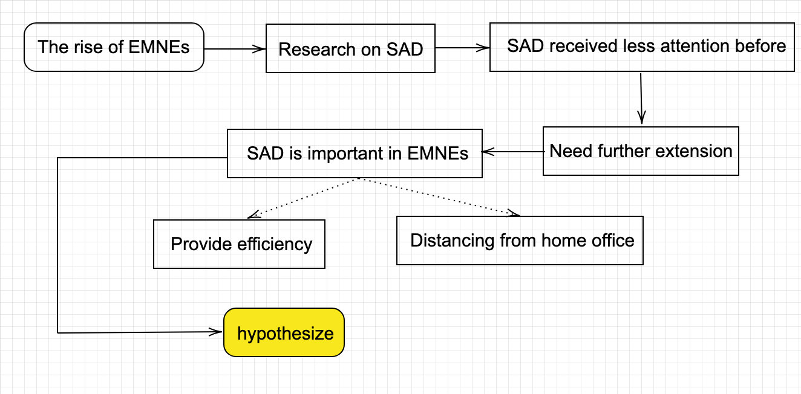
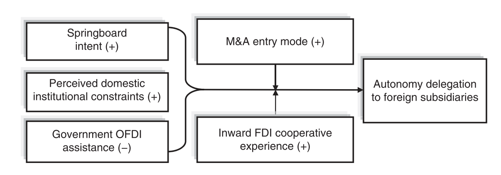
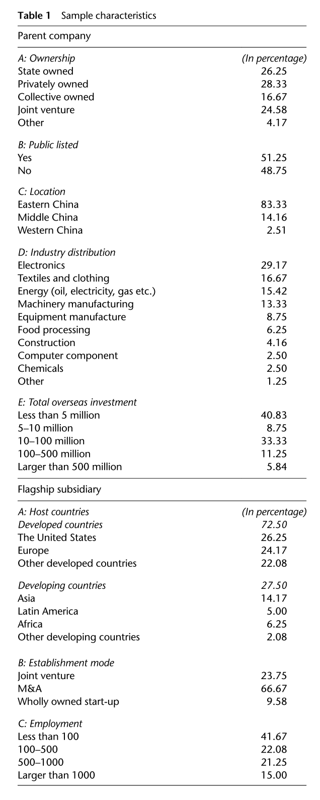
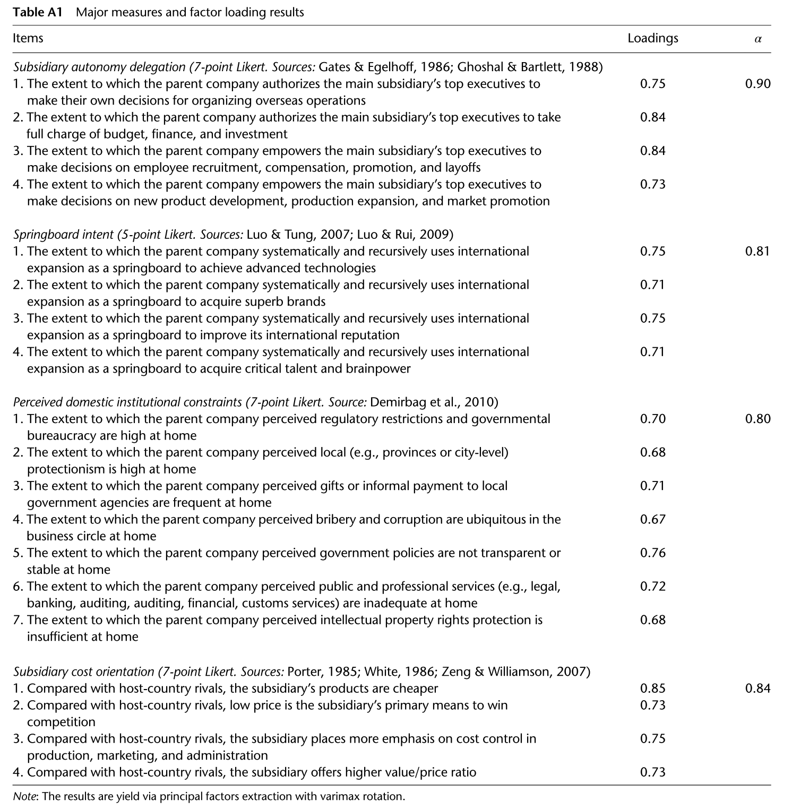
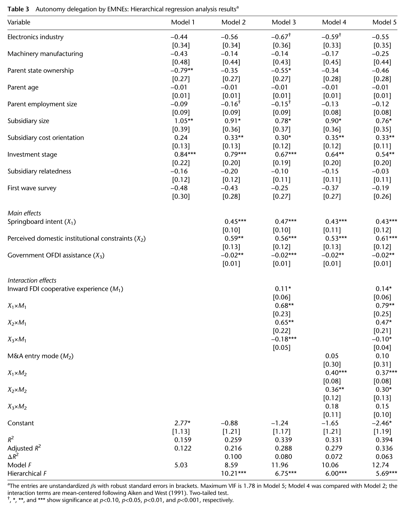

# Autonomy delegation to foreign subsidiaries: An enabling mechanism for emerging-market multinationals

(赋予外国子公司自治权：新兴市场跨国公司的授权机制)

## INTRODUCTION

The rise of emerging-market multinational enterprises (EMNEs) provides an ideal opportunity to complement a long line of research on the antecedents of **subsidiary autonomy delegation** in the area of international business.

Subsidiary autonomy received less attention in early MNE-centered perspectives and greater attention in later subsidiary-based perspectives.

* **early MNE-centered perspectives**: focus on the benefits of control and efficiency in exploiting home-based advantages.
* **later subsidiary-based perspectives**: emphasize the increased importance of subsidiaries in the widespread and complex MNE network.

Complex institutions in emerging economies are conducive to **disadvantages**, rather than advantages, in global competition for internationalizing domestic firms.

> Traditional views on the design of foreign subsidiary autonomy need further extension.
> Building on theoretical developments proposing that internationalization can be a way for EMNEs to overcome home-country-based disadvantages at both the firm and country levels (Bartlett & Ghoshal, 2000; Boisot & Meyer, 2008; Luo & Tung, 2007; Mathews, 2006), we argue that **EMNEs use subsidiary autonomy delegation as a key strategic mechanism and an organizational platform to lessen their home-originated weaknesses after foreign entry**.

Subsidiary autonomy plays a twofold role for EMNEs:

1. Providing efficiency in EMNEs’ approaches to overcome latecomer disadvantages.
   1. **Metanational advantage**(firms benefit from tapping globally dispersed knowledge, rather than from exploiting advantages learned in the home country).
      1. Strategic asset-seeking behaviors to compensate for EMNEs’ deficiencies in brand recognition, technological knowledge, and managerial expertise (Child & Rodriguez, 2005)
      2. Opportunity-seeking behaviors to exploit existing resources, and access and leverage locally embedded knowledge from around the world (Gubbi, Aulakh, Ray, Sarkar, & Chittoor, 2010)
   2. **However**, these approaches require abilities which can be challenging to accomplish without prior international experience and organizational expertise to organize complex activities globally, as well as in a realm of domestic institutional constraints.
      1. Organizational learning (Mathews, 2006)
      2. Development of strong learning capabilities (Bartlett & Ghoshal, 2000)
2. Distancing the foreign subsidiary from home office impediments instilled by the domestic institutional environment.
   1. Domestic institutions in emerging economies can impose constraints for the post-entry foreign operation of EMNEs.
      1. EMNEs may suffer from weak corporate governance and accountability (Luo & Tung, 2007)
      2. Have generally poor credibility and image in the host country (Bartlett & Ghoshal, 2000)
   2. In addition, as a consequence of the institutional voids in emerging economies (Khanna & Palepu, 1997), it is particularly relevant during the post-entry stage in host countries, and hence requires remedies different from the ones that focus on circumventing institutional voids in the home country (Khanna & Palepu, 2010)

hypothesize that subsidiary autonomy delegation is particularly salient among those EMNEs that rely on foreign markets as a springboard to acquire strategic assets.

## THEORY DEVELOPMENT

### Antecedents of Subsidiary Autonomy

Emphasis on **subsidiary autonomy** has increased as research moved from **MNE-centered** to **subsidiary-centered** perspectives (Paterson & Brock, 2002)

On the basis of the experiences of MNEs from **advanced economies**, the evolution of these views is fundamentally based on the idea of exploiting ownership advantages built in the home country (Dunning, 1988, 1993) and incrementally expanding global operations (Johanson & Vahlne, 1977, 1990).

Traditional views on the antecedents of subsidiary autonomy are difficult to apply – neither can the MNE-centered perspectives be applied to the resource-disadvantageous position of EMNEs, nor can the subsidiary-centered perspectives be easily applied to the fledgling network of most EMNEs.

### EMNE Perspectives

The pioneering scholarly works on EMNEs, includ- ing the work of Kumar and McLeod (1981) and Wells (1983), have provided unique features of EMNEs, such as:

* the lack of proprietary advantages
* weaker home institutions
* the latecomer status.

Recent theoretical developments have particularly highlighted **how EMNEs use internationalization to overcome their existing disadvantages** on the global stage (Bartlett & Ghoshal, 2000; Luo & Tung, 2007; Mathews, 2002, 2006).

Nevertheless, according to a recent study by *McKinsey Quarterly*,in the last decade EMNEs grew approximately **twice as fast** as those domiciled in advanced economies (Atsmon, Kloss, & Smit, 2012).

The insufficiency of mainstream internationalization theories, such as the `eclectic paradigm` (Dunning, 1988, 1993) and the `internationalization process model` (Johanson & Vahlne, 1977, 1990), to explain this phenomenon has spurred the development of other theoretical perspectives:

1. **springboard perspective** (Luo & Tung, 2007)
    Springboarding is a mechanism not only to catch up with advanced MNEs, but also to seekmore extensive long-term strategic gains. Luo and Tung (2007) specifically explain that springboarding is systematic, because it reflects a deliberate long-range strategy for improvement in competitive positions, as well as recursive in the sense that it is both recurrent (different actions serve different purposes) and revolving (international and domestic activities are integrated).
2. **linkage-leverage-learning (LLL) framework** (Mathews, 2002, 2006)
    EMNEs can generate competitive advantages, despite their latecomer status and scarcity of resources, by strategically targeting resources that are least rare and most imitable and transferable. In turn, EMNEs cumulatively learn to absorb and deploy resources of increasing sophistication and complexity, subsequently enabling them to **turn latecomer disadvantages into competitive advantages**.

Overall, both EMNE perspectives <u>underscore</u> the approaches that EMNEs take to overcome their disadvantages on the world stage.

### EMNEs’ Post-Entry Disadvantages

EMNEs’ distinctive disadvantages:

1. **latecomer disadvantages**
    Resource and capability voids in comparison with leadingmultinationals. These disadvantages originate both from EMNEs’ late entry in international competition and from their home countries’ latecoming to the world economy.
2. **domestic institutional heritage**
    The organizational characteristics of EMNEs that are permeated by the domestic institutional environment and carried over in host countries. Owing to domestic institutional constraints, this heritage of EMNEs is often negative, and contributes to an undesirable image outside their home country, despite the potential initial motivation of EMNEs to escape such constraints.

## HYPOTHESES

Building on the idea that internationalization serves as a scheme for EMNEs to overcome their home-country-based disadvantages, we advance the idea that subsidiary autonomy delegation is an **effective strategic mechanism for EMNEs to overcome their post-entry disadvantages**.

1. delegating autonomy to key subsidiaries equips them with greater capacity to perform critical functions in foreign markets (e.g., Prahalad & Doz, 1981).
    This role of subsidiary autonomy is particularly relevant to EMNEs seeking to use internationalization as a springboard to overcome their resource and capability disadvantages.
2. delegating autonomy to subsidiaries distances them administratively and organizationally from the parent organization.
    This role of subsidiary autonomy is particularly relevant to EMNEs whose managers realize the challenges imposed by their home-country institutional environment.

Despite this twofold role, subsidiary autonomy delegation is unlikely to be universal across all EMNEs. The twofold role of subsidiary autonomy delegation may be much less valuable for domestic-government-supported EMNEs.

Taking into account all these characteristics of subsidiary autonomy in EMNEs, we examine the main effects of three factors at the level of the parent company:

1. springboard intent
2. perceived domestic institutional constraints
3. government OFDI (outward foreign direct investment) assistance

### Springboard Intent

> **Hypothesis 1**: An EMNE with stronger spring-board intent will be characterized by greater foreign subsidiary autonomy delegation.

We define an EMNE’s **springboard intent** as:
* the extent to which the firm intends to use international expansion systematically and recursively as a springboard to compensate for its resource and capability voids.

EMNEs with higher springboard intent require appropriate internationalization mechanisms that fulfill their long-range plan to improve strategic competitiveness. Their success depends on the capacity of foreign units to perform such `uncertain`, `risky`, and often `complex` learning tasks (Barkema & Vermeulen, 1998). Therefore EMNEs need an organizational mechanism that supports and protects such capacity. This need is further exacerbated by the lack of foreign experience among EMNEs, and their corresponding unfamiliarity with the way such activities should be performed outside the home country. **A powerful organizational mechanism to provide such capacity is autonomy delegation to subsidiaries.**

### Perceived Domestic Institutional Constraints

> **Hypothesis 2**: An EMNE that perceives greater domestic institutional constraints will be characterized by greater foreign subsidiary autonomy delegation.

Institutional constraints in emerging economies include: 

* **institutional voids** (i.e., lack of effective intellectual property rights protection, absence of intermediaries that facilitate the functioning of the market, poor commercial law enforcement, or underdeveloped factor markets; Boisot & Meyer, 2008; Khanna & Palepu, 1997);
* **institutional hazards** (i.e., presence of public sector corruption, moral degradation, ambiguous laws, government intervention, or informal competition; Ramachandran & Pant, 2010; Witt & Lewin, 2007).

One major consequence of these institutional constraints is the poor corporate governance for emerging-market firms. Since the success of an EMNE depends critically on the success of its foreign units, it becomes imperative for it to find ways for its subsidiaries to build strong corporate governance and disassociate themselves from the parent company. **Delegating autonomy to subsidiaries may provide the necessary organizational platform to overcome negative heritage associated with home institutions.**

Domestic institutional constraints also have psychological consequences for domestic managers in the form of self-doubt or overconfidence in their company’s true potential in global competition, thereby stifling their emphasis on foreign operations (Bartlett & Ghoshal, 2000). **By hiring senior executives from the host-country market, who can act as “offshore champions” (Bartlett & Ghoshal, 2000: 80) in subsidiaries, EMNEs are able to distance themselves from the image of the parent company, and build their own reputation and legitimacy.**

### Government OFDI Assistance

> **Hypothesis 3**: An EMNE that utilizes government assistance for its internationalization will be characterized by lower foreign subsidiary autonomy delegation.

emerging-market governments (e.g., in China and India) have implemented numerous policies to promote OFDI, including direct assistance in the form of preferential credit and subsidies, host-country information, and guidance on the direction of OFDI, or administrative assistance in the form of supervision or reduced bureaucratization of the approval process (Luo et al., 2010).

Acquiring such assistance reduces the severity of perceived disadvantages on the world stage.

The availability of government assistance suppresses the need for EMNEs to address their disadvantages through organizational mechanisms such as subsidiary autonomy.

### Inward FDI Cooperative Experience

> **Hypothesis 4**: The effects of (a) springboard intent, (b) perceived domestic institutional constraints, and (c) government OFDI assistance, on subsidiary autonomy delegation are strengthened with greater inward FDI cooperative experience.

Inward FDI cooperative experience refers to an EMNE’s involvement in cooperative arrangements (e.g., joint ventures, strategic alliances, or original equipment design/manufacturing) with foreign multinationals in the EMNE’s home country prior to engaging in significant outward FDI. In such inward partnerships, especially with developed-country MNEs, domestic firms may be able to acquire modern practices that strengthen their international competitiveness (Guthrie, 2005). 

Through inward FDI experience, EMNEs’ managers may expand their expertise beyond the traditional control-centered approach. As a result, inward FDI cooperative experience will augment EMNEs’ use of subsidiary autonomy delegation to overcome their post-entry disadvantages.

### M&A Entry Mode

> **Hypothesis 5**: The effects of (a) springboard intent, (b) perceived domestic institutional con- straints, and (c) government OFDI assistance, on subsidiary autonomy delegation are strengthened when the subsidiary is established through an M&A entry mode.

EMNEs frequently build foreign subsidiaries through high-risk entry modes such as M&A (Child & Rodriguez, 2005). M&As are high-risk entry modes, partly because their success depends on the effectiveness of absorbing new knowledge and learning about the host-country market (Barkema&Vermeulen, 1998). When this knowledge is more uncertain, ambiguous, and tacit, the need for decentralized decision making to overcome home-based disadvantages increases (Luo, 1999).

EMNEs with high springboard intent and greater perceptions of domestic institutional constraints, and using less government assistance in internationalization, will be more likely to use subsidiary autonomy delegation when they use M&A entry modes.

## METHODS

### Data

This study uses a survey of EMNEs from China to test the foregoing propositions.

The source of the data for this study is a large **survey** we conducted throughout China in two waves: 2008–2009 and 2012.

#### Survey Design

We initially designed our survey in English, expanding on previous relevant literature (e.g., Andersson & Forsgren, 1996; Birkinshaw& Morrison, 1995; Brooke, 1984; Gates & Egelhoff, 1986; Ghoshal & Bartlett, 1988). The original survey questionnaire was then translated into Chinese, and cross-checked by over two dozen professors of management and senior doctoral students in China. It was further pre-tested for instrument validity by 50 EMBA students, all with an international business background, at a leading business school in China. To ensure conceptual equivalence, we then had a doctoral student re-translate the Chinese survey into English. On the basis of the feedback from all these sources, we revised or reworded the questions or terms that were considered ambiguous or difficult to interpret.

#### Survey Unit

Our survey unit was Chinese parent firms already engaging in OFDI. We used **senior corporate executives (C-suite level) as the major respondents**, with the assistance of other informants (e.g., accountants, marketing directors, or human resource managers) if needed. The sample firms themselves were obtained through a series of source contacts:

* we contacted China’s Ministry of Commerce, from which we collected the list of those provinces that had undertaken OFDI.
* we contacted provincial-level agencies in charge of OFDI (for provinces having at least $1 billion of OFDI stock by 2007), and through some of these agencies obtained the list of companies engaging in OFDI.
* we cross-checked the list with all Chinese companies with OFDI listed on the Shanghai Stock Exchange.

#### Survey Process

On the basis of these efforts, we finally identified **372 companies with OFDI in manufacturing sectors**.

We contacted all 372 companies, and after 3 rounds of attempts **246 companies** (66% of the population) indicated willingness to participate in the survey.

At the end of the survey process we eliminated five questionnaires that had incomplete information for the variables that were our focus (i.e., those having more than three missing values).

As a result, we had **240 final completed questionnaires (1 per firm)**, with **91** coming from firms surveyed in 2012 and **148** from firms surveyed during the first wave in 2008–2009.

We checked for non-response bias based on the information from the original sample list. The mean differences between responding and non-responding firms in major firm attributes, such as firm age, employment size, total OFDI investment, and the length of foreign operations, were contrasted using the t-test. Results indicated that the t values were **not significant**.

In many cases, EMNEs had only one subsidiary as the flagship subsidiary. If the firm had multiple foreign subsidiaries, we asked respondents to refer to the company’s main subsidiary (the central unit playing the most important strategic role for the company’s global expansion) as the subsidiary on point for answering subsidiary-level questions. For the few cases when respondents felt the company had more than one such subsidiary, we asked them to refer to the subsidiary that was established first.

### Measurement

We conducted both exploratory and confirmatory factor analyses. Loading patterns in both analyses clearly differentiate across variables and factor solutions consistent with our propositions.

#### Dependent Variable

  * **subsidiary autonomy**[^RedVariable]: is measured by four 7-point Likert items, adopted from the instruments used by Gates and Egelhoff (1986) and Ghoshal and Bartlett (1988). The variable high-lights the extent to which the parent company authorizes the leading subsidiary’s operational and strategic decision-making power. The final measure of subsidiary autonomy is the average of responses to these four items with high validity and reliability (Cronbach’s α= 0.90, convergent factor loadings from 0.73 to 0.84, and communality estimates from 0.64 to 0.78).

#### Independent Variables

  * **springboard intent**: was measured by four 5-point Likert items. we evaluated the extent to which the parent company aims to use international expansion systematically and recursively as a springboard to achieve advanced technologies, to acquire superb brands, to improve international reputation, and to acquire critical talent and brainpower. The variable indicates satisfactory reliability and validity, with a Cronbach’s α of 0.81, convergent factor loadings from 0.71 to 0.75, and communality estimates from 0.55 to 0.71.
  * **Perceived domestic institutional constraints**: were measured by seven 7-point Likert items, capturing the degree of the domestic regulatory and bureaucratic restriction, threats from local protectionism, corruption, and non-transparent and inadequate rules and policies (Demirbag, McGuinness, & Altay, 2010). The variable indicates satisfactory reliability and validity, with a Cronbach’s α of 0.80, convergent factor load- ings from 0.67 to 0.76, and communality estimates from 0.58 to 0.61.
  * **Government OFDI assistance**: was measured by the percentage of the focal firms’ capital that is from government subsidies or government-owned bank loans.

#### EM-specific Moderators

  * **inward FDI cooperative experience**: was measured with the average number of years of the parent company’s participation in joint ventures, cooperative alliances with foreign firms at home, or assembling foreign products or processing foreign materials for foreign firms before venturing abroad (Luo & Tung,2007; Zhou,Wu, &Luo,2007).
  * **M&A entry mode**: is a dummy variable (1 if the subsidiary was established via M&As, and 0 otherwise).

#### Control Variables

  * **parent firm ownership**: 1 if state-owned;
  * **parent firm age**: number of years;
  * **parent firm size**: number of full-time employees;
  * **two industry dummies**: electronics and machinery;
  * **subsidiary size**: measured by the amount of investment in the leading subsidiary as a percentage of total foreign investment;
  * **subsidiary cost advantage**: measured by four 7-point Likert items;
  * **investment stage**: 1= start-up, 2=early growth, 3=maturity;
  * **subsidiary relatedness**: the extent to which the main subsidiary and its parent firm are operationally interrelated in terms of upstream activities (e.g., raw materials, components, and technologies) or downstream activities (e.g., promotion, marketing, distribution, and services) (Bartlett & Ghoshal, 1989; Ghoshal & Nohria, 1989), measured by a single 7-point Likert item;
  * **first wave survey**: 1=first wave survey, 0=second wave survey.

### Common Method Variance Check

Most items used in this study were related to factual information (e.g., government OFDI assis- tance, inward FDI cooperative experience) or environments (e.g., domestic institutional constraints), and were **not issues that focused on social responsibility bias**.

In the post-survey stage, we interviewed 20 original respondents to check their response accuracy. The results showed **high consistency between their interview reports and their survey answers** (Pearson correlation R⩾0.88).

Cross-checked survey responses against the publicly available information – specifically, information pertaining to survey questions – for sample companies listed on the Shanghai Stock Exchange. **We found high consistency**.

Dispatched cross-checked 16 randomly selected sample firms by asking an alternative senior executive at each firm to complete the survey, and comparing these against the original survey responses by the first executive. Our comparison suggests that the responses of the two executives from the same responding company are **highly consistent for question items used in this study** (Pearson correlation R⩾0.80).

as a post hoc remedy and an effort to check the dyadic consistency between parent and subsidiary executive responses, we collected surveys from 12 leading subsidiary executives (one executive from each different subsidiary) whose responses were **highly consistent with those reported by the parent’s senior executives** (t=0.55–0.75, p>0.05).

conducted a Harman’ssingle-factor test, wherein all variables are allowed to load onto a single factor. The model demonstrated very poor fit (the model failed to converge), suggesting that there are **no significant common variance threats**.

## Results

Model 1 is the baseline model with all control variables included.

Model 2 presents our findings on the effects of three EMNE-specific parameters on autonomy delegation. **Corroborating Hypothesis 1**, the effect of springboard intent on autonomy delegation is found to be significant and positive (β=0.45, p<0.001). Hypothesis 2 proposes that the impact of perceived domestic institutional constraints on the level of autonomy delegation is positive. The result ( β = 0.59, p<0.01) **supports Hypothesis 2**. Government OFDI assistance is found to be significantly and negatively related to subsidi- ary autonomy ( β =−0.02, p<0.01), **lending support to Hypothesis 3**.

In Model 4, the interaction terms between inward FDI cooperative and springboard intent (β= 0.68, p<0.01) and perceived domestic institutional con- straints (β= 0.65, p<0.01) are both positive and statistically significant, and the interaction term between inward FDI cooperative and government OFDI assistance (β=−0.18, p<0.001) is negative and statistically significant. Compared with Model 2, Model 3 also explains a greater amount of variance in subsidiary autonomy ($\Delta R^2$ = 0.08, hierarchical F=6.75, p<0.001). Hence **Hypotheses 4a, 4b, and 4c are all strongly supported**.

In Model 6, the interaction terms between M&A entry mode and springboard intent (β=0.40, p<0.001) and perceived domestic insti- tutional constraints (β=0.36, p<0.01) are both positive and significant, validating the positive mod- erating effect of M&A entry mode. The interaction term between M&A entry mode and government OFDI assistance, however, is positive but insignificant (β=0.18, p>0.10). Compared with Model 2, Model 4 also explains a greater amount of variance in subsidi- ary autonomy ($\Delta R^2$=0.07, hierarchical F=6.00, p<0.001). Hence **Hypotheses 5a and 5b are strongly supported, and Hypothesis 5c is not supported**. The rejection of Hypothesis 5c shows that the link between government OFDI assistance and autonomy delegation is independent of the subsidiary entry mode.

In Model 5 (the full model) **all main effects remain significant, suggesting the resilient main effects on autonomy delegation. All significant interaction effects remain significant**. Compared with Model 4, Model 5 explains a significantly greater amount of variance in subsidiary autonomy ($\Delta R^2$=0.063, hierarchical F=5.69, p<0.001).

### Robustness Check

As a robustness check, we cross-validated our results with re-sampling techniques. We calculated bootstrap standard errors with 10,000 replicates and statistical tests from the average of the statistic from the bootstrap samples. We also randomly split the sample into two groups, comparing the model results from one sample with the results from the other, and obtained similar results.

To rule out possible endogeneity threats, we performed the two-stage least-square instrument variable test. We use domestic population density (1 year lagged), which varies at the province level, as an instrument variable, and find that our results are robust.

## DISCUSSION AND CONCLUSION

[^RedVariable]: Red variables are from survey.