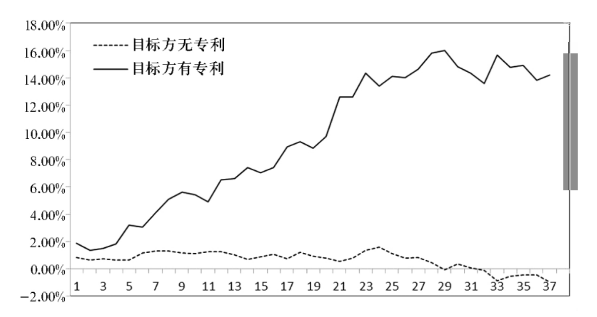
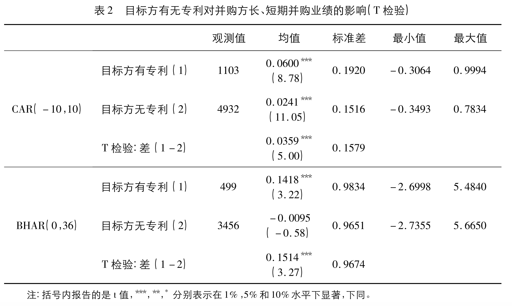
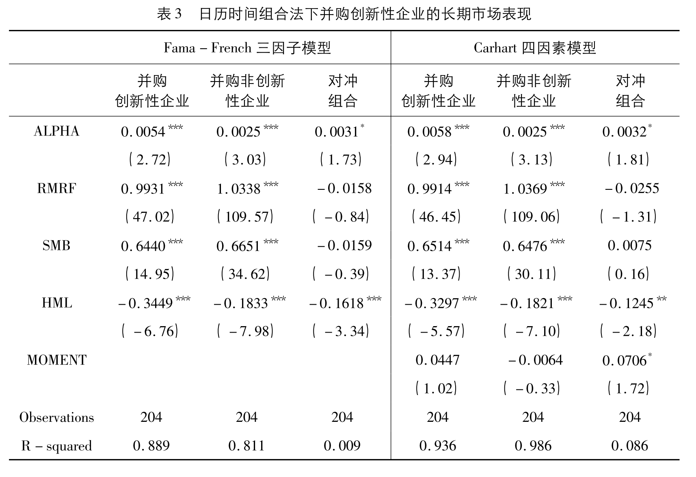
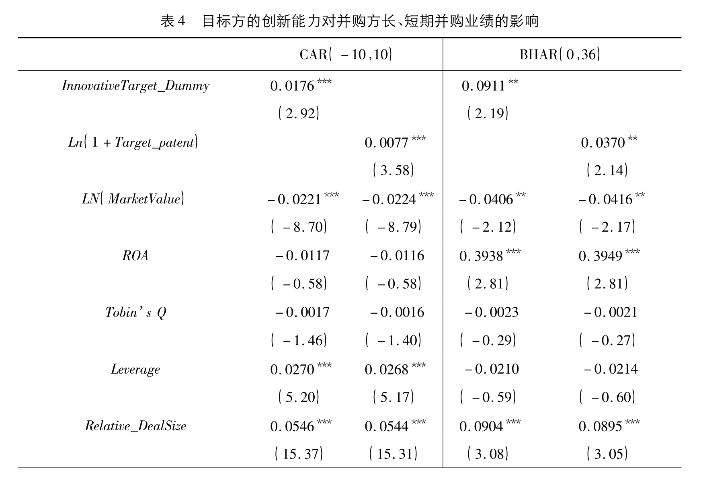
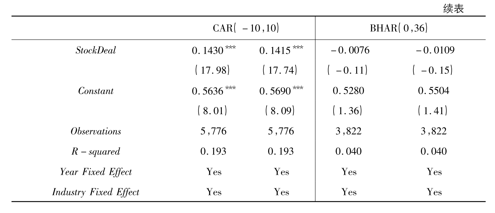
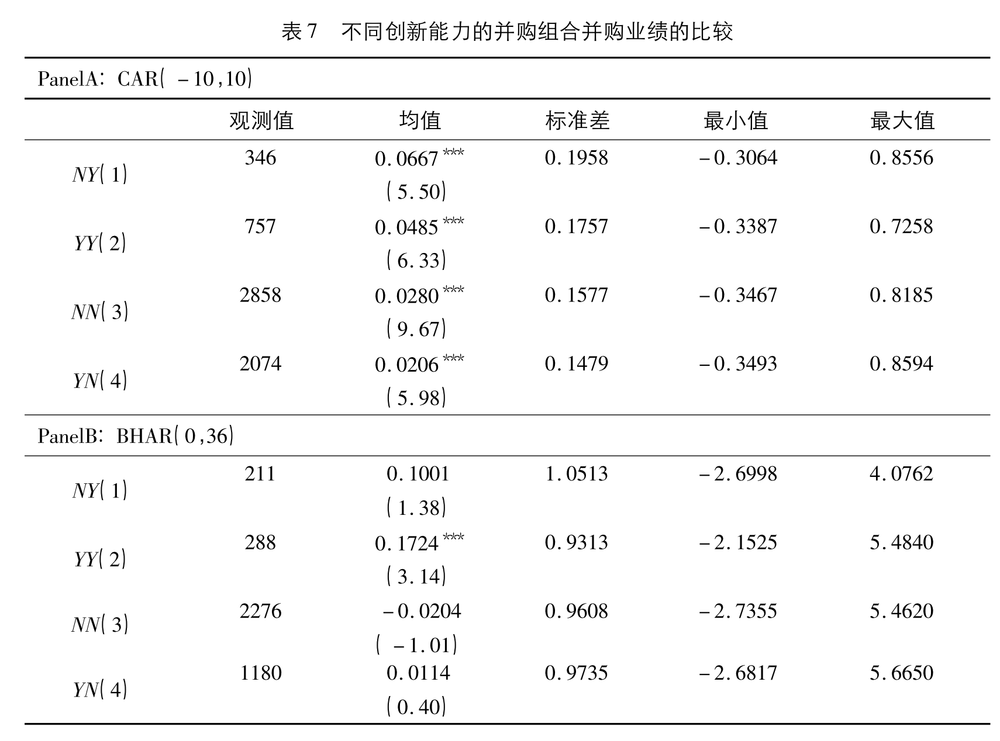
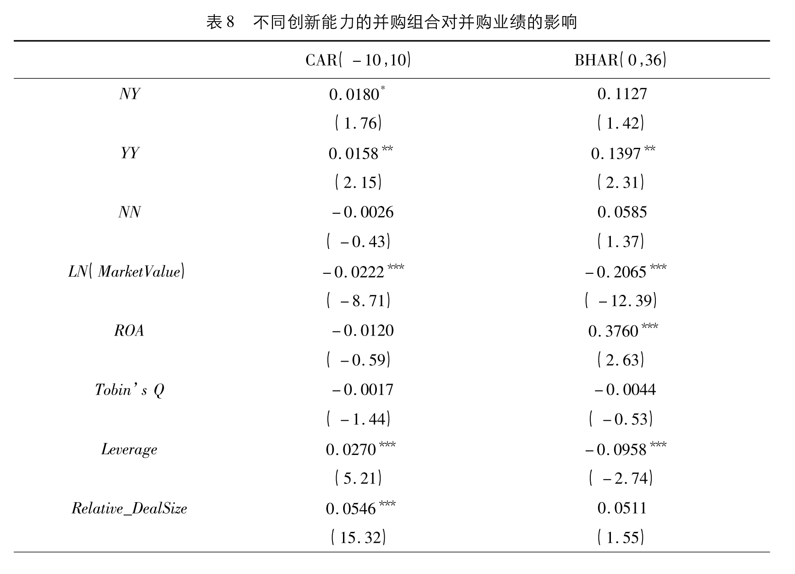
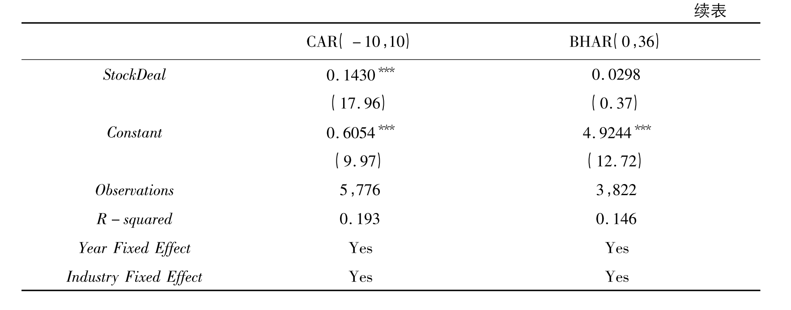

# 创新能力对上市公司并购业绩的影响

```
@article{ZhangXueyong2017,
author = {张学勇 and 柳依依 and 罗丹 and 陈锐},
journal = {金融研究},
mendeley-groups = {实证金融},
number = {3},
title = {创新能力对上市公司并购业绩的影响},
year = {2017}
}
```

创新能力是企业提升业绩的法宝，公司获取创新能力的途径包括自主研发和外部获取。而通过并购获取目标公司的创新技术逐渐成为并购的重要动机之一。本文从并购双方专利入手，考察了创新能力对并购企业的绩效的影响。

## 并购

并购重组是各国资本市场资源配置的重要环节之一，二战以后市场经济国家往往10余年就会发生一次并购浪潮。并购的动机和并购的价值效应也得到了广泛研究。

### 为什么会发生并购

并购是收购公司的决定，而什么促使了收购公司的这个决定，一直是西方学者的研究重点，也形成了林林总总的观点。根据邱金辉和王红昕（2006）[^Qiu2007]，西方企业并购动机论中，威斯迈理论比较被认可，其理论将并购动机分为以下7种：

* 企业协同效应假说
* 市场力量假说
* 战略动机假说
* 控制权市场假说
* 价值低估假说
* 内部利益人假说
* 过度自信假说

而我国的企业并购动机又可分为企业层面和政府层面的动机，企业层面主要有优惠政策、竞争优势双向转移、控制权增效等因素，政府层面有破产替代、资源优化、消除亏损、投机性重组等观点。

### 如何评价并购

由上可知，每个企业并购的动机有多重因素影响，跟市场的复杂变幻息息相关。我们要评价并购案例是否成功，很难通过企业并购的初始动机来分析，但作为一家企业，其经营的最基本的目标应该是提升绩效，因此，并购绩效成为并购研究的主战场。

并购绩效又怎么样来考察呢？叶会（2008）[^YeHui2008]指出，学术界对并购价值效应的研究主要有基于股东短期、长期财富效应的事件研究法和基于企业会计数据的会计研究法。

## 创新能力

在对企业的研究中，创新能力被多角度表明为企业发展的关键。这篇论文从以下几个方面对创新能力研究作了详细的文献综述：

* 提升企业竞争力
* 企业成长性
* 企业的财务业绩
* 企业的股票收益率

创新能力可以使企业获得竞争优势，提升公司财务业绩，促进企业的成长并增加其股票收益率，对企业的发展具有重要的作用。

### 企业如何获取创新能力

获取创新能力主要有两种途径：封闭式创新与开放式创新。 相对于封闭式创新，开放式创新模式下企业可以利用内部和外部两方面的创意资源，扩展了企业创新的来源。近来越来越多研究表明企业可以通过并购获得外部知识以增加自身的创新能力。而通过并购获取创新能力无疑也是一种开放式创新。

## 创新能力如何影响并购绩效

本文探究公司创新能力对上市公司并购业绩的影响暗含以下逻辑: 上市公司通过并购创新性目标方可以促进自身创新，而创新是企业成长和价值增值的主要驱动力，继而并购创新性目标方可为上市公司带来更好的股票市场业绩。

## 数据

本文的研究范围是1998年1月至2015年7月上市公司作为买方的所有股权并购事件。

并购数据、上市公司财务数据和上市公司股票的日度和月度收益率数据均来自**国泰安**数据库。为度量企业创新能力，本文采取通过国家知识产权局核准并授予的公司**专利数量**作为创新指标。在获取专利数量时，文章用了python爬虫来爬去**佰腾专利检索网页**的数据（实际上，**中国国家知识产权局网站**就可以查询更准确的数据）。

在搜索的并购数据中，文章做了以下筛选：

* 同一家上市公司1 个月内发起多个并购公告仅保留第一个事件，避免多个事件相互影响。
* 删除要约收购事件，并选择并 购股份比例在5%及以上的事件。
* 由于金融业的特殊性，将买方企业属于金融业的样本予 以剔除。

经过筛选，本文的样本事件一共*7086*起，时间跨度为1998年1月至2015年7月。

## 研究设计

文章采用了三种方法：

1. 事件研究法
2. 日历时间组合法
3. 多元回归模型

### 事件研究法

事件研究法主要考察并购发生前后长期和短期的股票收益。

短期事件研究考察上市公司并购的**短期异常收益率**，所有样本事件涉及的股票的平均累积异常收益率为

$$
\overline{C A R}=\frac{1}{n} \sum_{t=t_1}^{t_2} A R_{i, t}
$$

$AR_{i, t}$是股票$i$在$t$日的异常收益率。通过对$\overline{C A R}$的t检验，可以检验原假设$\overline{C A R}=0$的显著性。

文章选取了距并购公告发出当天前后各10个交易日作为事件窗口，选择事件窗之前250个交易日约一年的时间跨度为估计窗口。可见，**短期事件研究**主要研究了并购事件在市场的引起的短期效应。

长期事件研究采用买入持有异常收益(BHAR) 来衡量事件发生后的**长期异常收益率**。BHAR衡量了购买公司股票并持有直到考察期结束，公司股票收益率超过市场组合或对应组合收益率的大小，并采用t检验来检验显著性。本文选择的事件窗口是并购事件公告月到公告后的第36个月，可见**长期事件研究**目的在于考察并购事件对股票市场的长期影响。

### 日历时间组合法

日历时间组合法可以克服由于行业等因素导致事件公司收益在横截面上的相关性等问题，主要采用Fama－French三因素和Carhart四因素对对冲组合进行回归，如果截距项显著且为正，说明长期来看，并购创新性的目标公司比并购非创新性标的目标公司获得显著更高的收益；如果截距项显著且为负，结论正好相反；如果截距项不显著，说明目标公司是否创新对并购的长期业绩没有影响。

**日历时间组合法**主要分析了目标公司创新能力对并购的长期业绩影响。

### 多元回归模型

事件研究法通过t检验来检查并购事件的异常收益率是否显著不为零，多元回归模型则进一步考虑并购双方的创新能力，分别对短期CAR和长期BHAR进行回归，从而考察并购双方创新能力在影响并购绩效中的作用。回归模型如下：

$$
    C A R_{i}\left(B H A R_{i}\right)=\alpha+\beta_{1} \times {InnovativeTarget}_{-} d u m m y+\delta X_{i}+Y e a r_{t}+ {Industry}_{t}+u_{i}
$$

$$
    C A R_{i}\left(B H A R_{i}\right)=\alpha+\beta_{1} \times {InnovativeAcquirer}_{-} d u m m y+\delta X_{i}+Y e a r_{t}+ {Industry}_{t}+u_{i}
$$

$$
    C A R_{i}\left(B H A R_{i}\right)=\alpha+\beta_{1} \times \ln (1+Target_{-}patent)+\delta X_{i}+{ Year }_{t}+{ Industry }_{t}+u_{i}
$$

$$
    C A R_{i}\left(B H A R_{i}\right)=\alpha+\beta_{1} \times \ln (1+Acquirer_{-}patent)+\delta X_{i}+{ Year }_{t}+{ Industry }_{t}+u_{i}
$$

其中控制变量$X_{i}$包含了并购方的杠杆率、托宾Q和资产回报率，ROA、并购方市值、并购价值相对并购方市值比和并购支付方式六个，年度虚拟变量$Year_t$被引进来消除时间的影响，同时引入行业虚拟变量$Industry_t$来控制行业固定效应。

## 实证结果

结果从三方面来呈现：

1. 目标方创新能力对并购业绩的影响
2. 并购方创新能力对并购业绩的影响
3. 不同创新能力的并购组合的并购业绩比较

### 目标方创新能力对并购业绩的影响
.png)



以上是并购事件的短期和长期异常收益率走势，直观来看不论在短期还是长期，上市公司并购有专利的目标方其市场表现均好于并购无专利的目标方。

**事件研究**t检验的结果证实了相较于并购非创新性企业，并购创新性企业的上市公司可获得显著更高的短期和长期的市场表现。



接下来的**日历时间组合法**结果说明在并购发生后的三年间，并购有专利目标方的上市公司其收益率显著高于并购无专利的目标公司约0.3个百分点，即上市公司并购创新性企业的并购业绩显著更高。这与事件分析法的结论一致。



最后，为保证结果的稳健性，文章进一步通过多元回归模型得出结论：**相对于并购非创新性公司，那些并购创新性公司的并购方股票的长、短期收益均表现较好。**





### 并购方的创新能力对并购业绩的影响

并购可以使企业在较短时间内获得目标公司的专有技术和专利权，从而提升自身的技术能力与研发水平。但长期来看实现创新协同效应才是获得更高并购业绩的内在原因(Ang and Wu，2011)。然而实现创新协同效应需要并购方完成认知、吸收和应用目标方专有技术等一系列过程(Cohen and Levinthal，1990)。如果并购方创新能力较弱将难以完成以上过程从而导致未来创新产出的下降( Ahuja and Katila，2001; Cloodt et al．，2006)，因此实现创新协同效应，并购方创新能力是关键。不过，**协同效应的产生应该需要较长的时间，并非短期内就可以实现。**

.png)

续表.png)

多元回归结果也支持上述结论。

### 不同创新能力的并购组合的并购业绩比较

文章在目标方分组的基础上，进一步根据并购方在并购公告前是否申请专利，将整体样本事件分为四组:并购方无专利－目标方有专利(NY)、并购方有专利－目标方有专利(YY)、并购方无专利－目标方无专利(NN)、并购方有专利－目标方无专利(YN)。



从各组的统计数据上来看，，NY组合的并购方获得 最高的累积异常收益率，其次是YY组合，并购组合NN和YN的业绩表现依次随后。而从长期业绩来看，根据表7PanelB，YY组合的长期市场表现最好，BHAR(0，36)为17.24%；NY并购组合其次，BHAR(0，36)为10.01%；YN组合和NN组合表现依次随后，BHAR(0，36)分别 为1.14%和－2.04%。在短期和长期并购绩效中，排名前二的并购组合均具有创新性的目标方这一特征，说明目标方具有创新能力是促进企业并购业绩的重要因素。而且在长 期表现中仅YY组合的并购业绩是统计显著的，表明并购双方均具有创新能力，才可以在长期中获得超额收益、产生创新协同效应。

接下来文章进行了回归分析，选择“并购方有专利－目标方无专利”为基准组，对应表7中YN组合，同时设定三个虚拟变量NY、YY和NN。最后结果与之前的论述一致。因此，**目标方的创新能力是促进上市公司并购业绩的关键因素。而从长期来看，并购双方皆具有创新能力，有助于创新协同效应的产生，提升并购方的长期表现。**





文章在不同创新能力的并购组合的并购业绩比较阶段得出的结论与前面几个阶段的结论一致。

## 稳健性检验

文章从三个角度进行了稳健性检验。

1. CARs与BHARs计算的稳健性检验
2. 创新变量的内生性问题
3. 创新能力对制造业上市公司并购业绩的影响

在稳健性检验中得出的结论仍然与文章主体结论一致。

## 启发

1. 这篇文章角度新颖。从专利角度分析公司并购，研究结果也易于理解。
2. 文章研究方法规范。从事件研究法到日历时间组合法再到多元回归分析，文章用多个方法检验了结论。
3. 稳健性检验。文章从多个可能出现偏差的角度进行了稳健性检验，使得结果很有说服力。

[^Qiu2007]: 邱金辉. (2006). 我国企业并购理论研究现状分析. 经济问题, 7, 7–9.
[^YeHui2008]: 叶会. (2008). 企业并购理论综述. 广东金融学院学报, 23, 115–128.
