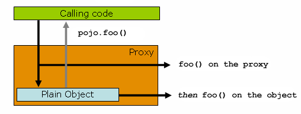

# Core Technologies

## Aspect Oriented Programming with Spring

Aspect-oriented Programming (AOP) complements Object-oriented Programming (OOP) by providing another way of thinking about program structure. The key unit of modularity in OOP is the class, whereas in AOP the unit of modularity is the aspect. Aspects enable the modularization of concerns (such as transaction management) that cut across multiple types and objects. (Such concerns are often termed “crosscutting” concerns in AOP literature.)

One of the key components of Spring is the AOP framework. While the Spring IoC container does not depend on AOP (meaning you do not need to use AOP if you don’t want to), AOP complements Spring IoC to provide a very capable middleware solution.

AOP is used in the Spring Framework to:

- Provide declarative enterprise services. The most important such service is declarative transaction management.

- Let users implement custom aspects, complementing their use of OOP with AOP.

### AOP Concepts

- Aspect: A modularization of a concern that cuts across multiple classes. Transaction management is a good example of a crosscutting concern in enterprise Java applications. In Spring AOP, aspects are implemented by using regular classes (the schema-based approach) or regular classes annotated with the `@Aspect` annotation (the @AspectJ style).

- Join point: A point during the execution of a program, such as the execution of a method or the handling of an exception. In Spring AOP, a join point always represents a method execution.

- Advice: Action taken by an aspect at a particular join point. Different types of advice include “around”, “before” and “after” advice. (Advice types are discussed later.) Many AOP frameworks, including Spring, model an advice as an interceptor and maintain a chain of interceptors around the join point.

- Pointcut: A predicate that matches join points. Advice is associated with a pointcut expression and runs at any join point matched by the pointcut (for example, the execution of a method with a certain name). The concept of join points as matched by pointcut expressions is central to AOP, and Spring uses the AspectJ pointcut expression language by default.

- Introduction: Declaring additional methods or fields on behalf of a type. Spring AOP lets you introduce new interfaces (and a corresponding implementation) to any advised object. For example, you could use an introduction to make a bean implement an IsModified interface, to simplify caching. (An introduction is known as an inter-type declaration in the AspectJ community.)

- Target object: An object being advised by one or more aspects. Also referred to as the “advised object”. Since Spring AOP is implemented by using runtime proxies, this object is always a proxied object.

- AOP proxy: An object created by the AOP framework in order to implement the aspect contracts (advise method executions and so on). In the Spring Framework, an AOP proxy is a JDK dynamic proxy or a CGLIB proxy.

- Weaving: linking aspects with other application types or objects to create an advised object. This can be done at compile time (using the AspectJ compiler, for example), load time, or at runtime. Spring AOP, like other pure Java AOP frameworks, performs weaving at runtime.

### Spring AOP Capabilities and Goals

Spring AOP is implemented in pure Java. There is no need for a special compilation process. Spring AOP does not need to control the class loader hierarchy and is thus suitable for use in a servlet container or application server.

Spring AOP currently supports only method execution join points (advising the execution of methods on Spring beans). Field interception is not implemented, although support for field interception could be added without breaking the core Spring AOP APIs. If you need to advise field access and update join points, consider a language such as AspectJ.

Spring AOP’s approach to AOP differs from that of most other AOP frameworks. The aim is not to provide the most complete AOP implementation (although Spring AOP is quite capable). Rather, **the aim is to provide a close integration between AOP implementation and Spring IoC, to help solve common problems in enterprise applications**.

### AOP Proxies

Spring AOP defaults to using standard JDK dynamic proxies for AOP proxies. This enables any interface (or set of interfaces) to be proxied.

Spring AOP can also use CGLIB proxies. This is necessary to proxy classes rather than interfaces. By default, CGLIB is used if a business object does not implement an interface.

### @AspectJ support

@AspectJ refers to a style of declaring aspects as regular Java classes annotated with annotations. The @AspectJ style was introduced by the AspectJ project as part of the AspectJ 5 release. Spring interprets the same annotations as AspectJ 5, using a library supplied by AspectJ for pointcut parsing and matching. **The AOP runtime is still pure Spring AOP, though, and there is no dependency on the AspectJ compiler or weaver**.

#### Enabling @AspectJ Support

To use @AspectJ aspects in a Spring configuration, you need to enable Spring support for configuring Spring AOP based on @AspectJ aspects and auto-proxying beans based on whether or not they are advised by those aspects. By **auto-proxying**, we mean that, if Spring determines that a bean is advised by one or more aspects, it automatically generates a proxy for that bean to intercept method invocations and ensures that advice is run as needed.

The @AspectJ support can be enabled with **XML**- or **Java**-style configuration. In either case, you also need to ensure that AspectJ’s aspectjweaver.jar library is on the classpath of your application (version 1.8 or later).

```xml
<aop:aspectj-autoproxy/>
```

```java
@Configuration
@EnableAspectJAutoProxy
public class AppConfig {

}
```

#### Declaring an Aspect

With @AspectJ support enabled, any bean defined in your application context with a class that is an @AspectJ aspect (has the @Aspect annotation) is automatically detected by Spring and used to configure Spring AOP.

```xml
<bean id="myAspect" class="org.xyz.NotVeryUsefulAspect">
    <!-- configure properties of the aspect here -->
</bean>
```

```java
package org.xyz;
import org.aspectj.lang.annotation.Aspect;

@Aspect
public class NotVeryUsefulAspect {

}
```

#### Declaring a Pointcut

Pointcuts determine join points of interest and thus enable us to control when advice runs. **Spring AOP only supports method execution join points for Spring beans**, so you can think of a pointcut as matching the execution of methods on Spring beans. A pointcut declaration has two parts: **a signature comprising a name and any parameters** and **a pointcut expression that determines exactly which method executions we are interested in**. In the @AspectJ annotation-style of AOP, a pointcut signature is provided by a regular method definition, and the pointcut expression is indicated by using the `@Pointcut` annotation (the method serving as the pointcut signature must have a `void` return type).

##### Supported Pointcut Designators

Spring AOP supports the following AspectJ pointcut designators (PCD) for use in pointcut expressions:

- `execution`: For matching method execution join points. This is the primary pointcut designator to use when working with Spring AOP.

- `within`: Limits matching to join points within certain types (the execution of a method declared within a matching type when using Spring AOP).

- `this`: Limits matching to join points (the execution of methods when using Spring AOP) where the bean reference (Spring AOP proxy) is an instance of the given type.

- `target`: Limits matching to join points (the execution of methods when using Spring AOP) where the target object (application object being proxied) is an instance of the given type.

- `args`: Limits matching to join points (the execution of methods when using Spring AOP) where the arguments are instances of the given types.

- `@target`: Limits matching to join points (the execution of methods when using Spring AOP) where the class of the executing object has an annotation of the given type.

- `@args`: Limits matching to join points (the execution of methods when using Spring AOP) where the runtime type of the actual arguments passed have annotations of the given types.

- `@within`: Limits matching to join points within types that have the given annotation (the execution of methods declared in types with the given annotation when using Spring AOP).

- `@annotation`: Limits matching to join points where the subject of the join point (the method being run in Spring AOP) has the given annotation.

> ##### Other pointcut types
> The full AspectJ pointcut language supports additional pointcut designators that are not supported in Spring: `call`, `get`, `set`, `preinitialization`, `staticinitialization`, `initialization`, `handler`, `adviceexecution`, `withincode`, `cflow`, `cflowbelow`, `if`, `@this`, and `@withincode`. Use of these pointcut designators in pointcut expressions interpreted by Spring AOP results in an `IllegalArgumentException` being thrown.
> 
> The set of pointcut designators supported by Spring AOP may be extended in future releases to support more of the AspectJ pointcut designators.

```java
@Pointcut("execution(* transfer(..))") // the pointcut expression
private void anyOldTransfer() {} // the pointcut signature
```

##### Combining Pointcut Expressions

```java
@Pointcut("execution(public * *(..))")
private void anyPublicOperation() {} // matches if a method execution join point represents the execution of any public method.

@Pointcut("within(com.xyz.myapp.trading..*)")
private void inTrading() {} // matches if a method execution is in the trading module.

@Pointcut("anyPublicOperation() && inTrading()")
private void tradingOperation() {} // matches if a method execution represents any public method in the trading module.
```

When referring to pointcuts by name, normal Java visibility rules apply (you can see private pointcuts in the same type, protected pointcuts in the hierarchy, public pointcuts anywhere, and so on). Visibility does not affect pointcut matching.

Spring AOP users are likely to use the `execution` pointcut designator the most often. The format of an execution expression follows:

```
    execution(modifiers-pattern? ret-type-pattern declaring-type-pattern?name-pattern(param-pattern)
                throws-pattern?)
```

##### Writing Good Pointcuts

During compilation, AspectJ processes pointcuts in order to optimize matching performance. Examining code and determining if each join point matches (statically or dynamically) a given pointcut is a **costly process**. (A dynamic match means the match cannot be fully determined from static analysis and that a test is placed in the code to determine if there is an actual match when the code is running). On first encountering a pointcut declaration, AspectJ rewrites it into an optimal form for the matching process. What does this mean? Basically, **pointcuts are rewritten in DNF (Disjunctive Normal Form) and the components of the pointcut are sorted such that those components that are cheaper to evaluate are checked first**. This means you do not have to worry about understanding the performance of various pointcut designators and may supply them in any order in a pointcut declaration.

However, AspectJ can work only with what it is told. For optimal performance of matching, you should think about what they are trying to achieve and **narrow the search space for matches as much as possible in the definition**. The existing designators naturally fall into one of three groups: kinded, scoping, and contextual:

- Kinded designators select a particular kind of join point: `execution`, `get`, `set`, `call`, and `handler`.

- Scoping designators select a group of join points of interest (probably of many kinds): `within` and `withincode`.

- Contextual designators match (and optionally bind) based on context: `this`, `target`, and `@annotation`.

A well written pointcut **should include at least the first two types (kinded and scoping)**. You can include the contextual designators to match based on join point context or bind that context for use in the advice. Supplying only a kinded designator or only a contextual designator works but could affect weaving performance (time and memory used), due to extra processing and analysis. Scoping designators are very fast to match, and using them usage means AspectJ can very quickly dismiss groups of join points that should not be further processed. A good pointcut should always include one if possible.

#### Declaring Advice

Advice is associated with a pointcut expression and runs before, after, or around method executions matched by the pointcut. The pointcut expression may be either a simple reference to a named pointcut or a pointcut expression declared in place.

```java
import org.aspectj.lang.annotation.Aspect;
import org.aspectj.lang.annotation.Before;

@Aspect
public class BeforeExample {

    @Before("com.xyz.myapp.CommonPointcuts.dataAccessOperation()")
    public void doAccessCheck() {
        // ...
    }

}
```

```java
import org.aspectj.lang.annotation.Aspect;
import org.aspectj.lang.annotation.Before;

@Aspect
public class BeforeExample {

    @Before("execution(* com.xyz.myapp.dao.*.*(..))") // in-place
    public void doAccessCheck() {
        // ...
    }

}
```

```java
import org.aspectj.lang.annotation.Aspect;
import org.aspectj.lang.annotation.AfterReturning;

@Aspect
public class AfterReturningExample {

    @AfterReturning(
        pointcut="com.xyz.myapp.CommonPointcuts.dataAccessOperation()",
        returning="retVal")
    public void doAccessCheck(Object retVal) {
        // ...
    }

}
```

```java
import org.aspectj.lang.annotation.Aspect;
import org.aspectj.lang.annotation.AfterThrowing;

@Aspect
public class AfterThrowingExample {

    @AfterThrowing(
        pointcut="com.xyz.myapp.CommonPointcuts.dataAccessOperation()",
        throwing="ex")
    public void doRecoveryActions(DataAccessException ex) {
        // ...
    }

}
```

```java
import org.aspectj.lang.annotation.Aspect;
import org.aspectj.lang.annotation.Around;
import org.aspectj.lang.ProceedingJoinPoint;

@Aspect
public class AroundExample {

    @Around("com.xyz.myapp.CommonPointcuts.businessService()")
    public Object doBasicProfiling(ProceedingJoinPoint pjp) throws Throwable {
        // start stopwatch
        Object retVal = pjp.proceed();
        // stop stopwatch
        return retVal;
    }

}
```

##### Access to the Current JoinPoint

Any advice method may declare, as its first parameter, a parameter of type `org.aspectj.lang.JoinPoint` (note that around advice is required to declare a first parameter of type `ProceedingJoinPoint`, which is a subclass of `JoinPoint`. The `JoinPoint` interface provides a number of useful methods:

- `getArgs()`: Returns the method arguments.

- `getThis()`: Returns the proxy object.

- `getTarget()`: Returns the target object.

- `getSignature()`: Returns a description of the method that is being advised.

- `toString()`: Prints a useful description of the method being advised.

##### Passing Parameters to Advice

```java
@Before("com.xyz.myapp.CommonPointcuts.dataAccessOperation() && args(account,..)")
public void validateAccount(Account account) {
    // ...
}
```

The `args(account,..)` part of the pointcut expression serves two purposes. First, it restricts matching to only those method executions where the method takes at least one parameter, and the argument passed to that parameter is an instance of `Account`. Second, it makes the actual `Account` object available to the advice through the `account` parameter.

Another way of writing this is to declare a pointcut that “provides” the `Account` object value when it matches a join point, and then refer to the named pointcut from the advice. This would look as follows:

```java
@Pointcut("com.xyz.myapp.CommonPointcuts.dataAccessOperation() && args(account,..)")
private void accountDataAccessOperation(Account account) {}

@Before("accountDataAccessOperation(account)")
public void validateAccount(Account account) {
    // ...
}
```

```java
@Before("com.xyz.lib.Pointcuts.anyPublicMethod() && @annotation(auditable)") // the advice that matches the execution of @Auditable methods
public void audit(Auditable auditable) {
    AuditCode code = auditable.value();
    // ...
}
```

##### Advice Ordering

Spring AOP follows the same precedence rules as AspectJ to determine the order of advice execution. The highest precedence advice runs first "on the way in" (so, given two pieces of before advice, the one with highest precedence runs first). "On the way out" from a join point, the highest precedence advice runs last (so, given two pieces of after advice, the one with the highest precedence will run second).

When two pieces of advice defined in different aspects both need to run at the same join point, unless you specify otherwise, the order of execution is **undefined**. You can control the order of execution by specifying precedence. This is done in the normal Spring way by either implementing the `org.springframework.core.Ordered` interface in the **aspect class** or annotating it with the `@Order` annotation. Given two aspects, the aspect returning the lower value from `Ordered.getValue()` (or the annotation value) has the higher precedence.

> As of Spring Framework 5.2.7, advice methods defined in the same `@Aspect` class that need to run at the same join point are assigned precedence based on their advice type in the following order, from highest to lowest precedence: `@Around`, `@Before`, `@After`, `@AfterReturning`, `@AfterThrowing`. Note, however, that due to the implementation style in Spring’s `AspectJAfterAdvice`, an `@After` advice method will effectively be invoked after any `@AfterReturning` or `@AfterThrowing` advice methods in the same aspect.
> 
> When two pieces of the same type of advice (for example, two `@After` advice methods) defined in the same `@Aspect` class both need to run at the same join point, the ordering is undefined (since there is no way to retrieve the source code declaration order through reflection for javac-compiled classes). Consider collapsing such advice methods into one advice method per join point in each `@Aspect` class or refactor the pieces of advice into separate `@Aspect` classes that you can order at the aspect level via Ordered or `@Order`.

#### Introductions

Introductions (known as inter-type declarations in AspectJ) enable an aspect to declare that advised objects implement a given interface, and to provide an implementation of that interface on behalf of those objects.

```java
@Aspect
public class UsageTracking {

    @DeclareParents(value="com.xzy.myapp.service.*+", defaultImpl=DefaultUsageTracked.class)
    public static UsageTracked mixin;

    @Before("com.xyz.myapp.CommonPointcuts.businessService() && this(usageTracked)")
    public void recordUsage(UsageTracked usageTracked) {
        usageTracked.incrementUseCount();
    }

}
```

### Choosing which AOP Declaration Style to Use

#### Spring AOP or Full AspectJ?

Use the simplest thing that can work. Spring AOP is simpler than using full AspectJ, as there is no requirement to introduce the AspectJ compiler / weaver into your development and build processes. If you only need to advise the execution of operations on Spring beans, Spring AOP is the right choice. If you need to advise objects not managed by the Spring container (such as domain objects, typically), you need to use AspectJ. You also need to use AspectJ if you wish to advise join points other than simple method executions (for example, field get or set join points and so on).

#### @AspectJ or XML for Spring AOP?

If you have chosen to use Spring AOP, you have a choice of @AspectJ or XML style. There are various tradeoffs to consider.

The Spring team prefers the @AspectJ style for custom aspects beyond simple configuration of enterprise services.

### Proxying Mechanisms

Spring AOP uses either JDK dynamic proxies or CGLIB to create the proxy for a given target object. JDK dynamic proxies are built into the JDK, whereas CGLIB is a common open-source class definition library (repackaged into `spring-core`).

If the target object to be proxied implements at least one interface, a JDK dynamic proxy is used. All of the interfaces implemented by the target type are proxied. If the target object does not implement any interfaces, a CGLIB proxy is created.

#### Understanding AOP Proxies

Spring AOP is proxy-based.



```java
public class Main {

    public static void main(String[] args) {
        ProxyFactory factory = new ProxyFactory(new SimplePojo());
        factory.addInterface(Pojo.class);
        factory.addAdvice(new RetryAdvice());

        Pojo pojo = (Pojo) factory.getProxy();
        // this is a method call on the proxy!
        pojo.foo();
    }
}
```

### Using AspectJ with Spring Applications

Spring ships with a small AspectJ aspect library, which is available stand-alone in your distribution as `spring-aspects.jar`. 

#### Using AspectJ to Dependency Inject Domain Objects with Spring

The Spring container instantiates and configures beans defined in your application context. It is also possible to ask a bean factory to configure a pre-existing object, given the name of a bean definition that contains the configuration to be applied. `spring-aspects.jar` contains an annotation-driven aspect that exploits this capability to allow dependency injection of **any object**. The support is intended to be used for objects created outside of the control of any container. Domain objects often fall into this category because they are often created programmatically with the new operator or by an ORM tool as a result of a database query.

