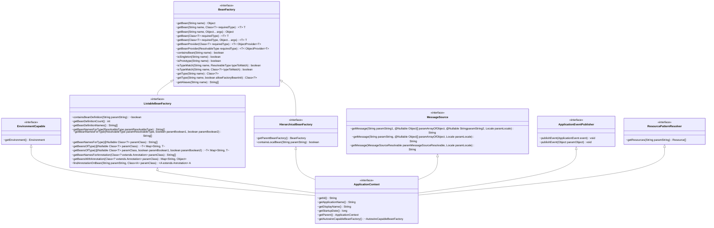
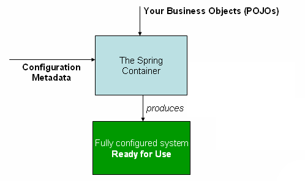
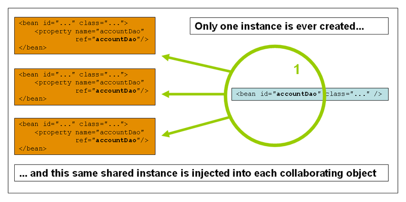
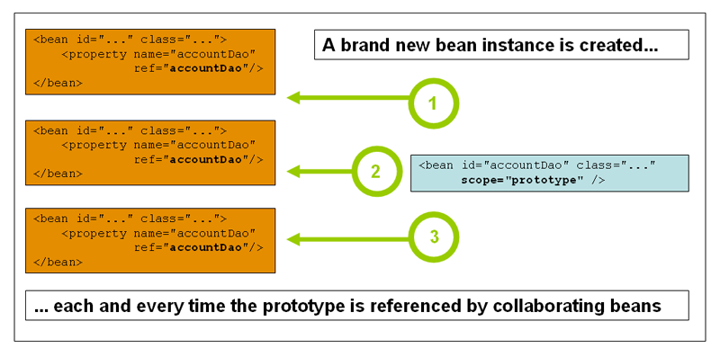

# Core Technologies

## The IoC Container

Inversion of Control (IoC) container is foremost amongst the integral technologies of the Spring Framework.

### Introduction to the Spring IoC Container and Beans

IoC is also known as dependency injection (DI). It is a process whereby objects **define** their dependencies (that is, the other objects they work with) only through constructor arguments, arguments to a factory method, or properties that are set on the object instance after it is constructed or returned from a factory method. The container **then injects** those dependencies when it creates the bean.

The `org.springframework.beans` and `org.springframework.context` packages are the basis for Spring Framework’s IoC container. The `BeanFactory` interface provides an advanced configuration mechanism capable of managing any type of object. `ApplicationContext` is a sub-interface of `BeanFactory`. In short, the `BeanFactory` provides the configuration framework and basic functionality, and the `ApplicationContext` adds more enterprise-specific functionality.



In Spring, the objects that form the backbone of your application and that are managed by the **Spring IoC container** are called beans. **A bean is an object that is instantiated, assembled, and otherwise managed by a Spring IoC container.** Otherwise, a bean is simply one of many objects in your application. Beans, and the dependencies among them, are reflected in the configuration metadata used by a container.


### Container Overview

The `org.springframework.context.ApplicationContext` interface represents the Spring IoC container and is responsible for instantiating, configuring, and assembling the beans. The container gets its instructions on what objects to instantiate, configure, and assemble **by reading configuration metadata**. The configuration metadata is represented in `XML`, `Java annotations`, or `Java code`. 



#### Configuration Metadata

This configuration metadata represents how you, as an application developer, tell the Spring container to instantiate, configure, and assemble the objects in your application.

- XML-based metadata.

- Annotation-based configuration: Spring 2.5 introduced support for annotation-based configuration metadata.

- Java-based configuration: Starting with Spring 3.0, many features provided by the Spring JavaConfig project became part of the core Spring Framework. Thus, you can define beans external to your application classes by using Java rather than XML files.


Typically, you define service layer objects, data access objects (DAOs), presentation objects such as Struts `Action` instances, infrastructure objects such as Hibernate `SessionFactories`, JMS `Queues`, and so forth. Typically, one does not configure fine-grained domain objects in the container, because it is usually the responsibility of DAOs and business logic to create and load domain objects.

#### Instantiating a Container

For XML-based metadata:

```java
ApplicationContext context = new ClassPathXmlApplicationContext("services.xml", "daos.xml");
```
The following example shows the service layer objects (services.xml) configuration file:

```xml
<?xml version="1.0" encoding="UTF-8"?>
<beans xmlns="http://www.springframework.org/schema/beans"
    xmlns:xsi="http://www.w3.org/2001/XMLSchema-instance"
    xsi:schemaLocation="http://www.springframework.org/schema/beans
        https://www.springframework.org/schema/beans/spring-beans.xsd">

    <!-- services -->

    <bean id="petStore" class="org.springframework.samples.jpetstore.services.PetStoreServiceImpl">
        <property name="accountDao" ref="accountDao"/>
        <property name="itemDao" ref="itemDao"/>
        <!-- additional collaborators and configuration for this bean go here -->
    </bean>

    <!-- more bean definitions for services go here -->

</beans>
```

The following example shows the data access objects daos.xml file:

```xml
<?xml version="1.0" encoding="UTF-8"?>
<beans xmlns="http://www.springframework.org/schema/beans"
    xmlns:xsi="http://www.w3.org/2001/XMLSchema-instance"
    xsi:schemaLocation="http://www.springframework.org/schema/beans
        https://www.springframework.org/schema/beans/spring-beans.xsd">

    <bean id="accountDao"
        class="org.springframework.samples.jpetstore.dao.jpa.JpaAccountDao">
        <!-- additional collaborators and configuration for this bean go here -->
    </bean>

    <bean id="itemDao" class="org.springframework.samples.jpetstore.dao.jpa.JpaItemDao">
        <!-- additional collaborators and configuration for this bean go here -->
    </bean>

    <!-- more bean definitions for data access objects go here -->

</beans>
```

#### Using the Container

By using the method `T getBean(String name, Class<T> requiredType)`, you can retrieve instances of your beans.

```java
// retrieve configured instance
PetStoreService service = context.getBean("petStore", PetStoreService.class);

// use configured instance
List<String> userList = service.getUsernameList();
```

The most flexible variant is `GenericApplicationContext` in combination with reader delegates.

```java
GenericApplicationContext context = new GenericApplicationContext();

new XmlBeanDefinitionReader(context).loadBeanDefinitions("services.xml", "daos.xml"); // read from xml metadata
context.refresh();

new GroovyBeanDefinitionReader(context).loadBeanDefinitions("services.groovy", "daos.groovy"); // read from groovy metadata
context.refresh();
```

###  Bean Overview

Within the container itself, these bean definitions are represented as `BeanDefinition` objects, which contain (among other information) the following metadata:

- A package-qualified class name: typically, the actual implementation class of the bean being defined.

- Bean behavioral configuration elements, which state how the bean should behave in the container (scope, lifecycle callbacks, and so forth).

- References to other beans that are needed for the bean to do its work. These references are also called collaborators or dependencies.

- Other configuration settings to set in the newly created object — for example, the size limit of the pool or the number of connections to use in a bean that manages a connection pool.

This metadata translates to a set of properties that make up each bean definition. 

| Property                 | Explained in…​           |
| ------------------------ | ------------------------ |
| Class                    | Instantiating Beans      |
| Name                     | Naming Beans             |
| Scope                    | Bean Scopes              |
| Constructor arguments    | Dependency Injection     |
| Properties               | Dependency Injection     |
| Autowiring mode          | Autowiring Collaborators |
| Lazy initialization mode | Lazy\-initialized Beans  |
| Initialization method    | Initialization Callbacks |
| Destruction method       | Destruction Callbacks    |

`BeanFactory` will instantiate the bean through `BeanDefinition` while `getBean(...)` is invoked.

#### Naming Beans

Every bean has one or more identifiers. These identifiers must be unique within the container that hosts the bean. A bean usually has only one identifier. However, if it requires more than one, the extra ones can be considered aliases.

You are not required to supply a `name` or an `id` for a bean. If you do not supply a `name` or `id` explicitly, the container generates a unique name for that bean. However, if you want to refer to that bean by name, through the use of the `ref` element or a Service Locator style lookup, you must provide a name. Motivations for not supplying a name are related to using inner beans and autowiring collaborators.

`name` can be used to get bean from `BeanFactory` through `getBean(...)`.

#### Instantiating Beans

A bean definition is essentially a recipe for creating one or more objects. The container looks at the recipe for a named bean when asked and uses the configuration metadata encapsulated by that bean definition to create (or acquire) an actual object.

You can use the Class property in one of two ways:

- Typically, to specify the bean class to be constructed in the case where the container itself directly creates the bean by calling its constructor reflectively, somewhat equivalent to Java code with the `new` operator.

- To specify the actual class containing the `static` factory method that is invoked to create the object, in the less common case where the container invokes a `static` factory method on a class to create the bean. The object type returned from the invocation of the `static` factory method may be the same class or another class entirely.

```java
package org.springframework.beans.factory.support;

// ...

@SuppressWarnings("serial")
public class DefaultListableBeanFactory extends AbstractAutowireCapableBeanFactory
        implements ConfigurableListableBeanFactory, BeanDefinitionRegistry, Serializable {
    
    // ...

    @Override
    public <T> T getBean(Class<T> requiredType, @Nullable Object... args) throws BeansException {
        
        // ...

        Object resolved = resolveBean(ResolvableType.forRawClass(requiredType), args, false);
        
        // ...

        return (T) resolved;
    }

    @Nullable
    private <T> T resolveBean(ResolvableType requiredType, @Nullable Object[] args, boolean nonUniqueAsNull) {
        NamedBeanHolder<T> namedBean = resolveNamedBean(requiredType, args, nonUniqueAsNull);
        if (namedBean != null) {
            return namedBean.getBeanInstance();
        }

        // ...

        return null;
    }

    @SuppressWarnings("unchecked")
    @Nullable
    private <T> NamedBeanHolder<T> resolveNamedBean(
            ResolvableType requiredType, @Nullable Object[] args, boolean nonUniqueAsNull) throws BeansException {

        Assert.notNull(requiredType, "Required type must not be null");
        String[] candidateNames = getBeanNamesForType(requiredType);

        if (candidateNames.length > 1) {
            List<String> autowireCandidates = new ArrayList<>(candidateNames.length);
            for (String beanName : candidateNames) {
                if (!containsBeanDefinition(beanName) || getBeanDefinition(beanName).isAutowireCandidate()) {
                    autowireCandidates.add(beanName);
                }
            }
            if (!autowireCandidates.isEmpty()) {
                candidateNames = StringUtils.toStringArray(autowireCandidates);
            }
        }

        // ...

        return null;
    }

    // ...
}
```

##### Determining a Bean’s Runtime Type

The runtime type of a specific bean is non-trivial to determine. A specified class in the bean metadata definition **is just an initial class reference**, potentially combined with a declared factory method or being a `FactoryBean` class which may lead to a different runtime type of the bean, or not being set at all in case of an instance-level factory method (which is resolved via the specified `factory-bean` name instead). Additionally, AOP proxying may wrap a bean instance with an interface-based proxy with limited exposure of the target bean’s actual type (just its implemented interfaces).

The recommended way to find out about the actual runtime type of a particular bean is a `BeanFactory.getType` call for the specified bean name. 

### Dependencies

#### Dependency Injection

Dependency injection (DI) is a process whereby objects define their dependencies (that is, the other objects with which they work) only through constructor arguments, arguments to a factory method, or properties that are set on the object instance after it is constructed or returned from a factory method. The container then injects those dependencies when it creates the bean. This process is fundamentally the inverse (hence the name, Inversion of Control) of the bean itself controlling the instantiation or location of its dependencies on its own by using direct construction of classes or the Service Locator pattern.

DI exists in two major variants: **Constructor-based dependency injection** and **Setter-based dependency injection**.

##### Constructor-based Dependency Injection

Constructor-based DI is accomplished by the container invoking a constructor with a number of arguments, each representing a dependency.

```java
package x.y;

public class ThingOne {

    public ThingOne(ThingTwo thingTwo, ThingThree thingThree) {
        // ...
    }
}
```

Assuming that `ThingTwo` and `ThingThree` classes are not related by inheritance, no potential ambiguity exists. Thus, the following configuration works fine, and you do not need to specify the constructor argument indexes or types explicitly in the `<constructor-arg/>` element.

```xml
<beans>
    <bean id="beanOne" class="x.y.ThingOne">
        <constructor-arg ref="beanTwo"/>
        <constructor-arg ref="beanThree"/>
    </bean>

    <bean id="beanTwo" class="x.y.ThingTwo"/>

    <bean id="beanThree" class="x.y.ThingThree"/>
</beans>
```

When another bean is referenced, the type is known, and matching can occur (as was the case with the preceding example).

When a simple type is used, such as `<value>true</value>`, Spring cannot determine the type of the value, and so cannot match by type without help. The container can use type matching with simple types if you explicitly specify the type of the constructor argument by using the `type` attribute.

```java
package examples;

public class ExampleBean {

    // Number of years to calculate the Ultimate Answer
    private int years;

    // The Answer to Life, the Universe, and Everything
    private String ultimateAnswer;

    public ExampleBean(int years, String ultimateAnswer) {
        this.years = years;
        this.ultimateAnswer = ultimateAnswer;
    }
}
```

```xml
<bean id="exampleBean" class="examples.ExampleBean">
    <constructor-arg type="int" value="7500000"/>
    <constructor-arg type="java.lang.String" value="42"/>
</bean>
```

##### Setter-based Dependency Injection

Setter-based DI is accomplished by the container calling setter methods on your beans after invoking a no-argument constructor or a no-argument `static` factory method to instantiate your bean.

```java
public class SimpleMovieLister {

    // the SimpleMovieLister has a dependency on the MovieFinder
    private MovieFinder movieFinder;

    // a setter method so that the Spring container can inject a MovieFinder
    public void setMovieFinder(MovieFinder movieFinder) {
        this.movieFinder = movieFinder;
    }

    // business logic that actually uses the injected MovieFinder is omitted...
}
```

The ApplicationContext supports constructor-based and setter-based DI for the beans it manages. It also supports setter-based DI after some dependencies have already been injected through the constructor approach. Setter injection should primarily only be used for optional dependencies that can be assigned reasonable default values within the class. Otherwise, not-null checks must be performed everywhere the code uses the dependency. One benefit of setter injection is that setter methods make objects of that class amenable to reconfiguration or re-injection later.

##### Dependency Resolution Process

The container performs bean dependency resolution as follows:

- The ApplicationContext is created and initialized with configuration metadata that describes all the beans. Configuration metadata can be specified by XML, Java code, or annotations.

- For each bean, its dependencies are expressed in the form of properties, constructor arguments, or arguments to the static-factory method (if you use that instead of a normal constructor). These dependencies are provided to the bean, when the bean is actually created.

- Each property or constructor argument is an actual definition of the value to set, or a reference to another bean in the container.

- Each property or constructor argument that is a value is converted from its specified format to the actual type of that property or constructor argument. By default, Spring can convert a value supplied in string format to all built-in types, such as int, long, String, boolean, and so forth.

The Spring container validates the configuration of each bean as the container is created. However, the bean properties themselves are not set until the bean is actually created. **Beans that are singleton-scoped and set to be pre-instantiated (the default) are created when the container is created. Otherwise, the bean is created only when it is requested.** Creation of a bean potentially causes a graph of beans to be created, as the bean’s dependencies and its dependencies' dependencies (and so on) are created and assigned.

> ### Circular dependencies
> If you use predominantly constructor injection, it is possible to create an unresolvable circular dependency scenario.
> 
> For example: Class A requires an instance of class B through constructor injection, and class B requires an instance of class A through constructor injection. If you configure beans for classes A and B to be injected into each other, the Spring IoC container detects this circular reference at runtime, and throws a `BeanCurrentlyInCreationException`.
>
> One possible solution is to edit the source code of some classes to be configured by setters rather than constructors. Alternatively, avoid constructor injection and use setter injection only. In other words, although it is not recommended, you can configure circular dependencies with setter injection.
>
>Unlike the typical case (with no circular dependencies), a circular dependency between bean A and bean B forces one of the beans to be injected into the other prior to being fully initialized itself (a classic chicken-and-egg scenario).

If no circular dependencies exist, when one or more collaborating beans are being injected into a dependent bean, each collaborating bean is totally configured prior to being injected into the dependent bean.

##### Lazy-initialized Beans

By default, `ApplicationContext` implementations eagerly create and configure all singleton beans as part of the initialization process. You can prevent pre-instantiation of a singleton bean by marking the bean definition as being lazy-initialized. A lazy-initialized bean tells the IoC container to create a bean instance when it is first requested, rather than at startup.

##### Autowiring Collaborators

The Spring container can autowire relationships between collaborating beans. You can let Spring resolve collaborators (other beans) automatically for your bean by inspecting the contents of the `ApplicationContext`. 

The following table describes the four autowiring modes:

| Mode          | Explanation                                                                                                                                                                                                                                                                                                                                          |
| ------------- | ---------------------------------------------------------------------------------------------------------------------------------------------------------------------------------------------------------------------------------------------------------------------------------------------------------------------------------------------------- |
| `no`          | (Default) No autowiring. Bean references must be defined by `ref` elements. Changing the default setting is not recommended for larger deployments, because specifying collaborators explicitly gives greater control and clarity. To some extent, it documents the structure of a system\.                                                          |
| `byName`      | Autowiring by property name. Spring looks for a bean with the same name as the property that needs to be autowired. For example, if a bean definition is set to autowire by name and it contains a `master` property (that is, it has a `setMaster(..)` method), Spring looks for a bean definition named `master` and uses it to set the property\. |
| `byType`      | Lets a property be autowired if exactly one bean of the property type exists in the container\. If more than one exists, a fatal exception is thrown, which indicates that you may not use `byType` autowiring for that bean\. If there are no matching beans, nothing happens (the property is not set)\.                                           |
| `constructor` | Analogous to `byType` but applies to constructor arguments\. If there is not exactly one bean of the constructor argument type in the container, a fatal error is raised\.                                                                                                                                                                           |

###### Limitations and Disadvantages of Autowiring

Autowiring works best when it is used consistently across a project. If autowiring is not used in general, it might be confusing to developers to use it to wire only one or two bean definitions.

Consider the limitations and disadvantages of autowiring:

- Explicit dependencies in `property` and `constructor-arg` settings always override autowiring. You cannot autowire simple properties such as primitives, `Strings`, and `Classes` (and arrays of such simple properties). This limitation is by-design.

- Autowiring is less exact than explicit wiring. Although, as noted in the earlier table, Spring is careful to avoid guessing in case of ambiguity that might have unexpected results. The relationships between your Spring-managed objects are no longer documented explicitly.

- Wiring information may not be available to tools that may generate documentation from a Spring container.

- Multiple bean definitions within the container may match the type specified by the setter method or constructor argument to be autowired. For arrays, collections, or `Map` instances, this is not necessarily a problem. However, for dependencies that expect a single value, this ambiguity is not arbitrarily resolved. If no unique bean definition is available, an exception is thrown.

In the latter scenario, you have several options:

- Abandon autowiring in favor of explicit wiring.

- Avoid autowiring for a bean definition by setting its `autowire-candidate` attributes to false.

- Designate a single bean definition as the primary candidate by setting the primary attribute of its `<bean/>` element to true.

- Implement the more fine-grained control available with annotation-based configuration, as described in Annotation-based Container Configuration.

##### Method Injection

You can make bean A aware of the container by implementing the `ApplicationContextAware` interface, and by making a `getBean("B")` call to the container ask for (a typically new) bean B instance every time bean A needs it. The following example shows this approach:

```java
public interface ApplicationContextAware extends Aware {
  void setApplicationContext(ApplicationContext paramApplicationContext) throws BeansException;
}
```

```java
// a class that uses a stateful Command-style class to perform some processing
package fiona.apple;

// Spring-API imports
import org.springframework.beans.BeansException;
import org.springframework.context.ApplicationContext;
import org.springframework.context.ApplicationContextAware;

public class CommandManager implements ApplicationContextAware {

    private ApplicationContext applicationContext;

    public Object process(Map commandState) {
        // grab a new instance of the appropriate Command
        Command command = createCommand();
        // set the state on the (hopefully brand new) Command instance
        command.setState(commandState);
        return command.execute();
    }

    protected Command createCommand() {
        // notice the Spring API dependency!
        return this.applicationContext.getBean("command", Command.class);
    }

    public void setApplicationContext(
            ApplicationContext applicationContext) throws BeansException {
        this.applicationContext = applicationContext;
    }
}
```

###### Lookup Method Injection

Lookup method injection is the ability of the container to override methods on container-managed beans and return the lookup result for another named bean in the container. The Spring Framework implements this method injection by using bytecode generation from the **CGLIB library** to dynamically generate a subclass that overrides the method.

```java
public abstract class CommandManager {

    public Object process(Object commandState) {
        Command command = createCommand();
        command.setState(commandState);
        return command.execute();
    }

    @Lookup("myCommand")
    protected abstract Command createCommand();
}
```

### Bean Scopes

When you create a bean definition, you create a **recipe** for creating actual instances of the class defined by that bean definition. The idea that a bean definition is a recipe is important, because it means that, as with a class, you can create many object instances from a single recipe.

You can control not only the various dependencies and configuration values that are to be plugged into an object that is created from a particular bean definition but also **control the scope of the objects created from a particular bean definition**.

| Scope         | Description                                                                                                                                                                                                                                                      |
| ------------- | ---------------------------------------------------------------------------------------------------------------------------------------------------------------------------------------------------------------------------------------------------------------- |
| `singleton`   | (Default) Scopes a single bean definition to a single object instance for each Spring IoC container\.                                                                                                                                                            |
| `prototype`   | Scopes a single bean definition to any number of object instances\.                                                                                                                                                                                              |
| `request`     | Scopes a single bean definition to the lifecycle of a single HTTP request\. That is, each HTTP request has its own instance of a bean created off the back of a single bean definition\. Only valid in the context of a web\-aware Spring `ApplicationContext`\. |
| `session`     | Scopes a single bean definition to the lifecycle of an HTTP `Session`\. Only valid in the context of a web\-aware Spring `ApplicationContext`\.                                                                                                                  |
| `application` | Scopes a single bean definition to the lifecycle of a `ServletContext`\. Only valid in the context of a web\-aware Spring `ApplicationContext`\.                                                                                                                 |
| `websocket`   | Scopes a single bean definition to the lifecycle of a `WebSocket`\. Only valid in the context of a web\-aware Spring `ApplicationContext`\.                                                                                                                      |

#### The Singleton Scope

Only one shared instance of a singleton bean is managed, and all requests for beans with an ID or IDs that match that bean definition result in that one specific bean instance being returned by the Spring container.



Spring’s concept of a singleton bean **differs from the singleton pattern** as defined in the Gang of Four (GoF) patterns book. The GoF singleton hard-codes the scope of an object such that one and only one instance of a particular class is created per ClassLoader. The scope of the Spring singleton is best described as being **per-container and per-bean**. This means that, if you define one bean for a particular class in a single Spring container, the Spring container creates one and only one instance of the class defined by that bean definition. The singleton scope is the default scope in Spring. 

#### The Prototype Scope

The non-singleton prototype scope of bean deployment results in the creation of a new bean instance every time a request for that specific bean is made. That is, the bean is injected into another bean or you request it through a getBean() method call on the container. As a rule, you should use the prototype scope for all stateful beans and the singleton scope for stateless beans.



In contrast to the other scopes, **Spring does not manage the complete lifecycle of a prototype bean**. The container instantiates, configures, and otherwise assembles a prototype object and hands it to the client, with no further record of that prototype instance. Thus, although initialization lifecycle callback methods are called on all objects regardless of scope, in the case of prototypes, configured destruction lifecycle callbacks are not called. The client code must clean up prototype-scoped objects and release expensive resources that the prototype beans hold. 

#### Request, Session, Application, and WebSocket Scopes

The `request`, `session`, `application`, and `websocket` scopes are available only if you use a web-aware Spring `ApplicationContext` implementation (such as `XmlWebApplicationContext`). If you use these scopes with regular Spring IoC containers, such as the `ClassPathXmlApplicationContext`, an `IllegalStateException` that complains about an unknown bean scope is thrown.

### Customizing the Nature of a Bean

The Spring Framework provides a number of interfaces you can use to customize the nature of a bean.

- Lifecycle Callbacks

- `ApplicationContextAware` and `BeanNameAware`

- Other `Aware` Interfaces

#### Lifecycle Callbacks

To interact with the container’s management of the bean lifecycle, you can implement the Spring `InitializingBean` and `DisposableBean` interfaces. The container calls `afterPropertiesSet()` for the former and `destroy()` for the latter to let the bean perform certain actions upon initialization and destruction of your beans.

> The JSR-250 `@PostConstruct` and `@PreDestroy` annotations are generally considered best practice for receiving lifecycle callbacks in a modern Spring application. Using these annotations means that your beans are not coupled to Spring-specific interfaces.
> If you do not want to use the JSR-250 annotations but you still want to remove coupling, consider `init-method` and `destroy-method` bean definition metadata.

We recommend that you do not use the `InitializingBean` interface and `DisposableBean` interface, because it unnecessarily couples the code to Spring. Alternatively, we **suggest using the `@PostConstruct` annotation and `@PreDestroy` annotation or specifying a POJO initialization and destroy method**. An example shown below.

###### 1. Spring `InitializingBean` and `DisposableBean` interfaces

```xml
<bean id="exampleInitBean" class="examples.ExampleBean"/>
```

```java
public class ExampleBean implements InitializingBean, DisposableBean {

    @Override
    public void afterPropertiesSet() {
        // do some initialization work
    }

    @Override
    public void destroy() {
        // do some destruction work (like releasing pooled connections)
    }
}
```

###### 2. `@PostConstruct` and `@PreDestroy` annotations

```java
public class CachingMovieLister {

    @PostConstruct
    public void populateMovieCache() {
        // populates the movie cache upon initialization...
    }

    @PreDestroy
    public void clearMovieCache() {
        // clears the movie cache upon destruction...
    }
}
```
> Like `@Resource`, the `@PostConstruct` and `@PreDestroy` annotation types were a part of the standard Java libraries from JDK 6 to 8. However, **the entire javax.annotation package got separated from the core Java modules in JDK 9 and eventually removed in JDK 11**. If needed, the javax.annotation-api artifact needs to be obtained via Maven Central now, simply to be added to the application’s classpath like any other library.

###### 3. `init-method` and `destroy-method` bean definition metadata:

```xml
<bean id="exampleInitBean" class="examples.ExampleBean" init-method="init" destroy-method="cleanup"/>
```

```java
public class ExampleBean {

    public void init() {
        // do some initialization work
    }

    public void cleanup() {
        // do some destruction work (like releasing pooled connections)
    }
}
```

Multiple lifecycle mechanisms configured for the same bean, with different initialization methods, are called as follows:

1. Methods annotated with `@PostConstruct`
2. `afterPropertiesSet()` as defined by the `InitializingBean` callback interface
3. A custom configured `init()` method

Destroy methods are called in the same order:

1. Methods annotated with `@PreDestroy`
2. `destroy()` as defined by the `DisposableBean` callback interface
3. A custom configured `destroy()` method


##### Startup and Shutdown Callbacks

The `Lifecycle` interface defines the essential methods for any object that has its own lifecycle requirements (such as starting and stopping some background process):

```java
public interface Lifecycle {

    void start();

    void stop();

    boolean isRunning();
}
```

Any Spring-managed object may implement the `Lifecycle` interface. Then, when the `ApplicationContext` itself receives start and stop signals (for example, for a stop/restart scenario at runtime), it cascades those calls to all `Lifecycle` implementations defined within that context. It does this by delegating to a `LifecycleProcessor`.

```java
public interface LifecycleProcessor extends Lifecycle {

    void onRefresh();

    void onClose();
}
```

An example of `LifecycleProcessor` is `DefaultLifecycleProcessor`.

```java
package org.springframework.context.support;

// other imports

public class DefaultLifecycleProcessor
  implements LifecycleProcessor, BeanFactoryAware
{
    // ...

    public void start() {
        startBeans(false);
        this.running = true;
    }

    public void stop() {
        stopBeans();
        this.running = false;
    }

    
    public void onRefresh() {
        startBeans(true);
        this.running = true;
    }

    
    public void onClose() {
        stopBeans();
        this.running = false;
    }
    // ...

    private void startBeans(boolean autoStartupOnly) {
        Map<String, Lifecycle> lifecycleBeans = getLifecycleBeans();

        // handle Lifecycle beans' start()

    }

    private void stopBeans() {
        Map<String, Lifecycle> lifecycleBeans = getLifecycleBeans();

        // handle Lifecycle beans' stop()

    }

    protected Map<String, Lifecycle> getLifecycleBeans() {
        ConfigurableListableBeanFactory beanFactory = getBeanFactory();
        Map<String, Lifecycle> beans = new LinkedHashMap<>();
        String[] beanNames = beanFactory.getBeanNamesForType(Lifecycle.class, false, false);
        for (String beanName : beanNames) {
        String beanNameToRegister = BeanFactoryUtils.transformedBeanName(beanName);
        boolean isFactoryBean = beanFactory.isFactoryBean(beanNameToRegister);
        String beanNameToCheck = isFactoryBean ? ("&" + beanName) : beanName;
        if ((beanFactory.containsSingleton(beanNameToRegister) && (!isFactoryBean || 
            matchesBeanType(Lifecycle.class, beanNameToCheck, (BeanFactory)beanFactory))) || 
            matchesBeanType(SmartLifecycle.class, beanNameToCheck, (BeanFactory)beanFactory)) {
            Object bean = beanFactory.getBean(beanNameToCheck);
            if (bean != this && bean instanceof Lifecycle) {
            beans.put(beanNameToRegister, (Lifecycle)bean);
            }
        } 
        } 
        return beans;
    }
}
```

#### `ApplicationContextAware` and `BeanNameAware`

When an `ApplicationContext` creates an object instance that implements the `org.springframework.context.ApplicationContextAware` interface, the instance is provided with a reference to that `ApplicationContext`. Thus, beans can programmatically manipulate the `ApplicationContext` that created them, through the `ApplicationContext` interface or by casting the reference to a known subclass of this interface (such as `ConfigurableApplicationContext`, which exposes additional functionality).

**Autowiring** is another alternative to obtain a reference to the `ApplicationContext`. The *traditional* `constructor` and `byType` autowiring modes can provide a dependency of type `ApplicationContext` for a constructor argument or a setter method parameter, respectively. 

When an `ApplicationContext` creates a class that implements the `org.springframework.beans.factory.BeanNameAware` interface, the class is provided with a reference to the name defined in its associated object definition. 

### Container Extension Points

#### Customizing Beans by Using a BeanPostProcessor

The `BeanPostProcessor` interface defines callback methods that you can implement to provide your own (or override the container’s default) instantiation logic, dependency resolution logic, and so forth. If you want to implement some custom logic after the Spring container finishes instantiating, configuring, and initializing a bean, you can plug in one or more custom `BeanPostProcessor` implementations.

An `ApplicationContext` automatically detects any beans that are defined in the configuration metadata that implements the `BeanPostProcessor` interface(not all `BeanFactory`s, e.g. `ConfigurableBeanFactory` need to invoke `addBeanPostProcessor` method to register a `BeanPostProcessor`. `ApplicationContext` do auto registration through  `PostProcessorRegistrationDelegate`). The `ApplicationContext` registers these beans as post-processors so that they can be called later, upon bean creation. Bean post-processors can be deployed in the container in the same fashion as any other beans.


