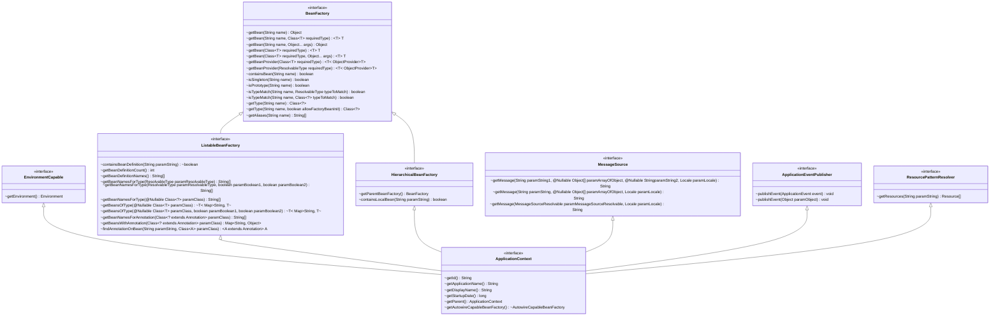

# Core Technologies

## The IoC Container

Inversion of Control (IoC) container is foremost amongst the integral technologies of the Spring Framework.

### Introduction to the Spring IoC Container and Beans

IoC is also known as dependency injection (DI). It is a process whereby objects **define** their dependencies (that is, the other objects they work with) only through constructor arguments, arguments to a factory method, or properties that are set on the object instance after it is constructed or returned from a factory method. The container **then injects** those dependencies when it creates the bean.

The `org.springframework.beans` and `org.springframework.context` packages are the basis for Spring Framework’s IoC container. The `BeanFactory` interface provides an advanced configuration mechanism capable of managing any type of object. `ApplicationContext` is a sub-interface of `BeanFactory`. In short, the `BeanFactory` provides the configuration framework and basic functionality, and the `ApplicationContext` adds more enterprise-specific functionality.



In Spring, the objects that form the backbone of your application and that are managed by the **Spring IoC container** are called beans. **A bean is an object that is instantiated, assembled, and otherwise managed by a Spring IoC container.** Otherwise, a bean is simply one of many objects in your application. Beans, and the dependencies among them, are reflected in the configuration metadata used by a container.


### Container Overview

The `org.springframework.context.ApplicationContext` interface represents the Spring IoC container and is responsible for instantiating, configuring, and assembling the beans. The container gets its instructions on what objects to instantiate, configure, and assemble **by reading configuration metadata**. The configuration metadata is represented in `XML`, `Java annotations`, or `Java code`. 


#### Configuration Metadata

This configuration metadata represents how you, as an application developer, tell the Spring container to instantiate, configure, and assemble the objects in your application.

- XML-based metadata.

- Annotation-based configuration: Spring 2.5 introduced support for annotation-based configuration metadata.

- Java-based configuration: Starting with Spring 3.0, many features provided by the Spring JavaConfig project became part of the core Spring Framework. Thus, you can define beans external to your application classes by using Java rather than XML files.


Typically, you define service layer objects, data access objects (DAOs), presentation objects such as Struts `Action` instances, infrastructure objects such as Hibernate `SessionFactories`, JMS `Queues`, and so forth. Typically, one does not configure fine-grained domain objects in the container, because it is usually the responsibility of DAOs and business logic to create and load domain objects.

#### Instantiating a Container

For XML-based metadata:

```java
ApplicationContext context = new ClassPathXmlApplicationContext("services.xml", "daos.xml");
```
The following example shows the service layer objects (services.xml) configuration file:

```xml
<?xml version="1.0" encoding="UTF-8"?>
<beans xmlns="http://www.springframework.org/schema/beans"
    xmlns:xsi="http://www.w3.org/2001/XMLSchema-instance"
    xsi:schemaLocation="http://www.springframework.org/schema/beans
        https://www.springframework.org/schema/beans/spring-beans.xsd">

    <!-- services -->

    <bean id="petStore" class="org.springframework.samples.jpetstore.services.PetStoreServiceImpl">
        <property name="accountDao" ref="accountDao"/>
        <property name="itemDao" ref="itemDao"/>
        <!-- additional collaborators and configuration for this bean go here -->
    </bean>

    <!-- more bean definitions for services go here -->

</beans>
```

The following example shows the data access objects daos.xml file:

```xml
<?xml version="1.0" encoding="UTF-8"?>
<beans xmlns="http://www.springframework.org/schema/beans"
    xmlns:xsi="http://www.w3.org/2001/XMLSchema-instance"
    xsi:schemaLocation="http://www.springframework.org/schema/beans
        https://www.springframework.org/schema/beans/spring-beans.xsd">

    <bean id="accountDao"
        class="org.springframework.samples.jpetstore.dao.jpa.JpaAccountDao">
        <!-- additional collaborators and configuration for this bean go here -->
    </bean>

    <bean id="itemDao" class="org.springframework.samples.jpetstore.dao.jpa.JpaItemDao">
        <!-- additional collaborators and configuration for this bean go here -->
    </bean>

    <!-- more bean definitions for data access objects go here -->

</beans>
```

#### Using the Container

By using the method `T getBean(String name, Class<T> requiredType)`, you can retrieve instances of your beans.

```java
// retrieve configured instance
PetStoreService service = context.getBean("petStore", PetStoreService.class);

// use configured instance
List<String> userList = service.getUsernameList();
```

The most flexible variant is `GenericApplicationContext` in combination with reader delegates.

```java
GenericApplicationContext context = new GenericApplicationContext();

new XmlBeanDefinitionReader(context).loadBeanDefinitions("services.xml", "daos.xml"); // read from xml metadata
context.refresh();

new GroovyBeanDefinitionReader(context).loadBeanDefinitions("services.groovy", "daos.groovy"); // read from groovy metadata
context.refresh();
```

###  Bean Overview

Within the container itself, these bean definitions are represented as `BeanDefinition` objects, which contain (among other information) the following metadata:

- A package-qualified class name: typically, the actual implementation class of the bean being defined.

- Bean behavioral configuration elements, which state how the bean should behave in the container (scope, lifecycle callbacks, and so forth).

- References to other beans that are needed for the bean to do its work. These references are also called collaborators or dependencies.

- Other configuration settings to set in the newly created object — for example, the size limit of the pool or the number of connections to use in a bean that manages a connection pool.

This metadata translates to a set of properties that make up each bean definition. 

| Property                 | Explained in…​           |
|--------------------------|--------------------------|
| Class                    | Instantiating Beans      |
| Name                     | Naming Beans             |
| Scope                    | Bean Scopes              |
| Constructor arguments    | Dependency Injection     |
| Properties               | Dependency Injection     |
| Autowiring mode          | Autowiring Collaborators |
| Lazy initialization mode | Lazy\-initialized Beans  |
| Initialization method    | Initialization Callbacks |
| Destruction method       | Destruction Callbacks    |

`BeanFactory` will instantiate the bean through `BeanDefinition` while `getBean(...)` is invoked.

#### Naming Beans

Every bean has one or more identifiers. These identifiers must be unique within the container that hosts the bean. A bean usually has only one identifier. However, if it requires more than one, the extra ones can be considered aliases.

You are not required to supply a `name` or an `id` for a bean. If you do not supply a `name` or `id` explicitly, the container generates a unique name for that bean. However, if you want to refer to that bean by name, through the use of the `ref` element or a Service Locator style lookup, you must provide a name. Motivations for not supplying a name are related to using inner beans and autowiring collaborators.

`name` can be used to get bean from `BeanFactory` through `getBean(...)`.

#### Instantiating Beans

A bean definition is essentially a recipe for creating one or more objects. The container looks at the recipe for a named bean when asked and uses the configuration metadata encapsulated by that bean definition to create (or acquire) an actual object.

You can use the Class property in one of two ways:

- Typically, to specify the bean class to be constructed in the case where the container itself directly creates the bean by calling its constructor reflectively, somewhat equivalent to Java code with the `new` operator.

- To specify the actual class containing the `static` factory method that is invoked to create the object, in the less common case where the container invokes a `static` factory method on a class to create the bean. The object type returned from the invocation of the `static` factory method may be the same class or another class entirely.

```java
package org.springframework.beans.factory.support;

// ...

@SuppressWarnings("serial")
public class DefaultListableBeanFactory extends AbstractAutowireCapableBeanFactory
        implements ConfigurableListableBeanFactory, BeanDefinitionRegistry, Serializable {
    
    // ...

    @Override
    public <T> T getBean(Class<T> requiredType, @Nullable Object... args) throws BeansException {
        
        // ...

        Object resolved = resolveBean(ResolvableType.forRawClass(requiredType), args, false);
        
        // ...

        return (T) resolved;
    }

    @Nullable
    private <T> T resolveBean(ResolvableType requiredType, @Nullable Object[] args, boolean nonUniqueAsNull) {
        NamedBeanHolder<T> namedBean = resolveNamedBean(requiredType, args, nonUniqueAsNull);
        if (namedBean != null) {
            return namedBean.getBeanInstance();
        }

        // ...

        return null;
    }

    @SuppressWarnings("unchecked")
    @Nullable
    private <T> NamedBeanHolder<T> resolveNamedBean(
            ResolvableType requiredType, @Nullable Object[] args, boolean nonUniqueAsNull) throws BeansException {

        Assert.notNull(requiredType, "Required type must not be null");
        String[] candidateNames = getBeanNamesForType(requiredType);

        if (candidateNames.length > 1) {
            List<String> autowireCandidates = new ArrayList<>(candidateNames.length);
            for (String beanName : candidateNames) {
                if (!containsBeanDefinition(beanName) || getBeanDefinition(beanName).isAutowireCandidate()) {
                    autowireCandidates.add(beanName);
                }
            }
            if (!autowireCandidates.isEmpty()) {
                candidateNames = StringUtils.toStringArray(autowireCandidates);
            }
        }

        // ...

        return null;
    }

    // ...
}
```

##### Determining a Bean’s Runtime Type

The runtime type of a specific bean is non-trivial to determine. A specified class in the bean metadata definition **is just an initial class reference**, potentially combined with a declared factory method or being a `FactoryBean` class which may lead to a different runtime type of the bean, or not being set at all in case of an instance-level factory method (which is resolved via the specified `factory-bean` name instead). Additionally, AOP proxying may wrap a bean instance with an interface-based proxy with limited exposure of the target bean’s actual type (just its implemented interfaces).

The recommended way to find out about the actual runtime type of a particular bean is a `BeanFactory.getType` call for the specified bean name. 

### Dependencies

#### Dependency Injection

Dependency injection (DI) is a process whereby objects define their dependencies (that is, the other objects with which they work) only through constructor arguments, arguments to a factory method, or properties that are set on the object instance after it is constructed or returned from a factory method. The container then injects those dependencies when it creates the bean. This process is fundamentally the inverse (hence the name, Inversion of Control) of the bean itself controlling the instantiation or location of its dependencies on its own by using direct construction of classes or the Service Locator pattern.

DI exists in two major variants: **Constructor-based dependency injection** and **Setter-based dependency injection**.

##### Constructor-based Dependency Injection

Constructor-based DI is accomplished by the container invoking a constructor with a number of arguments, each representing a dependency.

```java
package x.y;

public class ThingOne {

    public ThingOne(ThingTwo thingTwo, ThingThree thingThree) {
        // ...
    }
}
```

Assuming that `ThingTwo` and `ThingThree` classes are not related by inheritance, no potential ambiguity exists. Thus, the following configuration works fine, and you do not need to specify the constructor argument indexes or types explicitly in the `<constructor-arg/>` element.

```xml
<beans>
    <bean id="beanOne" class="x.y.ThingOne">
        <constructor-arg ref="beanTwo"/>
        <constructor-arg ref="beanThree"/>
    </bean>

    <bean id="beanTwo" class="x.y.ThingTwo"/>

    <bean id="beanThree" class="x.y.ThingThree"/>
</beans>
```

When another bean is referenced, the type is known, and matching can occur (as was the case with the preceding example).

When a simple type is used, such as `<value>true</value>`, Spring cannot determine the type of the value, and so cannot match by type without help. The container can use type matching with simple types if you explicitly specify the type of the constructor argument by using the `type` attribute.

```java
package examples;

public class ExampleBean {

    // Number of years to calculate the Ultimate Answer
    private int years;

    // The Answer to Life, the Universe, and Everything
    private String ultimateAnswer;

    public ExampleBean(int years, String ultimateAnswer) {
        this.years = years;
        this.ultimateAnswer = ultimateAnswer;
    }
}
```

```xml
<bean id="exampleBean" class="examples.ExampleBean">
    <constructor-arg type="int" value="7500000"/>
    <constructor-arg type="java.lang.String" value="42"/>
</bean>
```

##### Setter-based Dependency Injection

Setter-based DI is accomplished by the container calling setter methods on your beans after invoking a no-argument constructor or a no-argument `static` factory method to instantiate your bean.

```java
public class SimpleMovieLister {

    // the SimpleMovieLister has a dependency on the MovieFinder
    private MovieFinder movieFinder;

    // a setter method so that the Spring container can inject a MovieFinder
    public void setMovieFinder(MovieFinder movieFinder) {
        this.movieFinder = movieFinder;
    }

    // business logic that actually uses the injected MovieFinder is omitted...
}
```

The ApplicationContext supports constructor-based and setter-based DI for the beans it manages. It also supports setter-based DI after some dependencies have already been injected through the constructor approach. Setter injection should primarily only be used for optional dependencies that can be assigned reasonable default values within the class. Otherwise, not-null checks must be performed everywhere the code uses the dependency. One benefit of setter injection is that setter methods make objects of that class amenable to reconfiguration or re-injection later.

##### Dependency Resolution Process

The container performs bean dependency resolution as follows:

- The ApplicationContext is created and initialized with configuration metadata that describes all the beans. Configuration metadata can be specified by XML, Java code, or annotations.

- For each bean, its dependencies are expressed in the form of properties, constructor arguments, or arguments to the static-factory method (if you use that instead of a normal constructor). These dependencies are provided to the bean, when the bean is actually created.

- Each property or constructor argument is an actual definition of the value to set, or a reference to another bean in the container.

- Each property or constructor argument that is a value is converted from its specified format to the actual type of that property or constructor argument. By default, Spring can convert a value supplied in string format to all built-in types, such as int, long, String, boolean, and so forth.

The Spring container validates the configuration of each bean as the container is created. However, the bean properties themselves are not set until the bean is actually created. **Beans that are singleton-scoped and set to be pre-instantiated (the default) are created when the container is created. Otherwise, the bean is created only when it is requested.** Creation of a bean potentially causes a graph of beans to be created, as the bean’s dependencies and its dependencies' dependencies (and so on) are created and assigned.

> ### Circular dependencies
> If you use predominantly constructor injection, it is possible to create an unresolvable circular dependency scenario.
> 
> For example: Class A requires an instance of class B through constructor injection, and class B requires an instance of class A through constructor injection. If you configure beans for classes A and B to be injected into each other, the Spring IoC container detects this circular reference at runtime, and throws a `BeanCurrentlyInCreationException`.
>
> One possible solution is to edit the source code of some classes to be configured by setters rather than constructors. Alternatively, avoid constructor injection and use setter injection only. In other words, although it is not recommended, you can configure circular dependencies with setter injection.
>
>Unlike the typical case (with no circular dependencies), a circular dependency between bean A and bean B forces one of the beans to be injected into the other prior to being fully initialized itself (a classic chicken-and-egg scenario).

