# Spring Framework Overview

```
Based on Version 5.2.8.RELEASE
```

## What is Spring?

The term "Spring" means different things in different contexts. It can be used to refer to the **Spring Framework** project itself, which is where it all started. Over time, other Spring projects have been built on top of the Spring Framework. 

### Modules

```mermaid
erDiagram
    SPRING-AOP ||--o{SPRING-BEANS : uses
    SPRING-AOP ||--o{SPRING-CORE : uses
    SPRING-ASPECTS ||--o{SPRING-AOP : uses-optional
    SPRING-ASPECTS ||--o{SPRING-BEANS : uses-optional
    SPRING-ASPECTS ||--o{SPRING-CONTEXT : uses-optional
    SPRING-ASPECTS ||--o{SPRING-CONTEXT-SUPPORT : uses-optional
    SPRING-ASPECTS ||--o{SPRING-ORM : uses-optional
    SPRING-ASPECTS ||--o{SPRING-TX : uses-optional
    SPRING-BEANS ||--o{SPRING-CORE : uses
    SPRING-CONTEXT ||--o{SPRING-AOP : uses
    SPRING-CONTEXT ||--o{SPRING-BEANS : uses
    SPRING-CONTEXT ||--o{SPRING-CORE : uses
    SPRING-CONTEXT ||--o{SPRING-EXPRESSION : uses
    SPRING-CONTEXT ||--o{SPRING-INSTRUMENT : uses-optional
    SPRING-CONTEXT-SUPPORT ||--o{SPRING-BEANS : uses
    SPRING-CONTEXT-SUPPORT ||--o{SPRING-CONTEXT : uses
    SPRING-CONTEXT-SUPPORT ||--o{SPRING-CORE : uses
    SPRING-CONTEXT-SUPPORT ||--o{SPRING-JDBC : uses-optional
    SPRING-CONTEXT-SUPPORT ||--o{SPRING-TX : uses-optional
    SPRING-CORE ||--o{SPRING-JCL : uses
    SPRING-EXPRESSION ||--o{SPRING-CORE : uses
    SPRING-JDBC ||--o{SPRING-BEANS : uses
    SPRING-JDBC ||--o{SPRING-CORE : uses
    SPRING-JDBC ||--o{SPRING-TX : uses
    SPRING-JDBC ||--o{SPRING-CONTEXT : uses-optional
    SPRING-JMS ||--o{SPRING-BEANS : uses
    SPRING-JMS ||--o{SPRING-CORE : uses
    SPRING-JMS ||--o{SPRING-MESSAGING : uses
    SPRING-JMS ||--o{SPRING-TX : uses
    SPRING-JMS ||--o{SPRING-AOP : uses-optional
    SPRING-JMS ||--o{SPRING-CONTEXT : uses-optional
    SPRING-JMS ||--o{SPRING-OXM : uses-optional
    SPRING-MESSAGING ||--o{SPRING-BEANS : uses
    SPRING-MESSAGING ||--o{SPRING-CORE : uses
    SPRING-MESSAGING ||--o{SPRING-CONTEXT : uses-optional
    SPRING-MESSAGING ||--o{SPRING-OXM : uses-optional
    SPRING-ORM ||--o{SPRING-BEANS : uses
    SPRING-ORM ||--o{SPRING-CORE : uses
    SPRING-ORM ||--o{SPRING-JDBC : uses
    SPRING-ORM ||--o{SPRING-TX : uses
    SPRING-ORM ||--o{SPRING-AOP : uses-optional
    SPRING-ORM ||--o{SPRING-CONTEXT : uses-optional
    SPRING-ORM ||--o{SPRING-WEB : uses-optional
    SPRING-OXM ||--o{SPRING-BEANS : uses
    SPRING-OXM ||--o{SPRING-CORE : uses
    SPRING-R2DBC ||--o{SPRING-BEANS : uses
    SPRING-R2DBC ||--o{SPRING-CORE : uses
    SPRING-R2DBC ||--o{SPRING-TX : uses
    SPRING-TEST ||--o{SPRING-CORE : uses
    SPRING-TEST ||--o{SPRING-AOP : uses-optional
    SPRING-TEST ||--o{SPRING-BEANS : uses-optional
    SPRING-TEST ||--o{SPRING-CONTEXT : uses-optional
    SPRING-TEST ||--o{SPRING-JDBC : uses-optional
    SPRING-TEST ||--o{SPRING-ORM : uses-optional
    SPRING-TEST ||--o{SPRING-TX : uses-optional
    SPRING-TEST ||--o{SPRING-WEB : uses-optional
    SPRING-TEST ||--o{SPRING-WEBFLUX : uses-optional
    SPRING-TEST ||--o{SPRING-WEBMVC : uses-optional
    SPRING-TEST ||--o{SPRING-WEBSOCKET : uses-optional
    SPRING-TX ||--o{SPRING-BEANS : uses
    SPRING-TX ||--o{SPRING-CORE : uses
    SPRING-TX ||--o{SPRING-AOP : uses-optional
    SPRING-TX ||--o{SPRING-CONTEXT : uses-optional
    SPRING-WEB ||--o{SPRING-BEANS : uses
    SPRING-WEB ||--o{SPRING-CORE : uses
    SPRING-WEB ||--o{SPRING-AOP : uses-optional
    SPRING-WEB ||--o{SPRING-CONTEXT : uses-optional
    SPRING-WEB ||--o{SPRING-OXM : uses-optional
    SPRING-WEBFLUX ||--o{SPRING-BEANS : uses
    SPRING-WEBFLUX ||--o{SPRING-CORE : uses
    SPRING-WEBFLUX ||--o{SPRING-WEB : uses
    SPRING-WEBFLUX ||--o{SPRING-CONTEXT : uses-optional
    SPRING-WEBFLUX ||--o{SPRING-CONTEXT-SUPPORT : uses-optional
    SPRING-WEBMVC ||--o{SPRING-AOP : uses
    SPRING-WEBMVC ||--o{SPRING-BEANS : uses
    SPRING-WEBMVC ||--o{SPRING-CONTEXT : uses
    SPRING-WEBMVC ||--o{SPRING-CORE : uses
    SPRING-WEBMVC ||--o{SPRING-EXPRESSION : uses
    SPRING-WEBMVC ||--o{SPRING-WEB : uses
    SPRING-WEBMVC ||--o{SPRING-CONTEXT-SUPPORT : uses-optional
    SPRING-WEBMVC ||--o{SPRING-OXM : uses-optional
    SPRING-WEBSOCKET ||--o{SPRING-CONTEXT : uses
    SPRING-WEBSOCKET ||--o{SPRING-CORE : uses
    SPRING-WEBSOCKET ||--o{SPRING-WEB : uses
    SPRING-WEBSOCKET ||--o{SPRING-MESSAGING : uses-optional
    SPRING-WEBSOCKET ||--o{SPRING-WEBMVC : uses-optional
```




## Design Philosophy

- Provide choice at every level. Spring lets you defer design decisions as late as possible. 

- Accommodate diverse perspectives. Spring embraces flexibility and is not opinionated about how things should be done. It supports a wide range of application needs with different perspectives.

- Maintain strong backward compatibility. Spring’s evolution has been carefully managed to force few breaking changes between versions. Spring supports a carefully chosen range of JDK versions and third-party libraries to facilitate maintenance of applications and libraries that depend on Spring.

- Care about API design. The Spring team puts a lot of thought and time into making APIs that are intuitive and that hold up across many versions and many years.

- Set high standards for code quality. The Spring Framework puts a strong emphasis on meaningful, current, and accurate javadoc. It is one of very few projects that can claim clean code structure with no circular dependencies between packages.